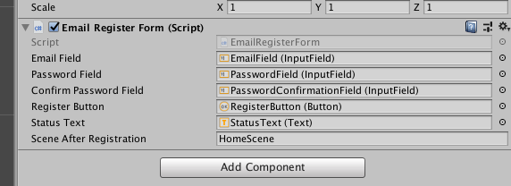

This template lets you quickly add email and password authentication of your players into your game. Make sure you read the [authentication](authentication) documentation page first.


## Player entity

Before you add the template to your game, you need to add the following fields to your `PlayerEntity`:

```cs
public class PlayerEntity : Entity
{
    public string email;
    public string password;
    public DateTime lastLoginAt = DateTime.UtcNow;
}
```

Email and password fields are self-explanatory, just keep in mind that the password field stores the password hash, not the plain password.

> **Note:** If you already have players registered in your database, you can simply add these new fields and all the old entities will be considered to have the default values (`null` for email and password and `UtcNow` for `lastLoginAt`, set at the time of loading from the database).


## Instantiating the template

We begin by creating the server-side code. Go to your `Backend` folder, right-click and choose `Create > Unisave > Email authentication > Backend`. This will create the following files:

    Backend/
    └── EmailAuthentication/
        ├── EmailAuthUtils.cs
        ├── EmailLoginFacet.cs
        ├── EmailRegisterFacet.cs
        └── EmailRegisterResponse.cs

- `EmailAuthUtils.cs` is a collection of static utility functions used by the facets.
- `EmailLoginFacet.cs` handles player login and logout.
- `EmailRegisterFacet.cs` handles player registration. You can modify the player creation method to customize the creation logic (e.g. to create other entities the player might own).
- `EmailRegisterResponse.cs` is an `enum` of possible registration results.

Now we need to create two client-side scripts. One will be attached to the login form and one to the registration form. Go to your `Scripts` folder, right click and choose `Create > Unisave > Email authentication > Login form` and `Create > Unisave > Email authentication > Register form`.

Both of these scripts are very simmilar so we will take a look at the registration script only.

To create a registeration form, simply add three `InputField`s, one `Button` and one `Text` into your scene. Then add the `EmailRegisterForm` and link all the corresponding components. Lastly don't forget to fill out the `sceneAfterRegistration` field.



The status text will be automatically disabled in `Start()`. Then it will show basic info about what's hapenning and what errors occur. After a successful registeration a new scene will be loaded, name of which is specified as an argument of the script.

Read the source code of `EmailRegisterForm` and modify it to suit your needs, it isn't long, nor complicated.


## Extending the server-side

The entire backend part of the template is built on top of the `Auth` facade about which you can read in the [custom authentication](authentication#custom-authentication) section.

Email addresses are currently normalized (meaning they are turned to lower-case and trimmed). This makes the login logic seem case-insensitive even though it isn't.

> **Note:** The lookup uses a case-sensitive email comparison to make sure a database index can be used. This speeds up the login significantly.

> **Note:** The lookup is performed twice - once with the email the player typed in and the second time with its lowercase variant. This ensures that an email address with upper-case characters in the database can still be logged into (for backwards compatibility and general fool-proofing).


### Player nicknames

You might be tempted to add player nickname as one additional field to the registration form. You can do that but keep in mind there's a better solution:

Add `public string nickname;` to the `PlayerEntity`. This will cause every new player to have a nickname of `null`. You can check this right after login (when your "home scene" loads) and display a screen that lets the user input a nickname.

This approach is better since you:

1. don't need to modify the existing authentication template which makes future updates easier.
2. can add additional authentication templates (say registration via Steam) where you don't have the luxury of "just adding another field".
3. can add nicknames even when you already have players in the database.


## Staying up-to-date

The latest version of the *Email authentication* template is `0.9.1`.

For instructions on how to update, check out [the changelog and upgrade guide](https://github.com/Jirka-Mayer/UnisaveAsset/blob/master/Assets/UnisaveFixture/TemplateChangelogs/EmailAuthentication.md).

You can view the latest template code on Github for [the backend part](https://github.com/Jirka-Mayer/UnisaveAsset/tree/master/Assets/UnisaveFixture/Backend/EmailAuthentication) and [the client](https://github.com/Jirka-Mayer/UnisaveAsset/blob/master/Assets/UnisaveFixture/Scripts/EmailAuthentication).
