**\[TODO\] clear up TODOs**

This module lets you quickly add "login via Epic Games" functionality to your game. It relies on the *Epic Online Services (EOS) Software Development Kit (SDK)* - a C# library that communicates with EOS. The EOS SDK is responsible for the authentication of the player inside your game client. Once authenticated there, this module will use the EOS SDK to authenticate the same player in Unisave by finding or creating a corresponding player document in the ArangoDB database and calling `Auth.Login(doc)` with that document (learn more about the `Auth` facade [here](authentication#custom-authentication)).

> **Version:** `0.1.0`<br>
> **Unisave:** `0.12.0` or higher<br>
> **Asset Store:** to be added<br>
> **Download:** [unisave-epic-authentication-0.1.0.unitypackage](https://github.com/unisave-cloud/epic-authentication/releases)<br>
> **GitHub:** [unisave-cloud/epic-authentication](https://github.com/unisave-cloud/epic-authentication)<br>


## Module overview

Before you begin, you should understand how [Unisave authentication](authentication) via the `Auth` facade works. To do a brief recap:

- We store all known players in the ArangoDB database as documents of a collection. One document represents one player and the ID of that document is the ID of that player as far as Unisave is concerned. We may use raw AQL queries, or we can use [entities](entities) to work with the database.
- The `Auth` facade is a Unisave backend-only utility, that lets us remember, which player is logged in (for each [client session](session) separately). We give it a database document ID and it will remember that ID (typically the document ID representing the player). We can ask it for the ID if we need to check if or who is logged in.
- To build a custom authentication system (say email and password), we need to store the email and password in the player document. During login we find the document based on the entered credentials and pass the document to the `Auth` facade to perform the login.

With Epic Games, we have players that have an *Epic Account*. This account has an ID, called *Epic Account ID*. What this module does is that it stores the *Epic Account ID* in the player document (like the email address) and performs some talking to the Epic servers to verify the player (like the password). Then it stores the corresponding player document in the `Auth` facade.

This process happens in two phases:

1. Your game client logs into EOS via the EOS SDK (no Unisave interaction).
2. You call `this.LoginUnisaveViaEpic(...);` in a `MonoBehaviour` which logs the same player in on the backend server.


## Installation

First, you should have Unisave installed in you Unity project with backend uploading set up and working. If not, see the [installation instructions](../installation/installation.md).

Then, start by importing this Unisave module as a Unity package into your project:

- via the Unity Asset Store **\[TODO\]**
- or from the `.unitypackage` downloaded from the [GitHub releases page](https://github.com/unisave-cloud/epic-authentication/releases)

Now, create an Epic Games Account, create a Product (your game) and download the C# EOS SDK. You can do so by following [this EOS documentation page](https://dev.epicgames.com/docs/epic-online-services/eos-get-started/services-quick-start).

> **Note:** You don't need to register if you just want to try the demo scene. But you do need it to start integrating your game.

> **Note:** You can download the C# SDK without registration from [the SDK webpage](https://dev.epicgames.com/en-US/sdk).

Extract the downloaded zip file and copy these files and folders to these places in your Unity project:

- `ZIP:/SDK/Bin/EOSSDK-Win64-Shipping.dll` copy to `UNITY:/Assets/Plugins/EOSSDK/EOSSDK-Win64-Shipping.dll` (assuming you target Win64, otherwise you need to use binaries for other platforms)
- `ZIP:/SDK/Source/Core` copy to `UNITY:/Assets/Plugins/EOSSDK/Core`
- `ZIP:/SDK/Source/Generated` copy to `UNITY:/Assets/Plugins/EOSSDK/Generated`

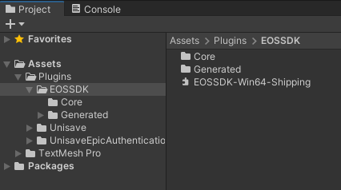

> **Note:** You can also read the [official documentation for the SDK integration with Unity](https://dev.epicgames.com/docs/epic-online-services/eos-get-started/eossdkc-sharp-getting-started) to get a better idea of how it works.


Notice that we place the SDK into the `Assets/Plugins` folder, not directly to `Assets`. This is because this Unisave module is also in the `Plugins` folder and this folder compiles before everything else. Not having the SDK here would mean this module would not see the SDK C# classes. If you need to have the SDK outside the `Plugins` folder, you have to move the `Assets/Plugins/UnisaveEpicAuthentication` folder outside as well.


## Demo project walkthrough

This module comes with an example scene in the folder: `Assets/Plugins/UnisaveEpicAuthentication/Examples/SimpleDemo`

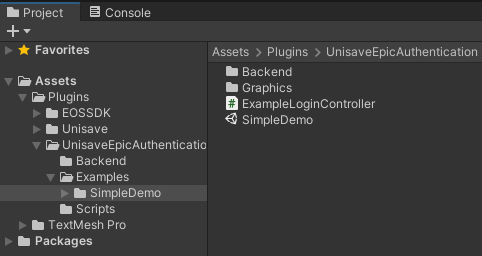

When you open the scene and hit play, you'll see the following screen:

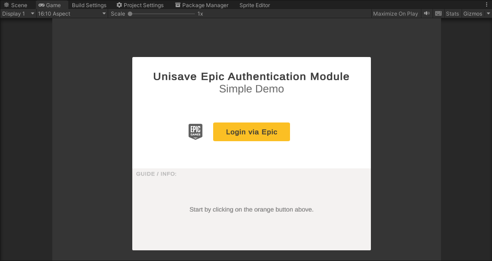

When you click the orange button, an Epic Account Portal overlay is displayed over your game that asks you to log in. It may also open a browser window with the login portal instead (especially in the Unity Editor the behaviour is iffy - in your final built game the overlay should work fine).


When you follow through, the overlay will close and the authentication will continue. In the end it will display a **Success!** message:

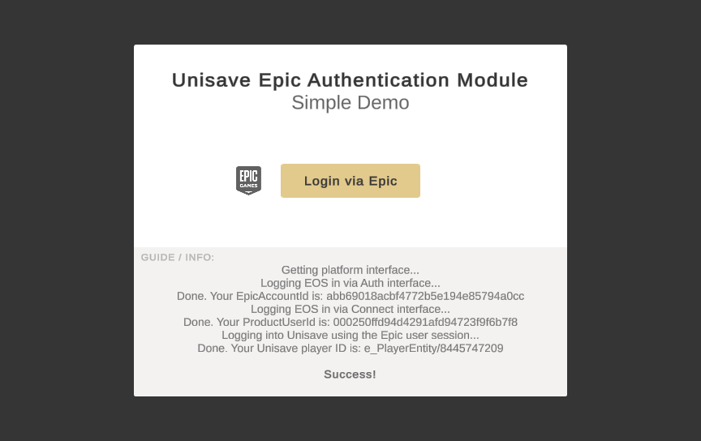

At this point you are logged into Epic in you game (see the *EpicAccountId* `abb69018ac...`) and you are also logged into Unisave via that Epic account as a Unisave player `e_PlayerEntity/8445747209`.

Now, if you make a [facet call](../facets.md) to your backend server, whenever you call `Auth.GetPlayer<T>()`, it will return the document `e_PlayerEntity/8445747209`.

If we open the database and find the player document, we see that it's connected with the Epic Account (see the `epicAccountId` field):

```json
{
    "_id": "e_PlayerEntity/8445747209",
    "_rev": "_giUsKhS---",
    "_key": "8445747209",
    "epicAccountId": "abb69018acbf4772b5e194e85794a0cc",
    "epicProductUserId": null,
    "lastLoginAt": "2023-08-30T09:02:38.557Z",
    "CreatedAt": "2023-08-18T13:11:04.382Z",
    "UpdatedAt": "2023-08-30T09:02:38.576Z"
}
```


### Connecting with your Epic product

The example project is by default configured to connect to an *Epic Product* (a game) I&nbsp;created, called *Unisave Integration Testing*. Its credentials are filled out in the `BasicEOSSDKComponent`, which is a component responsible for the EOS communication.


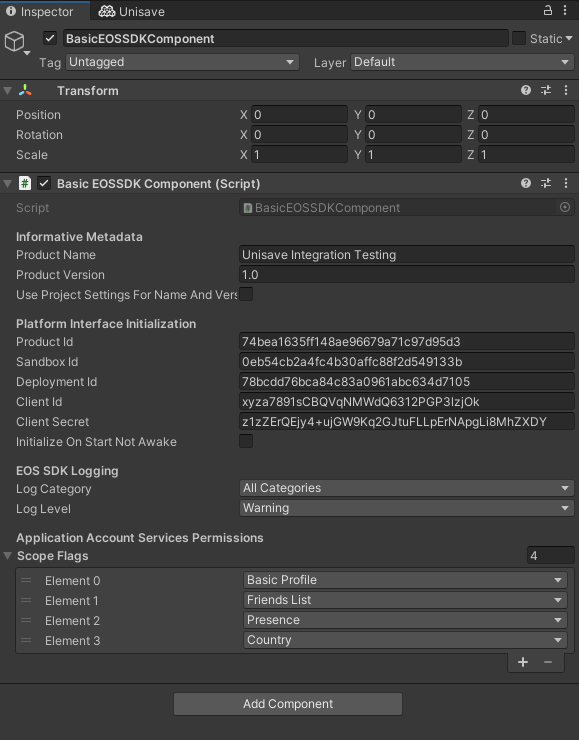

You can begin your integration by first creating your own *Epic Product* and connecting it with this demo scene. When you get that working, you can start modifying the source code.

Let's first connect the demo to your own *Epic Product*:

1. Create an *Epic Developer Account* and an *Organization* for yourself at [dev.epicgames.com/portal](https://dev.epicgames.com/portal).
2. In the *Developer Portal* create a new *Product* (a new game)
    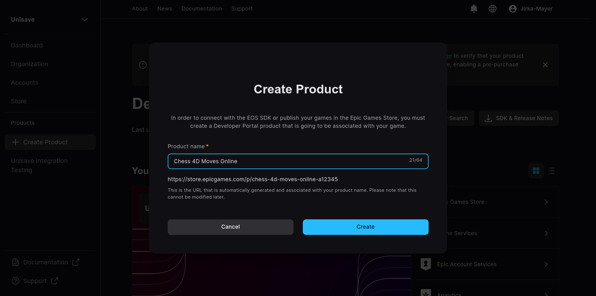
3. In the *Product Settings*, when you scroll down, you can see the `ProductID`, `SandboxID`, and `DeploymentID`. Copy these into the `BasicEOSSDKComponent`.
    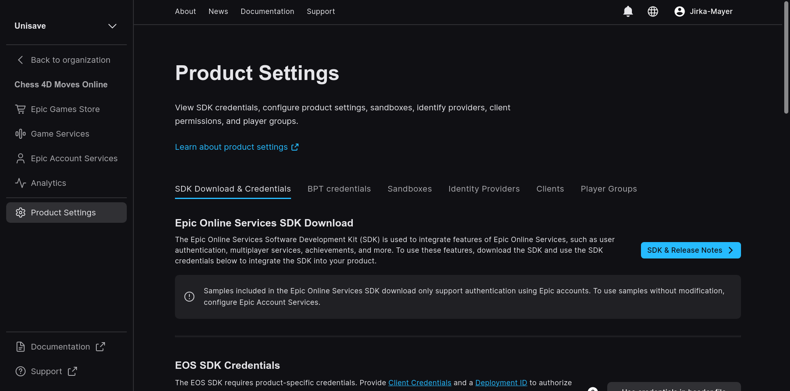
4. **In the *Clients* tab**, you need to create a new *Client Policy* and a new *Client*. When creating the policy (you can call it `Unity Client Policy`), you set the *Permission Configuration* to `Game Client`. This pre-fills the permissions in a way suitable to a game client (a built game distributed to players, as opposed to a server build). You can, of course, customize the permission set, depending on your needs and usage of *Epic Online Services*. Then you create a new client (you can call it `Unity Client`) with the created client policy. You should end up with this:
    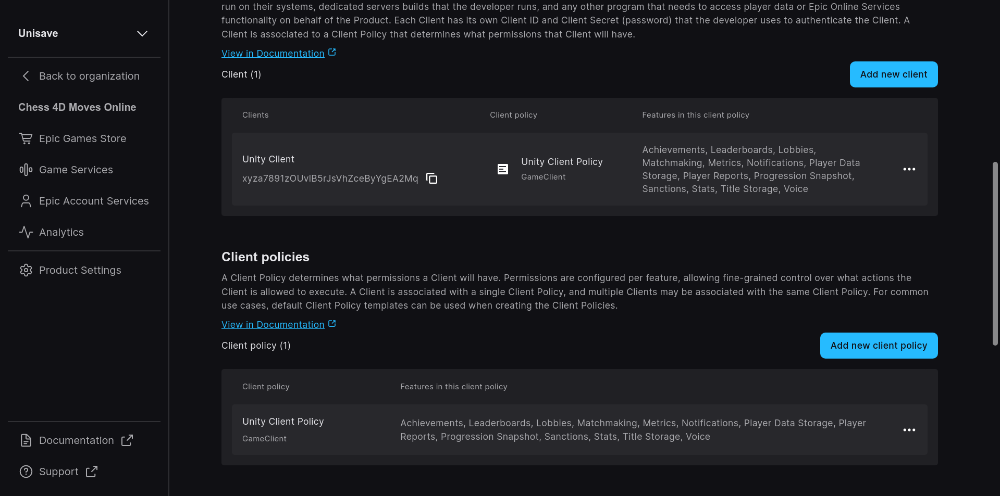
5. If you go back to the first *Product Settings* tab, you should see the new client. Copy the `ClientID` and the `ClientSecret` into the `BasicEOSSDKComponent`.<br/>*Note: The secret is not really a secret for game clients (builds that you distribute), but it is indeed a secret for server builds. This is because server builds typically have more privileges than game clients (they can access data about any player).*
6. The last step is to configure an *Application*. It is something that represents your game within *Epic Account Services* (a subset of EOS that we use for authentication). An *Application* with the same name as your *Product* is already created, you just need to configure it. This is done in the *Epic Account Services* page of your *Product*:
    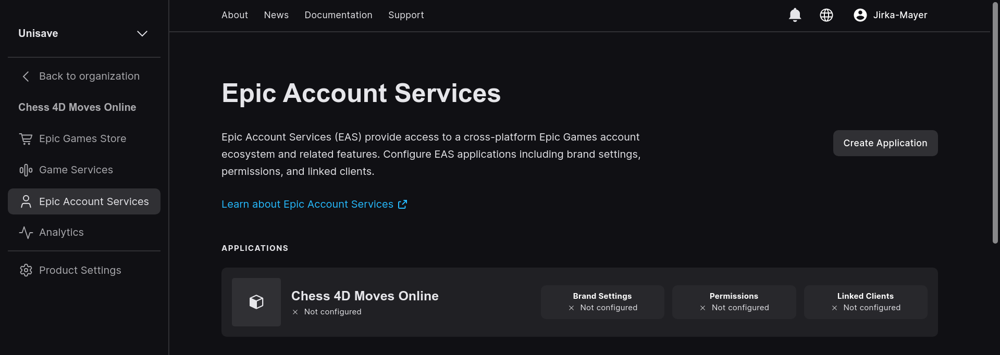
7. You fill out the brand settings, permissions, and link the *Client* we have created earlier.
8. Transfer the selected permissions into the `BasicEOSSDKComponent` as the `ScopeFlags`. Make sure you select the exact same flags as the permissions you have granted. No more, no less. If you don't set this right, the game will just not work with cryptic messages and freeze on play-mode exit. Yay!
    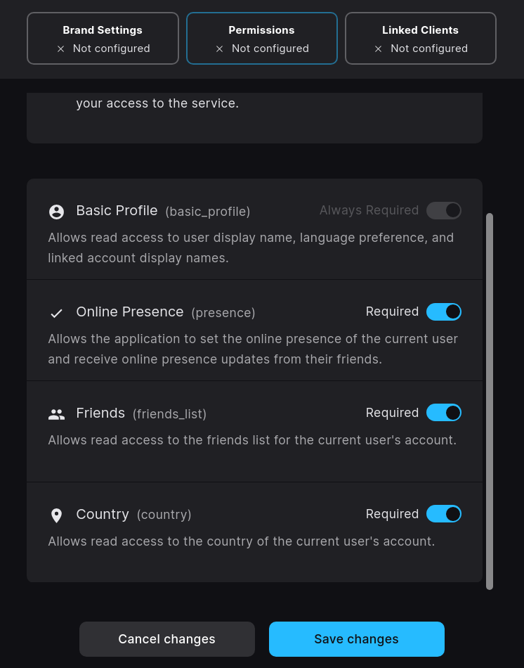
    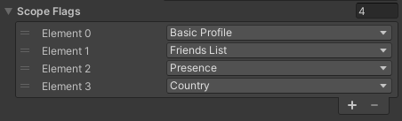
9. Lastly fill out your game name and version into the `BasicEOSSDKComponent`. These values are only informative and don't need to match anything in the *Developer Portal*. You can tick the checkbox to get the values from Unity *Project Settings* instead.
10. You can also adjust the logging level, or disable it completely. The SDK logs a lot of errors even if everything works (because it has to do workarounds when running in the Unity Editor).

With everything filled out, you can enter the play mode again. The demo should behave the same, except that now the EOS SDK is logging into your game, not the *Unisave Integration Testing* demo game.


### Epic Auth Tool

So far, when you launched the demo, an *Epic Account Portal* overlay was displayed for the player to log in. In practise, the game is going to be launched via the *Epic Launcher*, so the authentication will require no player interaction (the `BasicEOSSDKComponent` already supports this, but falls back on the overlay in the Unity Editor).

During development, there is a better way to perfom login. You can use the [Developer Authentication Tool](https://dev.epicgames.com/docs/epic-account-services/developer-authentication-tool) that comes with the SDK zip file in the `SDK/Tools` folder.

When you launch this tool, it asks you for a port. Enter the port:

```
6547
```

Then you can click "Log in" to create a new credential. Log into your *Epic Account* and name the new credential `me`. The credential will be used by the `BasicEOSSDKComponent` to log you in automatically, instead of displaying the overlay. The credential has to be called `me`, this is what the `BasicEOSSDKComponent` expects.

Using this tool speeds up testing and clears up error logs from the console (since using the other methods inside Unity Editor logs tons of errors as various attempts fail).

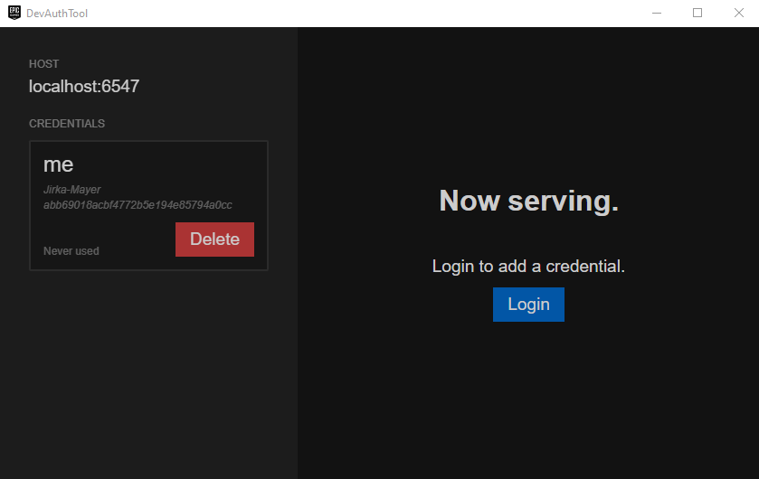


### Understanding the code

Now that we know how to configure the demo project, let's look at how it works so that you can transfer it to your game.


So far, we worked with the `BasicEOSSDKComponent`. This component is responsible for loading and managing the EOS SDK library. You can add this component to your startup scene. It will call `DontDestroyOnLoad` on itself, so that it will always be available in your game.

The component initializes a [Platform Interface](https://dev.epicgames.com/docs/game-services/eos-platform-interface), which is a C# object that we can use to communicate with the *Epic Online Services* (EOS). You can access this object via a public static property:

```cs
using Unisave.EpicAuthentication;
using Epic.OnlineServices.Platform;

// get the BasicEOSSDKComponent instance
BasicEOSSDKComponent sdkComponent = BasicEOSSDKComponent.Instance;

// get the platform interface
PlatformInterface platform = sdkComponent.PlatformInterface;
```

The `BasicEOSSDKComponent` is initialized during `Awake`, so you can use the `PlatformInterface` immediately in the `Start` method of any component.

The `BasicEOSSDKComponent` is used inside the `ExampleLoginController`, which is a top-level controller responsible for the button and the user interface. Let's look at its implementation now:

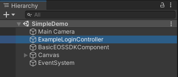

> **Note:** You can open its source code [online on GitHub](https://github.com/unisave-cloud/epic-authentication/blob/master/Assets/Plugins/UnisaveEpicAuthentication/Examples/SimpleDemo/ExampleLoginController.cs).

When you click the orange button, the `OnLoginClick` method is called. There, the code first calls `sdkComponent.AuthLogin()`:

```cs
Epic.OnlineServices.Auth.LoginCallbackInfo info
    = await sdkComponent.AuthLogin();

if (info.ResultCode == Result.Success)
    Debug.Log("Your EpicAccoundId: " + info.LocalUserId);
else
    Debug.Log("Login failed: " + info.ResultCode);
```

This method tries log your game client into EOS via the [Auth interface](https://dev.epicgames.com/docs/epic-account-services/auth/auth-interface) using:

1. the *Developer Authentication Tool*
2. the *Epic Launcher* exchange code passed in via command-line arguments
3. the *Epic Account Portal* login overlay

If all fail, the method returns the last failure. Otherwise it returns the first success.

This does no talking to Unisave. This only logs in the game client and gets the *Epic Account ID* of the player. After this, you can access Epic Friends and other EOS serivces, but as far as Unsiave is concerned, you are still logged-out.

Then the `sdkComponent.ConnectLoginOrRegister` method is called.

```cs
using Epic.OnlineServices.Connect; // ??

TODO todo = await sdkComponent.ConnectLoginOrRegister();

// ... TODO TODO TODO ...
```

This methods performs a similar login to *EOS Game Services* (a subset of EOS), which uses [the Connect interface](https://dev.epicgames.com/docs/game-services/eos-connect-interface) to log in. More specifically, this method registers a *Product User* for the *Epic Account* if there is none, or logs in, if the player already has one.

The reason Epic has these two login interfaces is that you may create *Product User* accounts for players who don't have an *Epic Account* (say, when you distribute to Xbox and don't want players to register at *Epic Games*). If you don't know what I mean, read the article [Connect vs Auth in
Epic Online Services](/guides/connect-vs-auth-in-epic-online-services).

If you already use *Product User Accounts* without *Epic Accounts*, then you need to modify this step and ask the player if they want to link an existing *Product User Accounts* with their *Epic Account*. But in such a case you already know how to do the low-level EOS SDK communication yourself. For the 95% rest of you, you can keep the code as is and just read the article - especially the [Distributing only to Epic Store](/guides/connect-vs-auth-in-epic-online-services#distributing-only-to-epic-store) section.

After this step, your game is logged into EOS twice, via both the Auth and the Connect interface. Therefore it can access both the [Epic Account Services](https://dev.epicgames.com/docs/epic-account-services) as well as the [EOS Game Services](https://dev.epicgames.com/docs/game-services). But from the Unisave perspective, you are still not logged in.

Now comes the time to log into Unisave via the two already performed Epic logins:

```cs
using Unisave.EpicAuthentication;

EpicLoginResponse response = await this.LoginUnisaveViaEpic(
    sdkComponent.PlatformInterface
);

Debug.Log("Your Unisave player ID: " + response.PlayerId);
```

The `this.LoginUnisaveViaEpic` is an extension method on `MonoBehaviour` that you can use from any `MonoBehaviour` as long as you have the `using Unisave.EpicAuthentication;` statement in place.

This method uses the platform interface to get the current *Epic Account ID* and *Product User ID* and sends them to the backend server. They are used to find the proper player (or register a new one) and log them in. In the response you get the document ID of the logged-in player.

> **Note:** Note that the method is not just sending the IDs as plain text. It sends [Json Web Tokens](https://jwt.io/) received from EOS, that can be verified server-side to make sure the client is not making things up and attempting to login as someone else.

Because there are many ways to use the database (entities, raw AQL, etc.), you need to specify, how the search and registration take place. For this there is a backend bootstrapper file that implements these methods. The file is at:<br>[`Assets/Plugins/UnisaveEpicAuthentication/Examples/SimpleDemo/Backend/EpicAuthBootstrapper.cs`](https://github.com/unisave-cloud/epic-authentication/blob/master/Assets/Plugins/UnisaveEpicAuthentication/Examples/SimpleDemo/Backend/EpicAuthBootstrapper.cs)

A minimal bootstrapper implements these two methods:

```cs
using System;
using Unisave.EpicAuthentication;
using Unisave.Facades;

public class EpicAuthBootstrapper : EpicAuthBootstrapperBase
{
    public override string FindPlayer(
        string epicAccountId,
        string epicProductUserId
    )
    {
        // Find the player document by epicAccountId first,
        // then try epicProductUserId. Return the player's
        // document ID, e.g. "players/123456".
        // If there's no such player, return null
        // and a new player will be registered.
    }

    public override string RegisterNewPlayer(
        string epicAccountId,
        string epicProductUserId
    )
    {
        // Create a new player document and save it
        // to the database. Return its document ID.
        // Don't forget to store the Epic identifiers
        // inside the created document.
    }
}
```


## Basic EOS SDK Component

The `BasicEOSSDKComponent` is a `MonoBehaviour` scripts responsible for loading and managing the EOS SDK and for initializing a `PlatformInterface` instance used for the interaction with EOS. The script is located in [`Assets/Plugins/UnisaveEpicAuthentication/Scripts/BasicEOSSDKComponent.cs`](https://github.com/unisave-cloud/epic-authentication/blob/master/Assets/Plugins/UnisaveEpicAuthentication/Scripts/BasicEOSSDKComponent.cs)

It is meant as a reasonable default for most games that want to integrate with *Epic Online Services*, so you can just drop it into your game and use it as is. If you, however, need some additional features, you can always copy its code into a new component and modify it as you see fit.

> **Note:** Do not modify the code of the component directly, do make a copy first (you can call it `MyEOSSDKComponent`) and move it outside the `UnisaveEpicAuthentication` folder. If you modify the component directly, it will be hard for you to update this module, when new version comes out.

The component calls `DontDestroyOnLoad` on itself, so you only need to include it in your startup scene.

The configuration of this component is explained in detail in the section [Connecting with your Epic Product](#connecting-with-your-epic-product).

If you need to set the configuration fields programatically, you can delay the platform initialization to the `Start` method by ticking the corresponding checkbox and setting the other public fields during `Awake` (by having a reference to the component created in the Unity Editor).

To get hold of the instance from anywhere in your game after it has been initialized, you can use the `Instance` static property:

```cs
BasicEOSSDKComponent sdkComponent = BasicEOSSDKComponent.Instance;
```

You can then use it to access the lower-level EOS SDK `PlatformInterface`:

```cs
PlatformInterface platform = sdkComponent.PlatformInterface;
```

It will return `null` if the interface has not been initialized yet, or has failed initializing.


### Auth interface login methods

The component exposes a couple of login methods, that log the game client into EOS via the Auth interface. The most capable one is `AuthLogin()` which tries all the other methods one by one (auth tool, epic launcher, account portal).

```cs
Epic.OnlineServices.Auth.LoginCallbackInfo info
    = await sdkComponent.AuthLogin();

if (info.ResultCode == Result.Success)
    Debug.Log("Your EpicAccoundId: " + info.LocalUserId);
else
    Debug.Log("Login failed: " + info.ResultCode);
```

Note that the player can cancel the login procedure, in which case the `Result.Canceled` is returned. The method does not throw any exceptions.

The other login methods are used in the same way:

```cs
LoginCallbackInfo info = await sdkComponent.AuthLoginViaDeveloperAuthTool();

LoginCallbackInfo info = await sdkComponent.AuthLoginViaEpicLauncher();

LoginCallbackInfo info = await sdkComponent.AuthLoginViaAccountPortal();
```

The *Account Portal* login almost never fails and can be used as a fallback when all the other options aren't available. It shouldn't be used as a default though, as it may ask the player for a 2FA verification code each time they log in.

The *Epic Launcher* method will return `Result.AuthExchangeCodeNotFound` if the game was not launched via the *Epic Launcher*. It works by reading an *Exchange Code* from the command-line arguments passed in by the *Epic Launcher*. This method should be used shortly after the game is launched, becase the *Exchange Code* expires and after that this method also returns `Result.AuthExchangeCodeNotFound`.

You can use these methods if you want to implement the login yourself:

```cs
bool isEpicLaunched = sdkComponent.IsLaunchedViaEpicLauncher();

string? exchangeCode = sdkComponent.GetExchangeCode();
```

The *Developer Auth Tool* method can be customized with these arguments:

```cs
LoginCallbackInfo info = await sdkComponent.AuthLoginViaDeveloperAuthTool(
    host: "localhost:6547",
    credentialName: "me"
);
```

### Connect interface login methods

TODO


## MonoBehaviour extensions

TODO


## Epic Auth Bootstrapper

TODO: what methods and configuration it offers to modify
