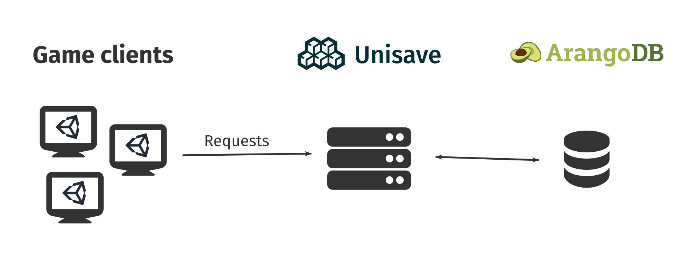

This page is a quick overview of the stuff you can achieve with Unisave. Its goal is to nail down what Unisave does precisely and whether it solves the problem you have.

## Overview

Unisave provides two main features to you game:

- Database for storing any data, accessible from anywhere
- Platform for running some of your game logic in the cloud

The database lets you store little pieces of data called *entities*. An entity could represent a player, an achievement, an item in the game or it could store more abstract data like your leaderboards, game events, metrics. An entity is analogous to a row in a relational database or a document in a NoSQL database but it is designed to interface nicely with the C# code in your game. See the chapter on [entities](entities) to learn more.

You can create *facets* which are sets of methods that live in the cloud, can access the database, and can be called by your game client. They contain the logic that communicates with the database so they perform tasks like registering and authenticating players, performing matchmaking, logging interesting events, or sending emails.

## What you can build

**Leaderboards** 
Leaderboards can be easily built on top of Unisave. One entity for storing the top few players and their score and a facet that can add a new record and send the leaderboards table to the client. You can implement any behaviour you need. Player registration is not required. Ranking all players into a list by their score is a bit more challenging due to the number of players, but definitely possible with a bit of software engineering.

**Player registration and authentication** 
You can easily register players, allow them to log in, reset passwords, and more. This is a core feature of any modern game since a player doesn't lose their progress when their computer breaks down. Also playing with your friends is way more fun than playing alone.

**Matchmaking** 
Many real-time multiplayer services provide matchmaking but oftentimes you need to match players according to their skill or mix-in bots when the traffic is low. These advanced features can be achieved with Unisave since you can implement any matchmaking logic you need.

**Achievements** 
Maybe your game does not use Steam because it's a WebGL game but you still want to preserve the achievements of your players. Simply store the list of acquired achievements in an entity in the database.

**In-game economy** 
Remembering how many coins a player has is as simple as adding a single integer attribute to the player entity. But you can go beyond that. Create auction hauses, bank vaults, or let the players mail coins to their friends.

**Extract information from the database** 
How many players leave before obtaining the first achievement? What portion of players makes an in-game purchase? There are many insights hidden in your database and you dig them up using the [AQL query language](https://www.arangodb.com/docs/stable/aql/).

**Separate development, testing, and production** 
Create an additional database for testing the new version of your game to make sure you don't accidentally corrupt your live database. Redirect game builds to different databases or prevent old builds from connecting.

**Analytics** 
Comparing the charts of daily active users by Unisave, Unity Analytics, and Steam can tell you how many players install your game, how many players start your game, and finally how many players register. Unisave gives you yet another angle of looking at your game.

**Sending mail** 
You can make HTTP requests to any other web services from within your backend code. Use [Mailgun](https://www.mailgun.com/) to add email verification and password resets and you can use [Mailchimp](https://mailchimp.com/) to inform your players about in-game events.

**Chat** 
The [broadcasting system](broadcasting) lets you send notifications from server to clients. You can use it to build chat, matchmaker, real-time friend requests or even an entire turn-based game.

## What you cannot build

**Not realtime** 
If you're looking for a real-time multiplayer solution, check out [Photon](https://www.photonengine.com/), [Mirror](https://mirror-networking.com/), or [MLAPI](https://mlapi.network/).

**Request-response only** 
The server-side code is only triggered by a request sent from your game client. This request has to be processed in under 10 seconds and the response is then sent back. Unisave does not support long-running server-side code. This is not an issue most of the time though.

## Other points

**Unity Engine all day, all night** 
Unisave targets specifically games written in Unity Engine. This lets you have a seamless experience with features like automatic *backend uploading*, *build registration*, server-side C# code, transparent serialization, and more.

**ArangoDB** 
Data of your game are stored in the [ArangoDB](https://www.arangodb.com/) database. You can trust this established NoSQL database that no data will get lost. You can export and import data in the JSON format, access the data from a [web interface](https://www.arangodb.com/docs/stable/getting-started-web-interface.html), and query it using the arango query language ([AQL](https://www.arangodb.com/docs/stable/aql/)).

**Security** 
Game clients communicate with the Unisave cloud using HTTPS protocol to make sure no information leaks. Unisave also comes with player authentication templates that use proper password hashing.

**Docker** 
Each request is processed in an isolated docker container. This provides you with a level ground on which to build your game backend and it makes sure one request does not interfere with other requests being processed. The container is also often restarted so that you don't have to worry about memory leakage.

**Digital Ocean** 
Unisave servers are proudly hosted by [Digital Ocean](https://www.digitalocean.com/) to ensure maximum stability and uptime.
