Getting started with Unisave is fast:

1. Create an account at [unisave.cloud](https://unisave.cloud).
2. Import the [Unisave Asset](https://assetstore.unity.com/packages/slug/142705) into your Unity project and connect it to the cloud.
3. Explore provided examples or start building.

And when you get stuck, feel free to ask on our [discord server](https://discord.gg/XV696Tp), or send me an email to [jirka@unisave.cloud](mailto:jirka@unisave.cloud).

## Create a cloud account

1. Go to [https://unisave.cloud/](https://unisave.cloud/).
2. Click `Create Acccount` and fill out the form:
    
3. You will be redirected to the app at [https://unisave.cloud/app](https://unisave.cloud/app)
    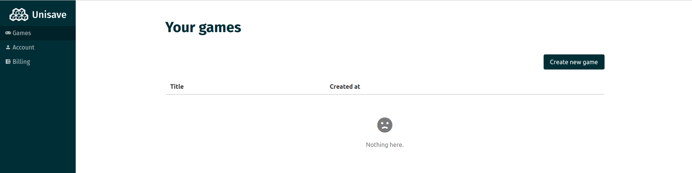
4. Click `Create new game` and type in a name.
5. You will be redirected to the **Development Console** of your newly created game:
    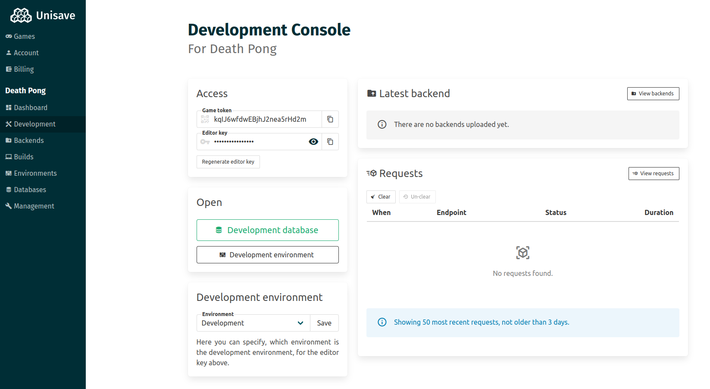

Keep this page open in your browser, you will need to copy the `Game Token` and `Editor Key` to your Unity project later - see [Connect project with the cloud](#connect-project-with-the-cloud).

## Import the Unity asset

1. Open the [Unisave Asset](https://assetstore.unity.com/packages/slug/142705) page and click the **Add to My Assets** button:
    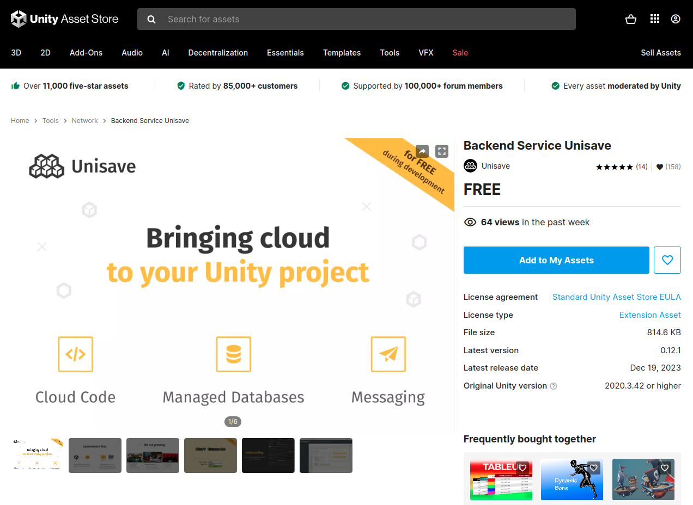
2. Open your game project in the Unity editor.
3. Open the **Package Manager** window by going to menu `Window > Package Manager`.
4. Open `Backend Service Unisave` asset, click on the **Download** button and then the **Import** button in the lower-left corner:
    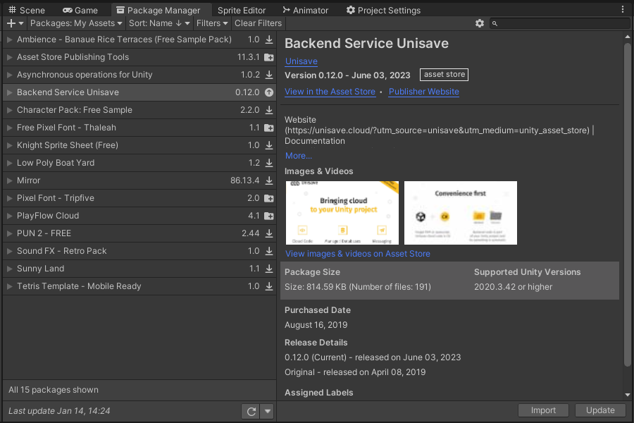
5. Import all the files:
    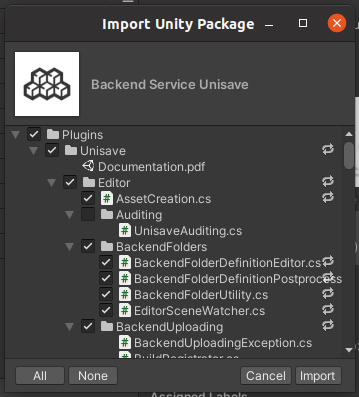

### Connect project with the cloud

1. When the import finishes, the **Unisave Window** should open. If not, open it from the menu `Tools > Unisave > Unisave Window`:
    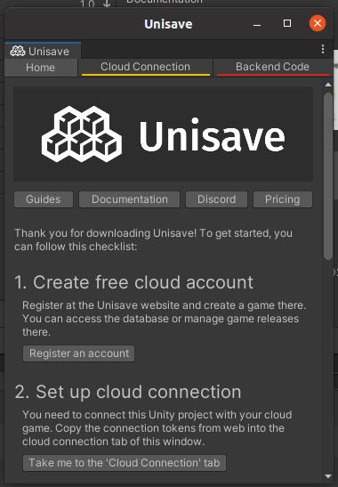
2. Click on the **Cloud Connection** tab and fill out the `Game Token` and `Editor Key` from the cloud **Development Console** website (see [Create a cloud account](#create-a-cloud-account)):
    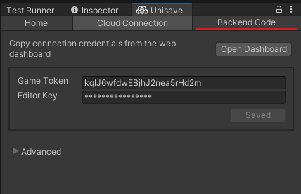
3. The backend code (the code of your game's backend server) should be uploaded automatically, but sometimes this system gets confused (especially during configuration changes). In these cases you can go to the **Backend Code** tab, and click the manual **Upload** button:
    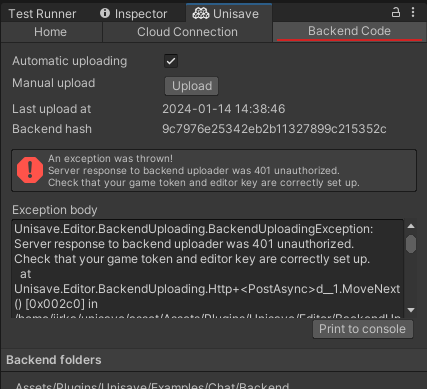
4. In this case the manual upload worked and the backend code was successfully compiled. Now the automatic upload system should work, and if not, you will be notified in the Unity console. If the error persists, read the error message - you can see that (in this case) the error was due to the missing token and key.
    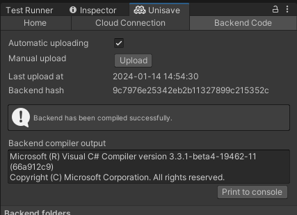

## Explore examples

Now you probably have a specific problem in mind, that you wish Unisave can solve for you. Your actions now differ based on that problem. You can look at the provided examples, but it's likely your problem is very specific and there will not be an example scene for it.

Either way, exploring these examples will give you an idea, how to build custom systems on top of Unisave. Read the next [Start building](#start-building) section to learn about backend folders and then the [Introduction](../introduction/introduction.md) documentation page, to learn about the structure of the Unisave platform, and which systems to use to achieve what goals. Maybe you don't have to build your feature from scratch, maybe there already is a module, ready to be configured and used.

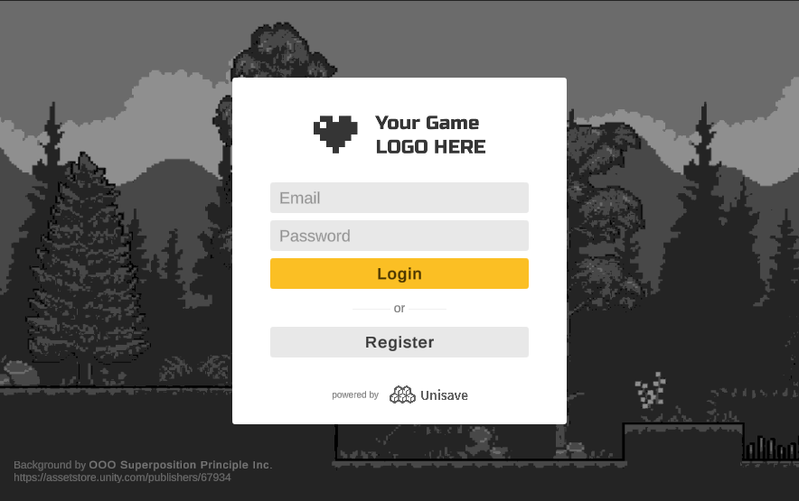

## Start building

The Unisave platform, at the lowest-level, is a platform that runs your backend servers, and gives you access to a database. Your role here is to build the backend server.

The backend server is a piece of software, that runs in the cloud, accepts requests from your game clients (the game you build in Unity Editor), manages the data stored in the database, and communicates with external services.

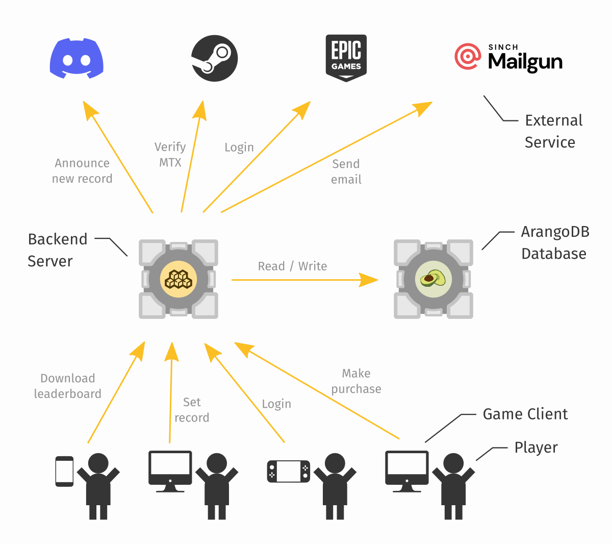

> **Note:** You can view Unisave as a [FaaS](https://en.wikipedia.org/wiki/Function_as_a_service) service, together with a [DBaaS](https://en.wikipedia.org/wiki/Cloud_database) service, with a few other auxiliary functionalities, such as code deployment.

The backend server is written in C# and is part of your Unity project. The code is placed in so-called **Backend Folders**. It's the same as having your textures in a `Textures` folder, your code in a `Scripts` folder, you will have your backend scripts in a `Backend` folder. Here is the backend folder for the `Email Authentication` example:

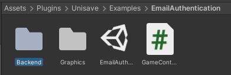

A backend folder can contain C# code used to accept game client requests (see [Facets](../facets.md)), code to interact with the database (see [Entities](../entities.md)), code to configure other Unisave modules (see [Bootstrappers](../bootstrapping.md)), or any other custom C# code. The only restriction is that the code cannot access client-side logic (e.g. `GameObject`s or `Component`s), because there's no such thing on the server.

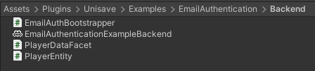

Because these folders are automatically uploaded to the cloud and compiled, they need to be identified somehow. This is done by creating a **Backend Folder Definition File** inside of the folder. The file can be called anything, you can see it here being named `EmailAuthenticationExampleBackend`.

### Create a backend folder

You will need at least one backend folder that contains your own backend code. Even if you only plan to use existing [Unisave modules](../modules.md), you still need this folder to configure the modules.

You can place it directly into your `Assets` folder. Simply create an empty folder named `Backend`:

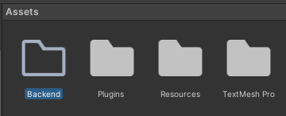

Then enter that folder, and create a **Backend Folder Definition File** by right-clicking, and choosing `Create > Unisave > Backend Folder Definition File`. You can call the file `MyBackend`.

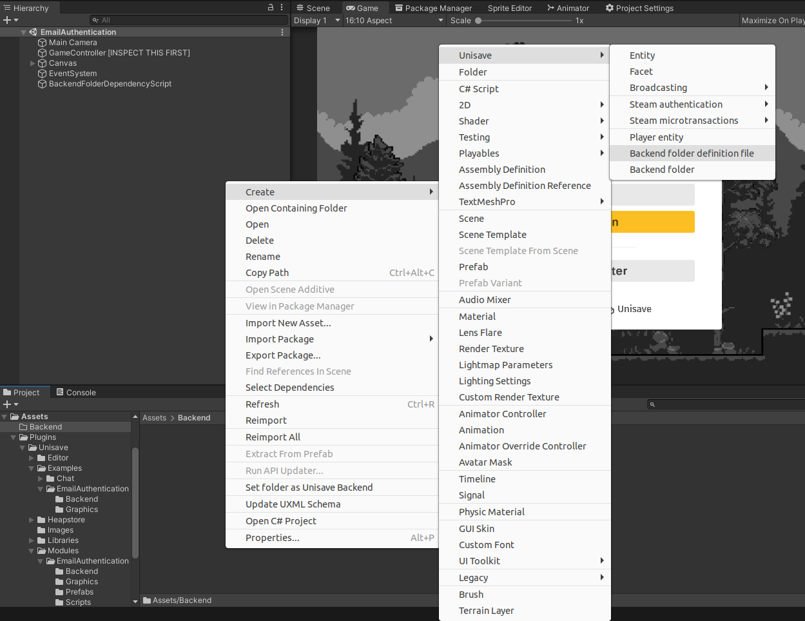

You can now create your own [Facets](../facets.md), [Entities](../entities.md), and other backend code in this folder.

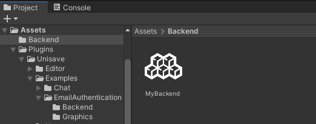

You can now proceed onto the [Introduction](../introduction/introduction.md) page.

## Updating the asset

Unity has a bit tricky asset updating. The problem is that it only adds and modifies files, it does not remove old files. This is a problem since Unisave asset is full of C# code and you want to remove deprecated files, otherwise, the update might break the Unisave asset.

**The best way to install an update is to delete the entire `Assets/Plugins/Unisave` folder and then to import the Unisave asset again.**

This asset updating behavior is rather weird but it has it's reasons so we just have to deal with it.

