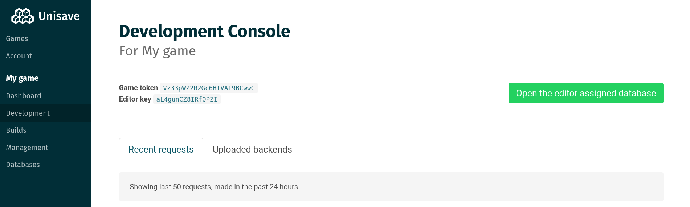
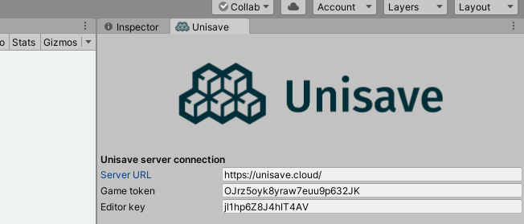
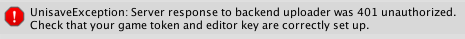
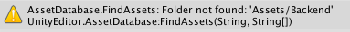

## Web application

Before you start working in Unity, you first need an account at [unisave.cloud](https://unisave.cloud/).

- Go to [https://unisave.cloud/](https://unisave.cloud/)
- Click `Sign Up` and fill out the form
- You will be redirected to the app at [https://unisave.cloud/app](https://unisave.cloud/app)
- Click `Create new game` and type in a name
- You be redirected to the *Development console* of your newly created game

Keep this page open in the browser since you will need it later. Now you can open up your Unity project.

## Unity asset setup

Inside the Unity editor with your project open, you will need to install the free Unisave asset from the asset store:

- Open your game project in the Unity editor
- Open the *Asset store* window by going to menu `Window > Asset Store`
- Search for `Unisave` and open <a href="https://assetstore.unity.com/packages/slug/142705" target="_blank">this asset</a>.
- Click `Download`, then `Import` and import all the files

Now you need to tell the *Unisave asset* how to connect to the cloud service. The asset needs to know the `Game token` and the `Editor key`, both of which can be found on the *Development* board of your game (see the image above).

In the Unity editor, open *Unisave preferences* window by clicking on menu `Window > Unisave > Preferences` and copy-paste values from the web application:

## Creating the backend folder

The `Backend` folder is the place where all of your Unisave related logic lives.

To create the `Backend` folder, simply right-click in the `Assets` folder and choose `Create > Unisave > Backend folder`.

> With the *Unisave asset* set up and the *backend folder* created, you can proceed to [the introduction](introduction). The following text explains updating and troubleshooting.

## Updating the asset

Unity has a bit tricky asset updating. The problem is that it only adds and modifies files, it does not remove old files. This is a problem since Unisave asset is full of C# code and you want to remove deprecated files, **otherwise, the update might break the Unisave asset.**

The best way to install an update is to remove the `Unisave` folder entirely and pull the new version. You will, however, have to set the `Game token` again. To preserve preferences, you can delete everything except the `Unisave/Resources` folder.

This asset updating behavior is rather weird but it has it's reasons so we just have to deal with it.

## Troubleshooting

**Missing token or key**

This error is shown when you have missing or incorrect `Game token` or `Editor key`. Open the *Unisave preferences* window and make sure they are present and correct.

**Missing backend folder**

This warning is shown when your `Backend` folder is missing. Or there's simply an incorrect path set in the *Unisave preferences* window.
