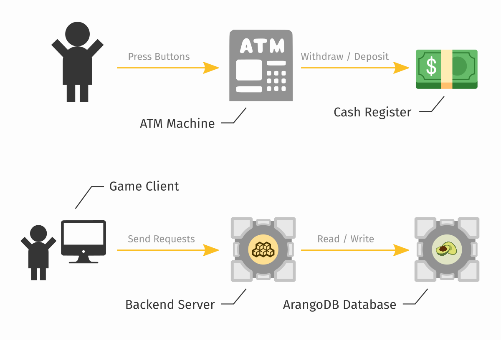
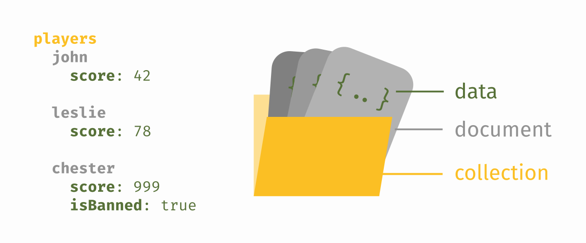
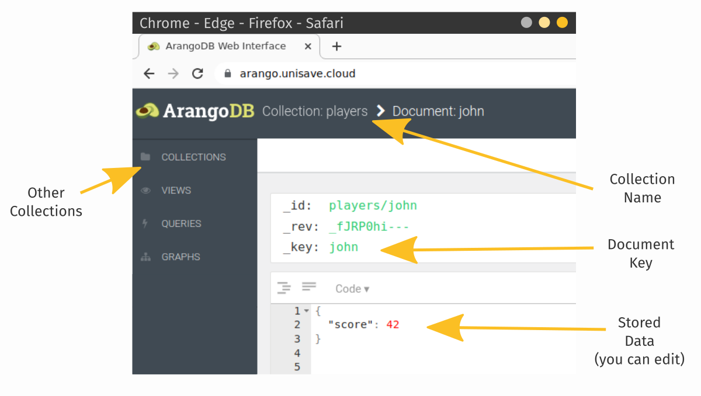
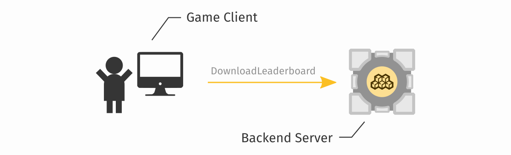
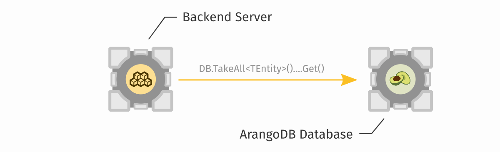
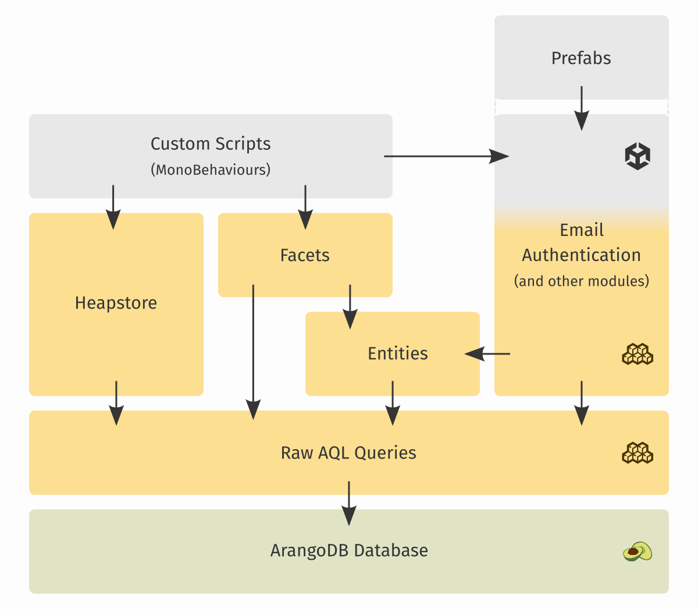
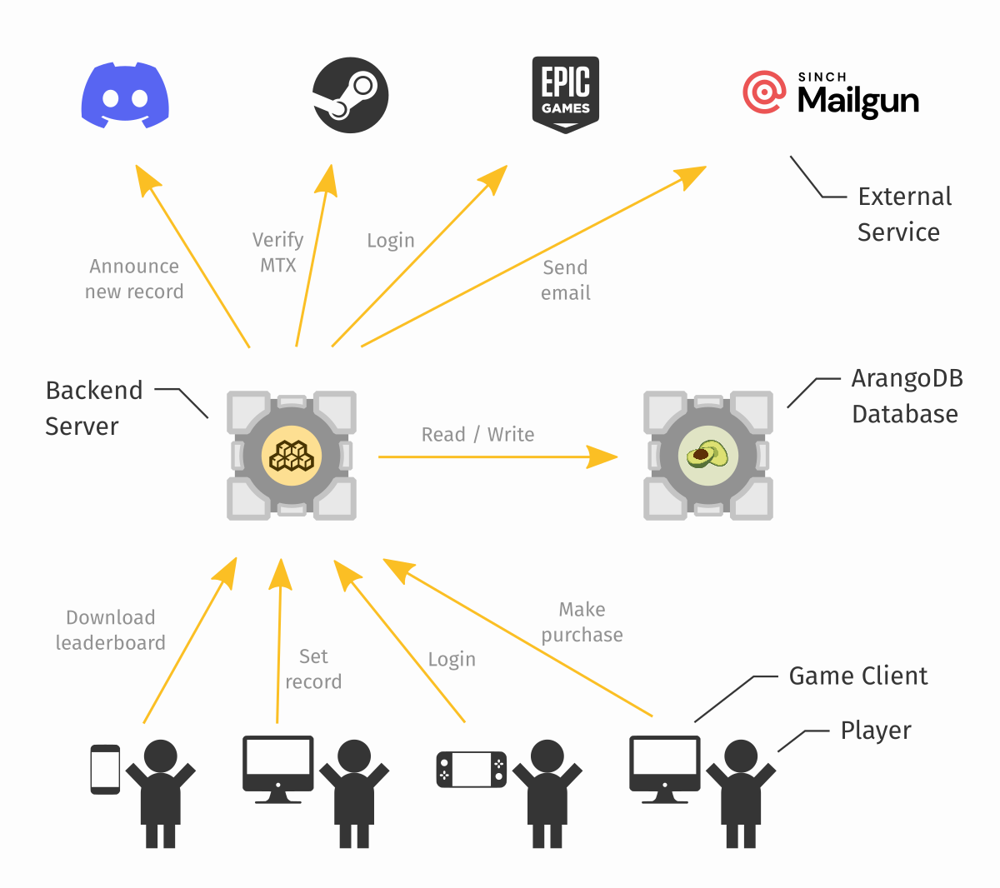

Using Unisave is all about building and operating your own backend server. There are many tools to build it, starting from ready-made drop-in modules, all the way down to low-level HTTP and databse requests. The modules get you going quickly, and can be configured, but when you need something special and custom, you have the low-level tools to build it from scratch.

But really, the most important thing about a backend system is the data in the database. The backend server is there only to manipulate the data. The database is the only component, that knows what players are registered, what they own, what they achieved. The database is like the cash register in an ATM, the backend server is like the screen and the buttons that dictate who and how can access that cash.



Therefore whenever you're designing some backend logic, always start with the data. What is going to be stored, how exactly, what values will be allowed, and what they mean.


## The database

Unisave uses the [ArangoDB](https://arangodb.com/) database to store your game data. The reason for this choice is briefly described in [an article I wrote](../../guides/why-not-to-build-game-backend-server-with-mysql-and-php/why-not-to-build-game-backend-server-with-mysql-and-php.md).

ArangoDB database organizes data into JSON documents, grouped into collections. You typically have one collection for each type of entity, say `players`, `bonus_codes`, `error_logs`, `leaderboard_records`.



Each document is a JSON object containing fields. The document is identified by a `_key` within the collection, or an `_id` within the database (`_id` is just the `_key` combined with the collection name). The `_key` is either set by you, or automatically generated by the database. Documents inside a collection usually have the same fields (the same structure), but it's not necessary and may vary within a collection (say, for a `configuration` collection).

Here is an example document representing a player:

```json
{
    "_key": "chester",
    "_id": "players/chester",
    "score": 999,
    "isBanned": true
}
```


### Aardvark

When you log into the cloud dashboard, you can view and edit your game database through an ArangoDB interface called Aardvark:




## The backend server

Your backend server stands between your game clients and your database. Its responsibility is to handle client requests (say, setting a new leaderboard record) and use and modify the database accordingly (say, add new record to the `leaderboard_records` collection and send back the top 10 records).

The code responsible for receiving and processing client requests is called [Facets](../facets.md). Public methods on a facet class can be called from the client over the Internet. Here is an example facet class, that should be placed in your [Backend Folder](../installation/installation.md#create-a-backend-folder):

```cs
using System;
using System.Collections.Generic;
using Unisave;
using Unisave.Facades;
using Unisave.Facets;

public class LeaderboardFacet : Facet
{
    /// <summary>
    /// Returns all the leaderboard records.
    /// </summary>
    public List<LeaderboardRecordEntity> DownloadLeaderboard()
    {
        // fetches all documents of the `leaderboard_records`
        // collection using the Entities system (see below)
        return DB.TakeAll<LeaderboardRecordEntity>().Get();
    }
}
```

You can call this facet method from a `MonoBehaviour` script like this:

```cs
using System;
using Unisave;
using Unisave.Facets;
using UnityEngine;

public class LeaderboardController : MonoBehaviour
{
    async void Start()
    {
        var records = await this.CallFacet(
            (LeaderboardFacet f) => f.DownloadLeaderboard()
        );
        
        foreach (LeaderboardRecordEntity r in records)
            Debug.Log(r.nickname + ": " + r.score);
    }
}
```

This is what is happening on the diagram from the top of this page. A game client code (a `MonoBehaviour`) is making a request (a [Facet call](../facets.md)) to your backend server, to the `LeaderboardFacet` class:



The `LeaderboardFacet` uses the [Entities](../entities.md) system to communicate with the ArangoDB database. To work with the data in C#, we need to create a new class, called an entity, that will be used to facilitate this communication:

```cs
using System;
using Unisave;
using Unisave.Entities;

[EntityCollectionName("leaderboard_records")]
public class LeaderboardRecordEntity : Entity
{
    /// <summary>
    /// Nickname of the record holder
    /// </summary>
    public string nickname;

    /// <summary>
    /// The achieved score
    /// </summary>
    public double score;
}
```

Entities let us easily work with the database from backend code:

```csharp
// get all documents
var records = DB.TakeAll<LeaderboardRecordEntity>().Get();

// get only some documents
var records = DB.TakeAll<LeaderboardRecordEntity>()
    .Where(e => e.score >= 10_000)
    .Get();

// create a new document
var r = new LeaderboardRecordEntity {
    nickname = "John",
    score = 42
};
r.Save();
```

Looking back at our diagram, this is how our `LeaderboardFacet` uses entities to download the documents from the database, before returning them back to the client:




### Systems and modules

[Entities](../entities.md) and [facets](../facets.md) are not the only way, how to build a backend server. In-fact, they are one of the more low-level systems that you use to build a feature from scratch. In practise, there are [modules](../modules.md), like [Email Authentication](../email-authentication/email-authentication.md), that you use to add larger pieces of functionality to your game quickly. Then you use entities and facets only to tie these modules together and to add your custom specific features. Try going through the list of [modules](../modules.md) in to documentation, to see what's available.

> **Note:** If the module you want does not exist, chances are there are other people who would like such a module as well. You can build such a module yourself and distribute or sell it via the Unity Asset Store.

Modules are designed to provide a specific feature, or to solve a specific problem. Unisave also has systems/modules that are more general-purpose and may be used to build your backend server in a different way to the entities and facets systems. The two notable are:

- [Raw AQL queries](../database.md): These let you access the ArangoDB database at the lowest-level possible. If you hit a limitation of the entities systems, you can always find a solution by writing a custom AQL query. Using custom queries may also be necessary in performace critical cases. The entity system is actually built on top of this layer.
- [Heapstore](../heapstore.md): Heapstore lets you access the database directly from your client code, skipping the need for writing custom facets or entities. This makes it very convenient to write simple logic and to draft out ideas. The data-access is protected by writing security rules. You can use Heapstore alongside other systems, since at the end, all the systems just edit the database contents. While easy to use, it's also limited in its features and you might find it necessary to resort back to facets and entities/AQL-queries for more complex logic. Also, it's heavily inspired by Firebase.



As you can see on the diagram, high-level feature-based modules, such as [Email Authentication](../email-authentication/email-authentication.md) can be used by dragging-in prefabs and they handle everything all the way to the database. But they can't be used to build anything else, other than what they provide. Whereas more general-purpose, lower-level systems, like facets and entities, only focus on a little part of the backend server. But they can be used to build any custom system.

Also, don't forget that Unisave is not only about the database but also about connecting external services.




## Where to go next

Now you can continue to a multitude of places, depending on your needs:

- Browse [modules](../modules.md), to see if there already is a solution for your problem.
- Read [guides](../../guides/index.html) to learn how to build custom features.
- Read more on [facets](../facets.md) and [entities](../entities.md) to learn in what ways they can be used.
- Read about the [authentication system](../authentication.md), to see how all the authentication modules yield control back to you, once a player becomes logged-in.
- If you want to communicate with external services, use the [HTTP client](../http-client/http-client.md).
- Try to see if [Heapstore](../heapstore.md) does not fit your problem best, instead of facets and entities.

You can start by reading the [How to store player data online with Unity](../../guides/how-to-store-player-data-online-with-unity/how-to-store-player-data-online-with-unity.md) guide.
