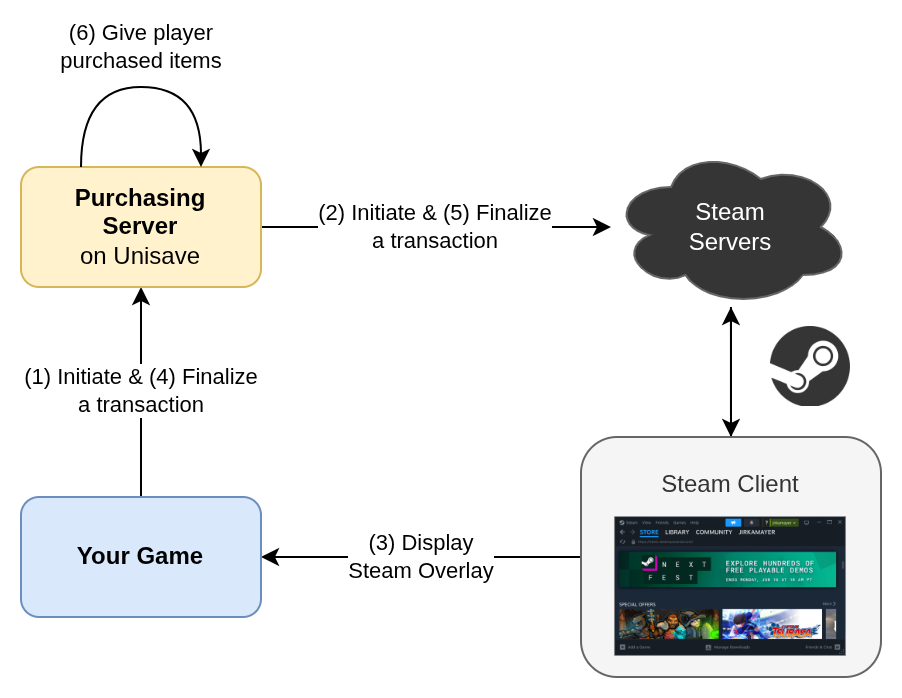
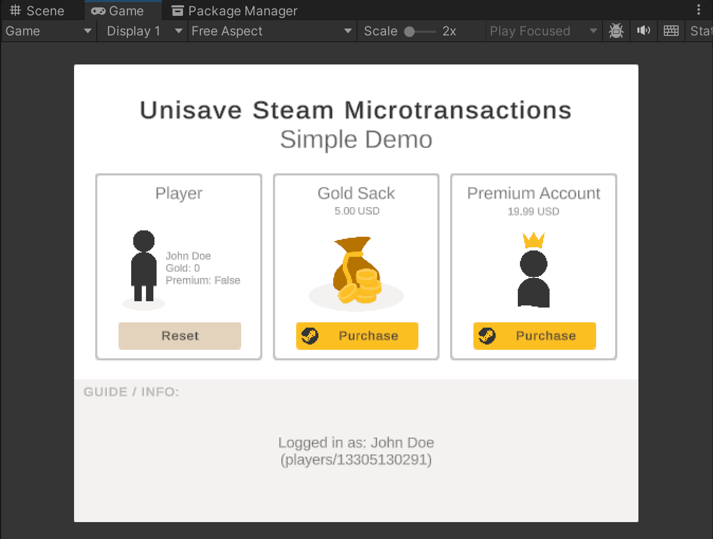

Steam is an online marketplace for selling and distributing games. It also offers a microtransactions service where you can let players purchase virtual goods through Steam's payment gateway directly inside your game. The integration requires a secure backend server (called the purchasing server) to validate and perform these purchases. This module lets you quickly set up this purchasing server on the Unisave platform.

> **Version:** `1.0.0`<br>
> **Unisave:** `0.14.1` or higher<br>
> **Download:** TODO, asset name: "Unisave Microtransactions for Steam"<br>
> **GitHub:** [unisave-cloud/steam-microtransactions](https://github.com/unisave-cloud/steam-microtransactions)<br>


## Module overview

A new transaction starts with the player clicking some `[Buy]` button in the UI. First a transaction proposal object is created, which describes the products the player wants to purchase. This proposal is given to this module code which triggers the whole Steam checkout flow. The Steam overlay is displayed, where the player authorizes and pays for the transaction. Then on the server-side, your custom code is called that grants the purchased goods to the player. This completes the transaction.

<!-- https://drive.google.com/file/d/1CRZQYzwO3LHWV34yi8bimTnevfJPw-7W/view?usp=drive_link -->


This flow has a few prerequisites:

- **Player authentication:**  Some player must be authenticated, so that we know who is doing the purchase and therefore whom the purchased products should be given to.
- **Server-side player data:** The player-related data, such as the owned in-game items, must be stored in the backend server, because the product-granting logic is executed on the server as part of the checkout flow.

These two conditions, while recommended, are not strictly necessary. This module can be also used for single-player games, you will just loose the verification logic and player data security. You still need the purchasing server though, because it needs to store the Steam API keys and perform transaction auditing. For more information for single-player and/or offline games, see the [Client-side player data](#client-side-player-data) section.

To learn more about the Steam part of this module, you can read the Steam's [Microtransactions Implementation Guide](https://partner.steamgames.com/doc/features/microtransactions/implementation).


## Installation

First, you should have Unisave installed in your Unity project with backend uploading set up and working. If not, see the [installation instructions](../installation/installation.md).

Then, since this is a Steam integration, you also need to have the [Steamworks.NET](https://github.com/rlabrecque/Steamworks.NET) library installed. Follow the [Installing Steamworks in Unity](../../guides/installing-steamworks-in-unity/installing-steamworks-in-unity.md) checklist to get it ready.

Now you can import this Unisave module as a Unity asset:

- TODO: from the asset store
- from the `.unitypackage` downloaded from the [GitHub releases page](https://github.com/unisave-cloud/steam-microtransactions/releases)

The `SteamMicrotransactionsModule` backend folder included in the asset should be now enabled for backend uploading and the backend server should compile fine.

The example scene will require *Text Mesh Pro* to be installed, which can be done via menu `Window > TextMeshPro > Import TMP Essential Resources`, but this is optional.


## Environment variables

Before the purchasing server can be used, it must be configured via these [environment variables](../environments.md):

```bash
STEAM_API_URL=https://partner.steam-api.com/
STEAM_APP_ID=480
STEAM_PUBLISHER_KEY=secret
STEAM_USE_MICROTRANSACTION_SANDBOX=false
```

You need to specify your App ID and [publisher web API key](https://partner.steamgames.com/doc/webapi_overview/auth). The Steam API URL is set to a sensible default and the last `STEAM_USE_MICROTRANSACTION_SANDBOX` specifies whether to use the [testing sandbox that Steam provides](https://partner.steamgames.com/doc/webapi/ISteamMicroTxnSandbox) when making transaction requests.

You should start in the sandbox mode when testing the integration so as to not get charged real money for testing microtransactions.


## Describing products

The module uses custom C# classes to describe virtual products that can be purchased. In your own backend folder, create a new C# class with this content and modify it appropriately:

```csharp
using System.Collections.Generic;
using Unisave.Facades;
using Unisave.SteamMicrotransactions;

public class LargeDiamondChestProduct : SteamProduct
{
    public override uint ItemId => 1;

    public override IReadOnlyDictionary<string, decimal> UnitCost
        => new Dictionary<string, decimal> {
            ["USD"] = 5.00m, // "m" means "decimal type"
            ["EUR"] = 4.25m
        };

    public override IReadOnlyDictionary<string, string> Description
        => new Dictionary<string, string> {
            ["en"] = "Large chest with 500 diamonds.",
            ["de"] = "Große Truhe mit 500 Diamanten."
        };

    public override string Category => null;

    public override void GiveToPlayer(int quantity)
    {
        // get the logged-in player
        var player = Auth.GetPlayer<PlayerEntity>();
        
        // and give him the diamonds
        // quantity is the number of chests purchased, usually 1
        player.diamonds += 500 * quantity;
        player.Save();
    }
}
```

When a transaction is being proposed, it lists names of these `SteamProduct` classes and quantities of each, that the player wishes to purchase. The data here is used to get the localized description texts, prices, and other metadata about the product.

The class needs to define these members:

- `ItemId`: Custom numeric identifier for the product (item). Steam stores this number to identify the product in a transaction.
- `UnitCost`: Prices in currencies you want to support. The currencies are ISO 4217 codes and the list of possible currencies is [listed in the Steam documentation](https://partner.steamgames.com/doc/store/pricing/currencies).
- `Description`: Human-readable descriptions in languages you want to support. They are displayed in the Steam overlay during checkout and you can also use them in your own in-game UI. The keys are ISO 639-1 language codes and the list of possible currencies is [listed in the Steam documentation](https://partner.steamgames.com/doc/store/localization/languages).
- `Category`: Optional category name for the item. The value is used by Steam to group sales data in the web reporting dashboard. The value is never displayed to the player.

The `GiveToPlayer` method is called at the end of a successful checkout flow, once for each purchased product, and its purpose is to grant the purchased product to the player. This method is called on the server. The argument given to the method is number of times the product was present in the transaction, although usually just once.

There is also an asynchronous variant `Task GiveToPlayerAsync(...)`, which you can use instead if need to await some call. But be careful, each non-reliable slow operation here can cause the function to crash, which would result in the player paying for a product they have not received (the crash).

If you need to access services from the [service container](../service-container.md) here, you can ask for them in the `SteamProduct` constructor via arguments (just like in facets).


## Downloading product info

The `SteamProduct` described above is a server-only object and cannot be sent to the client. Instead, a snapshot called `LocalizedProductInfo` should be sent to the client to be displayed in the user interface. This allows the server to be the source of ground truth data, as well as being able to specify some product properties via environment variables or some in-database configuration object.

When you want to fetch this snapshot from the client, you can use this extension method:

```csharp
using UnityEngine;
using Unisave.SteamMicrotransactions;

public class MyTransactionsClient : MonoBehaviour
{
    private LocalizedProductInfo diamondsInfo;

    async void Start()
    {
        diamondsInfo = await this.DownloadProductInfo<
            LargeDiamondChestProduct
        >(
            currency: "USD",
            language: "en"
        );

        Debug.Log(diamondsInfo.Description);
        Debug.Log(diamondsInfo.UnitCost);
    }
}
```

The C# extension method becomes available after you add `using Unisave.SteamMicrotransactions;` to your file.

The returned `LocalizedProductInfo` contains analogous fields as are specified in the `SteamProduct` above, just in one language and currency. It also contains the name of the specific `SteamProduct` type.


## Making a transaction

To initiate a transaction from the client, there is the `DoSteamCheckoutFlow` extension method that accepts a transaction proposal and then performs the whole checkout flow:

```csharp
using UnityEngine;
using Unisave.SteamMicrotransactions;

public class MyTransactionsClient : MonoBehaviour
{
    private LocalizedProductInfo diamondsInfo;

    async void OnBuyDiamondsClicked()
    {
        // Prepare the transaction.
        var transactionProposal = SteamTransactionEntity.NewProposal(
            playerSteamId: SteamUser.GetSteamID().m_SteamID,
            language: "en",
            currency: "USD"
        );
        transactionProposal.AddItem(diamondsInfo, quantity: 1);

        // Run the checkout flow.
        CheckoutFlowResult flowResult = await this.DoSteamCheckoutFlow(
            transactionProposal
        );

        // The player just closed the Steam Overlay without paying.
        if (flowResult.WasAborted)
        {
            Debug.Log("Player aborted the transaction.");
            return;
        }

        // There was some problem with the transaction.
        if (flowResult.WasError)
        {
            Debug.LogError(flowResult.ErrorMessage);
            return;
        }

        // The purchase was successful.
        Debug.Log("Success!");
    }
}
```

First, the transaction is proposed, by creating an in-memory instance of the `SteamTransactionEntity` that will be sent to the server to be stored in the database for auditing and then its checkout flow will be initiated. The transaction needs to know the Steam player making the purchase, which is the first argument. Then we specify the language and the currency. This must match the localization specified when fetching the `LocalizedProductInfo` earlier. Then we add one product into the transaction via the `.AddItem` method. Multiple different items can be added by calling the method multiple times.

Then the `DoSteamCheckoutFlow` method launches the complex checkout flow. It will trigger the Steam overlay which asks the player to authorize the transaction. The result of this minute-long process is returned as a `CheckoutFlowResult`.

This result has to be inspected to inform the player appropriately. It can end in three outcomes:

1. The player authorized the transaction and it succeeded.
2. The player cancelled the checkout flow, in which case the `WasAborted` value will be `true`. This is not an error, although a record about the attempted transaction will remain in the audit log.
3. Something unexpected failed, in which case the `WasError` value will be `true`. The `ErrorMessage` should be displayed to the player so that he can take a screenshot and report the problem. The `SteamTransactionEntity` stored in the database will also contain the error message, unless the error was fully client-side (e.g. network outage).

After this process, the transaction was completed and the product was granted to the player. Now you should reload the player data from the server to reflect the new state of his inventory in the UI.


## Problems with Unity editor and Steam overlay

The interaction between your game and Steam is quite complex. It is described in this [Installing Steamworks in Unity](../../guides/installing-steamworks-in-unity/installing-steamworks-in-unity.md) guide. The important part is that the Steam overlay that the player interacts with during checkout is actually part of the same process that is your game. At the same time, when developing your game, the Unity Engine is also the same process as your game. This creates issues when testing this module from inside Unity. The end result is that **you cannot test steam microtransactions inside the Unity Editor.**

If you try, you will get random failures. Either the transaction just hangs and the Steam overlay won't open, or you may get an error response like this form Steam servers:

```
Steam rejected transaction initiation.
[7] User 123456789 not logged in
Order ID: 123456789
```

Luckily, there are hacks to get around this issue. I've described the testing procedure in a separate guide called [Testing Steam Overlay with the Unity Editor](../../guides/testing-steam-overlay-with-the-unity-editor/testing-steam-overlay-with-the-unity-editor.md).


## Demo scene walkthrough

The Unity asset also comes with a project `Examples/SimpleDemo` with this structure:

```
Assets/Plugins/UnisaveSteamMicrotransactions/Examples/SimpleDemo/
    Backend/
        PlayerEntity.cs
        DummyAuthFacet.cs
        GoldSackProduct.cs                <-- SteamProduct
        PremiumAccountProduct.cs          <-- SteamProduct
        ...
    Graphics/
        ...
    ExamplePurchasingController.cs        <-- MonoBehaviour
    SimpleDemo                            <-- scene
```

It defines two products, `GoldSackProduct` and `PremiumAccountProduct`. These are `SteamProduct`s, as described above in section [Describing products](#describing-products). The player is defined by the `PlayerEntity` and it stores only the name, gold coins, and a boolean flag for the premium account. The `DummyAuthFacet` is a fake [authentication system](../authentication.md) that always logs you in as the `John Doe` player, creating him if necessary.

The scene is controlled by a single script `ExamplePurchasingController`, which first confronts you with a dummy login button to initiate the Unisave session and then presents you with the two products to buy, as well as the current state of the player:



You can start by reading the `ExamplePurchasingController` script. Its structure directly follows from the sections at the beginning of this documentation:

- [Downloading product info](#downloading-product-info)
- [Making a transaction](#making-a-transaction)

The purpose of the demo scene is to show you these code snippets put together into a single, coherent codebase.

Due to the [issues with Steam Overlay in Unity](#problems-with-unity-editor-and-steam-overlay) you cannot test the example project in Unity. Instead, set up the connection to Unisave and upload the backend. Then add the scene to the build settings and build the game. Lastly, upload the game to Steam and launch it via the Steam client. Then you will be able to see the project working.


## Steam transaction entity

The module stores all transactions passed to the `DoSteamCheckoutFlow` in the database in the `steam_microtransactions` collection. Each transaction has a corresponding instance of the `SteamTransactionEntity`.

The entity stores all the metadata about the transaction, as well as its progress through the checkout flow. These are the fields present:

- `string State`: State in which the entity is. Identifies the progression through [the checkout flow](#the-checkout-flow).
- `ulong PlayerSteamId`: SteamID of the player that initiated the transaction.
- `string UnisavePlayerId`: ID of the authenticated Unisave player at the time the transaction was created. Equals the `PlayerEntity` ID. Can be `null` if nobody was authenticated. Obtained via [`Auth.Id()`](../authentication.md).
- `ulong OrderId`: Our custom identifier used to pair up transaction initiation with finalization for Steam. Generated randomly by the module logic.
- `ulong TransactionId`: Steam-generated identifier for the transaction.
- `string Language`: Chosen language for the transaction.
- `string Currency`: Chosen currency for the transaction.
- `List<SteamTransactionItem> Items`: Items being purchased by the player.
- `string ErrorCode`: Steam error code, if Steam killed the transaction for some reason, `null` otherwise. See [the list of codes](https://partner.steamgames.com/doc/features/microtransactions/implementation#error_codes).
- `string ErrorDescription`: Human-readable description for the error code above. Only present for Steam errors, not for code-exceptions.
- `JsonObject Exception`: Serialized exception, if an unexpected code-exception was raised, both on the server, or the client. Set to `null` if no exception occured.
- `string StateBeforeException`: Stores the value of `State` field before an code exception was raised.

The `SteamTransactionItem` has these fields that come from the corresponding `SteamProduct` and are frozen in place in the entity for auditing reasons:

- `uint ItemId`
- `decimal UnitCost`
- `string Description`
- `string Category`
- `string ProductTypeClassName` (name of the `SteamProduct` class)

The `SteamTransactionItem` also contains these additional fields:

- `int Quantity` Number of times the product is present in the transaction.
- `int TotalAmountInCents` Computed from unit cost and quantity and kept here for auditing, because this is the value that's actually sent to Steam to be used as the price to be paid.

Transaction entities are supposted to be manipulated only from the module's code, you should not change them manually. But you can run queries on them to get insights into the purchasing patterns of your players, as well as to debug any issues with the checkout flow.


## The checkout flow

When you call the `DoSteamCheckoutFlow` method, the behaviour encapsulated within it is quite complex. The `SteamTransactionEntity` is stored and periodically updated, as it passes through its states:

<!-- https://drive.google.com/file/d/1CRZQYzwO3LHWV34yi8bimTnevfJPw-7W/view?usp=drive_link -->


These states represent major transitions in the checkout flow. This flow is fully captured by the following diagram:

<!-- https://drive.google.com/file/d/1CRZQYzwO3LHWV34yi8bimTnevfJPw-7W/view?usp=drive_link -->


The colors in this diagram correspond to who performs what actions. Blue is your own code, yellow is this module's code, and gray is Steam's code. Green corresponds to the ArangoDB database.

If you observe entities in your database, that got stuck in some state which is not `complete` or `aborted`, this diagram can point you to the place that's causing the issue. However, note that some entities will always end up in unexpected states, as sometimes, a network outage, PC crash, or player walking away from the checkout process for 5 hours may cause the transaction to stall in some intermediate state without there really being a bug.

Both the sever-side and client-side code of the module are covered by try-catch blocks, which capture any unexpected failures that may occur. Especially in the user code that grants players their purchased products. If such an exception occurs, the transaction transitions into the `exception` state and the state in which that exception occured is stored in the `StateBeforeException` field. But this will not capture all the faults, if the exception occurs on the client due to network connection, it very likely cannot be sent to the backend server to be stored. Similarly if the database crashes, it cannot be stored there either. But these are extreme examples.

Note that once the transaction has passed the `authorized` state, the player has been charged for money. If the transaction failed after that, **it will not be automatically refunded**. You must check at what stage the transaction failed and whether the products have been given to the player. Then either refund the transaction manually, give the player the products manually by editing the database, or negotiate something else with the player.


## Client-side player data

If your game does not use a backend server, or does not store player data online, this module can still be used. The only downside is that we have no protection against save file modifications and we cannot manually correct failed purchases because of the lack of access to the data.

The usage in this scenario is very similar to the regular one, except that the `GiveToPlayer` methods for our `SteamProduct`s will remain empty.

```csharp
using System.Collections.Generic;
using Unisave.Facades;
using Unisave.SteamMicrotransactions;

public class PremumAccountProduct : SteamProduct
{
    // ...

    public override void GiveToPlayer(int quantity)
    {
        // Nothing here.
        // Product will be given to the player on the client side.
    }
}
```

Then, at the client side, after we call the `DoSteamCheckoutFlow` and it returns a success, we give the player the products there, however, we wrap the code in the `GiveProductsToPlayerClientSide` so that the success or exception is sent to the server and we will know about every failed or successful transaction:

```csharp
using UnityEngine;
using Unisave.SteamMicrotransactions;

public class MyTransactionsClient : MonoBehaviour
{
    async void OnBuyPremiumClicked()
    {
        // Prepare the transaction.
        var transactionProposal = ...;

        // Run the checkout flow.
        var flowResult = await this.DoSteamCheckoutFlow(
            transactionProposal
        );

        // Handle errors.
        if (flowResult.WasAborted) { /* ... */ }
        if (flowResult.WasError) { /* ... */ }

        // Give premium account to the player, client-side.
        await this.GiveProductsToPlayerClientSide(flowResult, () =>
        {
            PlayerPrefs.SetInt("HasPremium", 1);
            PlayerPrefs.Save();
        });

        // The purchase was successful.
        Debug.Log("Success!");
    }
}
```

The process functions exactly as the server-side variant. All the transaction state transitions happen in the same way, except that there is one more transition from `completed` to `client-side-completed` after the client-side products are given to the player. If the code inside the `GiveProductsToPlayerClientSide` block raises an exception, it will mark the whole transaction as failed, due to exception. Note that **it will not refund the purchase**, you either must do that manually from Steam or resolve it somehow with the player.

The asset contains the `Examples/ClientSideData` example scene, which uses this client-side only player data persistence. Check out the `ClientSidePuchasingController.cs` script to learn more.


## Upgrading from v0.9.0

First, update your product definitions. Change parent class from `IVirtualProduct` to `SteamProduct`. Modify the `GiveToPlayer` method to apply the `quantity` argument appropriately (before, the method was called repeatedly, now it's called once with the parameter).

```csharp
// BEFORE
public class MediumGoldPack : IVirtualProduct
{
    /* ... */

    public void GiveToPlayer(SteamTransactionEntity transaction)
    {
        /* ... */
    }
}

// AFTER
public class MediumGoldPackProduct : SteamProduct
{
    /* ... */

    public override void GiveToPlayer(int quantity)
    {
        /* ... */
    }
}
```

Then, update the client code (making new transaction) according to the sections [Downloading product info](#downloading-product-info) and [Making a transaction](#making-a-transaction). Ideally completely remove the legacy `SteamPurchasingClient.cs` script, only scavenge parts of it that are your own code and put it into a new script file. There is a lot of code in that script that has now been moved into C# extension methods, such as the `DoSteamCheckoutFlow` method, which can be completely deleted.

Delete both of the old `SteamTransactionEntity.cs` and `SteamPurchasingServerFacet.cs`, they are re-implemented in the new module and require no modifications on your part.

To read the old v0.9.0 documentation for this module and orient yourself in your current legacy code, follow [this GitHub permalink](https://github.com/unisave-cloud/website/blob/0cb0348ac4ddc9ed8afbd6808531d6dbf7e81138/src/docs/steam-microtransactions.md).

Last change was in the database - the `e_SteamTransactionEntity` collection has been renamed to `steam_microtransactions` and the structure of these entities have been slightly modified. If you wish to move the old entities into the new collection, you can execute this AQL query:

```aql
FOR old IN e_SteamTransactionEntity
    LET new = {
        State: old.state,
        PlayerSteamId: old.playerSteamId,
        UnisavePlayerId: old.authenticatedPlayerId,
        OrderId: old.orderId,
        TransactionId: old.transactionId,
        Language: old.language,
        Currency: old.currency,
        Items: (FOR i IN old.items RETURN {
            ItemId: i.itemId,
            Quantity: i.quantity,
            UnitCost: TO_STRING((i.totalAmountInCents / 100) / i.quantity),
            TotalAmountInCents: i.totalAmountInCents,
            Description: i.description,
            Category: i.category,
            ProductTypeClassName: i.productClass,
        }),
        ErrorCode: old.errorCode,
        ErrorDescription: old.errorDescription,
        Exception: null,
        StateBeforeException: null,
        CreatedAt: old.CreatedAt,
        UpdatedAt: old.UpdatedAt,
    }
    UPSERT { OrderId: old.orderId }
        INSERT new
        UPDATE new
        IN steam_microtransactions
```

The query can be run multiple times and it will only insert each entity once, because it disambiguates transactions by their `OrderId`. You can just copy the query into the ArangoDB web interface and run it. After it runs and you can see the copied entities in the new `steam_microtransactions` collection, you can delete the old `e_SteamTransactionEntity` collection.
