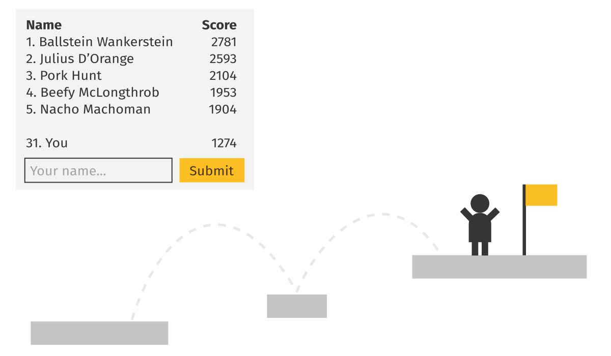
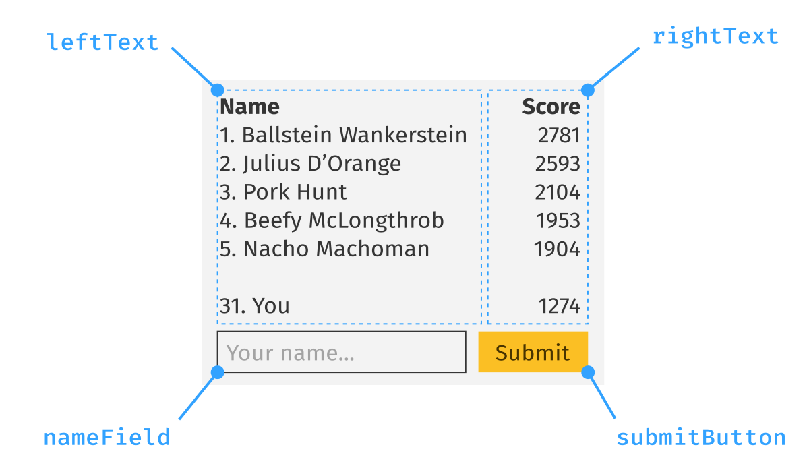

Leaderboards are an easy way to increase player engagement for any game. In this guide we will build a simple online leaderboard for a single-player game.


To store our leaderboard data in cloud, we will use the online service [Unisave](https://unisave.cloud/). Start by [setting it up](../../docs/installation/installation.md) in your Unity project.


## Our game

We will be adding leaderboards to a single-player game with levels. The player completes levels one after the other and at the end of each he finishes with some score. It's at this moment that we want to add the score to the leaderboard for that level, just before the player starts the next one.



This leaderboard code can easily be adjusted for any other game. The core concepts are going to be the same.

All the leaderboards are going to be represented in the database with a single collection of documents called `leaderboardRecords` and each record will look like this:

```json
{
    "leaderboardName": "Level 7",
    "playerName": "John",
    "score": 28.8
}
```


## User interface

Let's start from the user interface. Create two TextMeshPro 2D text [`TMPro.TextMeshProUGUI`](https://docs.unity3d.com/Packages/com.unity.textmeshpro@3.2/api/TMPro.TextMeshProUGUI.html) components, each with text aligned to one side like this:



We will use the left column to display player names and the right one to display scores.

Then below this, add an input field [`TMPro.TMP_InputField`](https://docs.unity3d.com/Packages/com.unity.textmeshpro@3.2/api/TMPro.TMP_InputField.html) with a Unity button [`UnityEngine.UI.Button`](https://docs.unity3d.com/Packages/com.unity.ugui@2.0/manual/script-Button.html). The input field will ask the player to enter the name and then submit the current score into the leaderboard by clicking on the button.

All of this will be controlled by a `LeaderboardController` script. This script should be attached to the leaderboard dialog window and become enabled when the window appears. This is its code:

```csharp
using System;
using System.Collections.Generic;
using System.Linq;
using TMPro;
using UnityEngine;
using UnityEngine.SceneManagement;
using UnityEngine.UI;
using Unisave.Facades;
using Unisave.Facets;
using Unisave;

public class LeaderboardController : MonoBehaviour
{
    // references to UI components,
    // must be set up manually in the inspector window
    public TextMeshProUGUI leftText;
    public TextMeshProUGUI rightText;
    public TMP_InputField nameField;
    public Button submitButton;

    // information about this level run
    private float currentScore;
    private string levelName;

    // state that controls the UI
    // (the snapshot is null while it's being downloaded)
    private LeaderboardSnapshot snapshot = null;
    private int? estimatedPosition = null;
    private bool scoreWasSubmitted = false;

    void Start()
    {
        submitButton.onClick.AddListener(SubmitScore);
    }

    // when the leaderboard dialog window is displayed
    async void OnEnable()
    {
        // dummy code,
        // pull the number from your score tracking script instead
        currentScore = UnityEngine.Random.Range(0.0f, 1000.0f);

        // dummy code,
        // pull this from your level naming system
        levelName = SceneManager.GetActiveScene().name;

        // reset the UI state and re-render
        snapshot = null;
        estimatedPosition = null;
        scoreWasSubmitted = false;
        Render();

        // download the leaderboard and re-render
        snapshot = await this.CallFacet(
            (LeaderboardFacet f) => f.DownloadSnapshot(
                levelName
            )
        );
        estimatedPosition = await this.CallFacet(
            (LeaderboardFacet f) => f.EstimatePosition(
                levelName,
                currentScore
            )
        );
        Render();
    }

    // when the submit button is clicked
    async void SubmitScore()
    {
        // forget the old snapshot and download the new one
        snapshot = null;
        scoreWasSubmitted = true;
        Render();

        // submit the score and download the new snapshot
        await this.CallFacet(
            (LeaderboardFacet f) => f.SubmitScore(
                levelName,
                nameField.text,
                currentScore
            )
        );
        snapshot = await this.CallFacet(
            (LeaderboardFacet f) => f.DownloadSnapshot(
                levelName
            )
        );
        Render();
    }

    ///////////////////////
    // UI Rendering code //
    ///////////////////////

    // Updates the UI based on the state
    void Render()
    {
        if (snapshot == null || estimatedPosition === null)
        {
            RenderLoading();
            RenderSubmitUI(isVisible: false);
        }
        else
        {
            RenderLeaderboard();
            RenderSubmitUI(isVisible: !scoreWasSubmitted);
        }
    }

    void RenderLoading()
    {
        leftText.text = "<b>Name</b>\n\nLoading leaderboard...";
        rightText.text = "<b>Score</b>";
    }

    void RenderLeaderboard()
    {
        // get a copy of the top 5 records
        // (the server sent us top 100 records, we only show top 5)
        List<(string, float)> renderedRecords = snapshot.topRecords
            .Take(5)
            .ToList();

        // if the leaderboard is too empty, add dummy records
        // to make sure our table always has 5 rows
        while (renderedRecords.Count < 5)
            renderedRecords.Add(("---", 0.0f));
        
        // render the table header
        leftText.text = "<b>Name</b>\n";
        rightText.text = "<b>Score</b>\n";

        // render table rows
        int i = 1;
        foreach ((string name, float score) in renderedRecords)
        {
            // 1. Alice       123
            // 2. Peter       123
            leftText.text += i + ". " + name + "\n";
            rightText.text += Mathf.RoundToInt(score) + "\n";
            
            i += 1;
        }

        // show the estimated position
        leftText.text += "\n" + estimatedPosition.Value + ". You";
        rightText.text += "\n" + Mathf.RoundToInt(currentScore) + "\n";
    }

    void RenderSubmitUI(bool isVisible)
    {
        nameField.gameObject.SetActive(isVisible);
        submitButton.gameObject.SetActive(isVisible);
    }
}
```

The controller code calls a server-side [facet](../../docs/facets.md), which is described in another section below.

The controller code consists of three sections: the state, actions, and UI rendering. The state holds the downloaded leaderboard snapshot, as well as the estimated position within the leaderboard for the current score. When this information is still being downloaded from the server, they both have `null` values. There is also the `scoreWasSubmitted` field, which remembers whether to display the submit button or not.

There are two actions, `OnEnable` and `SubmitScore`. The first is tied to the dialog openning and it performs the initial leaderboard download. The second one is called after the button click and it submits the score into the leaderboard and downloads the updated leaderboard snapshot.

The UI rendering code is pretty boring. It just configures the UI components to reflect the current values in the state fields. It should be called every time the state changes to keep the UI in sync with the state.


## Leaderboard facet

A [facet](../../docs/facets.md) is a class that lives on the server and has access to the cloud database. We now need to define the `LeaderboardFacet` that we call from the controller above via the `this.CallFacet(...)` syntax. Calling a facet is an asynchronous operation (it takes a fraction of a second), so to prevent our game from freezing while the call is pending, we use the async-await syntax. If you've never seen this, read the [Async-Await for Dummies](../async-await-for-dummies/async-await-for-dummies.md) guide.

The facet has three public methods: `DownloadSnapshot` to get the top-100 records; `EstimatePosition` to get the position of a new score; and `SubmitScore` to insert or update a record.

But first, we need to define the data class that is returned by the `DownloadSnapshot` method - the `LeaderboardSnapshot` class. Create this class inside your [backend folder](../../docs/installation/installation.md#create-a-backend-folder), so that it is accessible from both the UI code and the server code.

```csharp
using System.Collections.Generic;

public class LeaderboardSnapshot
{
    /// <summary>
    /// Name of the leaderboard this snapshot represents.
    /// </summary>
    public string leaderboardName;

    /// <summary>
    /// Top 100 records of the leaderboard. May be less
    /// if the leaderboard has not grown enough yet.
    /// May be empty if the leaderboard is empty.
    /// </summary>
    public List<(string, float)> topRecords;
}
```

Now we can define the facet that produces this snapshot:

```csharp
using System;
using System.Collections;
using System.Collections.Generic;
using Unisave;
using Unisave.Facets;
using Unisave.Facades;

public class LeaderboardFacet : Facet
{
    public LeaderboardResponse DownloadLeaderboard(
        string leaderboardName
    )
    {
        List<(string, float)> topRecords = DB.Query(@"
            FOR r IN leaderboardRecords
                FILTER r.leaderboardName == @leaderboardName
                SORT r.score DESC
                LIMIT @k
                RETURN [r.name, r.score]
        ")
            .Bind("leaderboardName", leaderboardName)
            .Bind("k", 100) // take top 100 records
            .GetAs<(string, float)>();
        
        return new LeaderboardSnapshot {
            leaderboardName = leaderboardName,
            topRecords = topRecords
        };
    }

    // 1-based leaderboard position
    private int EstimateScorePosition(
        string leaderboardName, float score
    )
    {
        return DB.Query(@"
            FOR r IN leaderboardRecords
                FILTER r.leaderboardName == @leaderboardName
                FILTER r.score > @score
                COLLECT WITH COUNT INTO length
                RETURN length
        ")
            .Bind("leaderboardName", leaderboardName)
            .Bind("score", score)
            .FirstAs<int>() + 1; // zero-index to one-index
    }

    public void SubmitScore(
        string leaderboardName, string playerName, float score
    )
    {
        var oldRecord = DB.TakeAll<LeaderboardRecordEntity>()
            .Filter(e => e.leaderboardName == leaderboardName)
            .Filter(e => e.playerName == playerName)
            .First();
        
        // insert a new record
        if (oldRecord == null)
        {
            var newRecord = new LeaderboardRecordEntity() {
                leaderboardName = leaderboardName,
                playerName = playerName,
                score = score
            };
            newRecord.Save();
            return;
        }

        // update the old record
        if (oldRecord.score < score)
        {
            oldRecord.score = score;
            oldRecord.Save();
        }
    }
}
```

The facet uses two [AQL-queries](../../docs/database.md) to read the `leaderboardRecords` collection.

The first query:

```
FOR r IN leaderboardRecords
    FILTER r.leaderboardName == @leaderboardName
    SORT r.score DESC
    LIMIT @k
    RETURN [r.name, r.score]
```

The first query takes all records that belong to a given leaderboard, sorts them by score, takes the top K of them and formats them as pairs of values. The result of the query may look something like this:

```json
[
    ["Alice", 123.4],
    ["Peter", 89.1],
    ["Tom", 35.0],
]
```

The second query:

```
FOR r IN leaderboardRecords
    FILTER r.leaderboardName == @leaderboardName
    FILTER r.score > @score
    COLLECT WITH COUNT INTO length
    RETURN length
```

The second query again takes all records for a leaderboard and then filters them down to only those that have higher score than the one given. Then it counts up how many such documents exist.

The `SubmitScore` method is simpler, because it does not need to perform aggregation of data. It uses the [entity system](../../docs/entities.md) to fetch the proper record by its leaderboard name and player name:

```csharp
var oldRecord = DB.TakeAll<LeaderboardRecordEntity>()
    .Filter(e => e.leaderboardName == leaderboardName)
    .Filter(e => e.playerName == playerName)
    .First();
```

If no such record exists, it gets created. If it does, it gets updated (but only if the score increased).

The last missing part of the codebase is the definition of the `LeaderboardRecordEntity` class.


## Leaderboard record entity

Let's define the `LeaderboardRecordEntity` class, that will represent database documents stored in the `leaderboardRecords` collection:

```csharp
using System;
using System.Collections;
using System.Collections.Generic;
using Unisave;
using Unisave.Entities;
using Unisave.Facades;

[EntityCollectionName("leaderboardRecords")]
public class LeaderboardRecordEntity : Entity
{
    /// <summary>
    /// Name of the leaderboard this record belongs to
    /// </summary>
    public string leaderboardName;

    /// <summary>
    /// Identifier of the player
    /// </summary>
    public string playerName;

    /// <summary>
    /// The score value
    /// </summary>
    public float score;
}
```


## Putting it together

Now you have all the necessary code present. This is the structure it should have:

- [**Assets**/LeaderboardController.cs](LeaderboardController.cs)
- [**Assets/Backend**/LeaderboardSnapshot.cs](LeaderboardSnapshot.cs)
- [**Assets/Backend**/LeaderboardFacet.cs](LeaderboardFacet.cs)
- [**Assets/Backend**/LeaderboardRecordEntity.cs](LeaderboardRecordEntity.cs)

When you run the project now, it should allow you to insert dummy scores into the leaderboard.


## Sanitizing user input

This is an optional extension. When you let players input text to be displayed on the leaderboard, it is guaranteed that someone will enter some crazy name that will break your UI. To keep the leaderboard civil, we can only allow a subset of characters and limit the maximum length of the name.

We could do this on the client side (in the UI), but to be extra safe, we can define the sanitization function in the backend code and use it both in the UI and on the server side. This way, even if someome tampers with your client, they won't be able to get around the sanitization code.

First, let's define the sanitization function as a static method of the `LeaderboardFacet`. Static facet methods are not called remotely, only regular public methods are. We could also define a `LeaderboardUtils` static class for this, but we'll keep it simple:

```csharp
public class LeaderboardFacet : Facet
{
    ...

    public static string SanitizeName(string name)
    {
        const string allowedChars = "abcdefghijklmnopqrstuvwxyz"
            + "ABCDEFGHIJKLMNOPQRSTUVWXYZ"
            + "0123456789"
            + "_- ?.*@$:;+-/=";
        const int maxLength = 50;

        StringBuilder sb = new StringBuilder();
        
        for (int i = 0; i < maxLength && i < name.Length; i++)
            if (allowedChars.Contains(name[i]))
                sb.Append(name[i]);
        
        return sb.ToString();
    }
}
```

Now in the UI, in the `Start` method, we will add a change listener that will keep the name input field sanitized:

```csharp
public class LeaderboardController : MonoBehaviour
{
    ...

    void Start()
    {
        ...

        nameField.onValueChanged.AddListener((_) => {
            nameField.text = LeaderboardFacet.SanitizeName(
                nameField.text
            );
        });
    }

    ...
}
```

And finally, to make sure this UI-check cannot be circumvented, we also run the sanitization function when a new record is to be inserted:

```csharp
public class LeaderboardFacet : Facet
{
    ...

    public void SubmitScore(
        string leaderboardName, string playerName, float score
    )
    {
        playerName = SanitizeName(playerName);

        ...
    }

    ...
}
```


## Remembering player name

This is also an optional extension. Forcing the player to re-enter their name after each level is very cumbersome. We can remember the name in `PlayerPrefs` to save the player the hustle.

We can remember the name as it's being submitted to the leaderboard:

```csharp
public class LeaderboardController : MonoBehaviour
{
    ...

    async void SubmitScore()
    {
        PlayerPrefs.SetString("playerName", nameField.text);
        PlayerPrefs.Save();

        ...
    }

    ...
}
```

When the leaderboard dialog is being openned, we can load this value into the input field:

```csharp
public class LeaderboardController : MonoBehaviour
{
    ...

    void OnEnable()
    {
        nameField.text = PlayerPrefs.GetString("playerName", "");

        ...
    }

    ...
}
```


## Conclusion

You have learned how to build a simple online leaderboard for your Unity game. You can build on this code further and bend it to your needs. If you're using [player authentication](../../docs/authentication.md), you can replace the `playerName` with a reference to a `PlayerEntity`. You can also create leaderboards for matches, for global ranking of player and so on. I'm curious to see what you can build.
