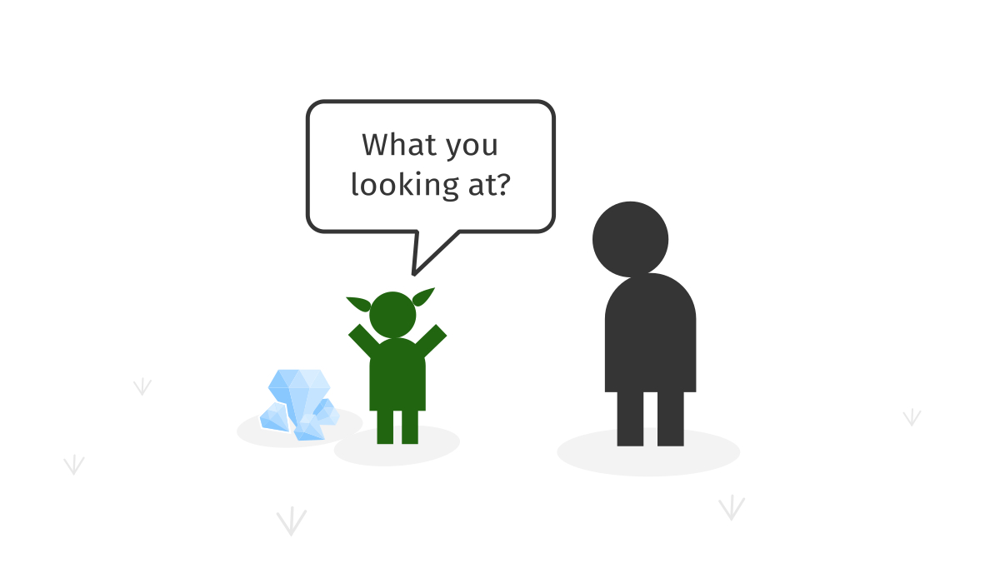
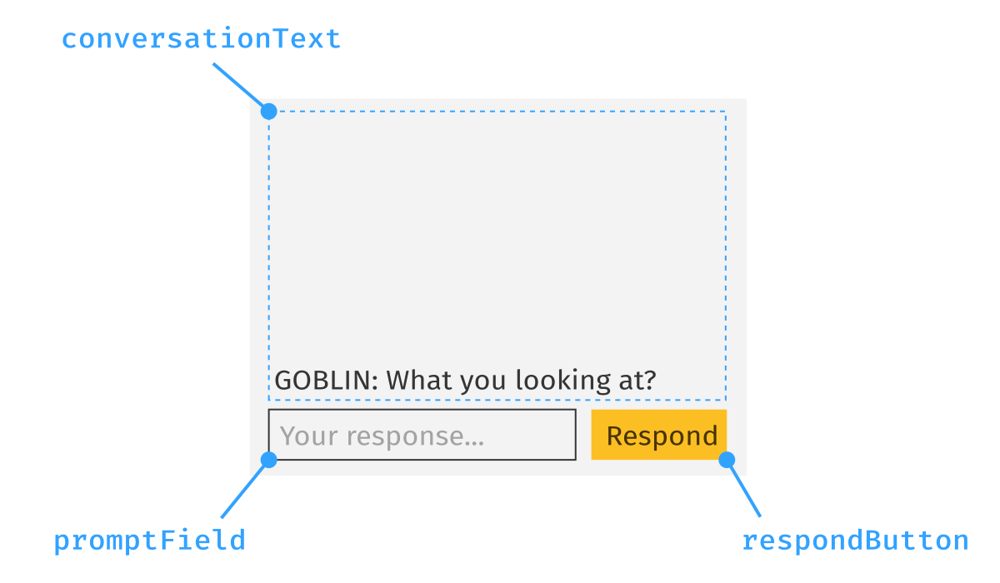
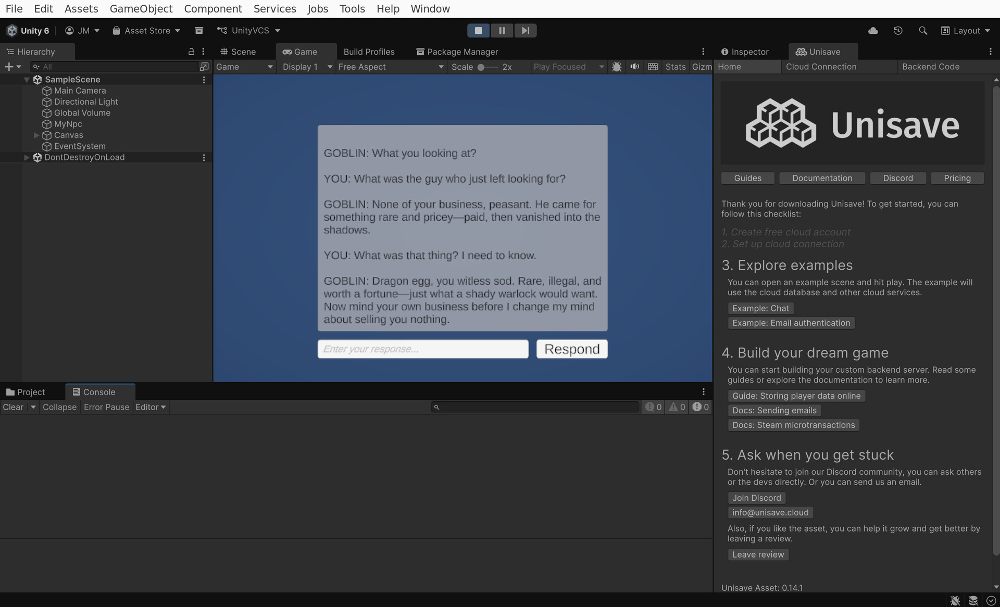

Large language models are transforming how we interact with computers. This guide explains how to integrate the [OpenAI API](https://openai.com/api/) behind [ChatGPT](https://chatgpt.com/) into your Unity project. We will build a simple AI-driven NPC character to interact with as a proof of concept, however the technology can just as well be used for player moderation, toxic content detection and much more.



Communication with the OpenAI API will be routed through the backend service [Unisave](https://unisave.cloud) so that:

- Your OpenAI secret API key is not exposed publicly in your game client.
- You can monitor, limit and optimize the API usage.
- You can prevent malicious actors from using the API in unexpected ways.
- You can integrate the AI with [cloud-stored player data](../how-to-store-player-data-online-with-unity/how-to-store-player-data-online-with-unity.md) and other cloud functionality.

Start by [setting up Unisave](../../docs/installation/installation.md) in your Unity project.


## The plan

The goal is to build a simple dialog system with an NPC (non-player-character) in some RPG fantasy game. The player is given a quest to track a warlock character and should interact with a goblin trader to find out what the warlock bought from him. Instead of having pre-scripted dialogues, LLMs let the player improvise on the spot and ask any questions they wish.

ChatGPT can be conditioned by an invisible instruction called the *system prompt* to play a certain role. This is the prompt we will use:

> **System prompt:**<br>
> You are a goblin trader. Today, you sold many magical and prohibited items to various shady people. A few moments ago you sold a dragon egg to a warlock in a black cape. You don't know his name, you're just excited about the trade since you made a lot of money. But you also know that selling dagon eggs is prohibited and you will be fined much more than you made if the king finds out. You are also a rude person, short on words, so that others don't pay much attention to your deeds. Now, a random villager is comming up to you. You already greeted him: "What you looking at?". He wants to know what have you sold to the warlock. Don't mention the egg until he really pushes you on it. Be offensive to him. Keep your answers short, about 2-3 sentences.

Then we will let the player talk to this AI agent to have a conversation like this:

> **🧌 Goblin:**<br>What you looking at?<br><br>
> **👨 You:**<br>What was the guy who just left looking for?<br><br>
> **🧌 Goblin:**<br>None of your business, peasant. He came for something rare and pricey—paid, then vanished into the shadows.<br><br>
> **👨 You:**<br>What was that thing? I need to know.<br><br>
> **🧌 Goblin:**<br>Dragon egg, you witless sod. Rare, illegal, and worth a fortune—just what a shady warlock would want. Now mind your own business before I change my mind about selling you nothing.


## User interface

Let's start from the user interface. Create a [`TMPro.TextMeshProUGUI`](https://docs.unity3d.com/Packages/com.unity.textmeshpro@3.2/api/TMPro.TextMeshProUGUI.html) component for the conversation log, one [`TMPro.TMP_InputField`](https://docs.unity3d.com/Packages/com.unity.textmeshpro@3.2/api/TMPro.TMP_InputField.html) for the prompt field and a [`UnityEngine.UI.Button`](https://docs.unity3d.com/Packages/com.unity.ugui@2.0/manual/script-Button.html) to send the response to OpenAI API.



These UI components will be controlled by the following `NpcController` script:

```csharp
using Unisave.Facets;
using UnityEngine;
using TMPro;
using Unisave;
using UnityEngine.UI;

public class NpcController : MonoBehaviour
{
    // references to UI components,
    // must be set up manually in the inspector window
    public TMP_InputField promptField;
    public Button respondButton;
    public TextMeshProUGUI conversationText;
    
    // conversation state necessary to generate coherent responses
    private NpcConversation conversation = new NpcConversation();
    
    void Start()
    {
        respondButton.onClick.AddListener(OnPlayerResponse);
        promptField.onSubmit.AddListener(_ => OnPlayerResponse());
    }

    async void OnPlayerResponse()
    {
        // there is no player prompt, do nothing
        if (promptField.text == "")
            return;
        
        // add the player response to the conversation log
        conversationText.text += "\n\nYOU: ";
        conversationText.text += promptField.text;
        
        // send the request to Unisave and then OpenAI
        UnisaveOperation<NpcConversation> facetCall = this.CallFacet(
            (NpcFacet f) => f.RespondToPlayer(
                conversation,
                promptField.text
            )
        );
        
        // disable UI while waiting for response
        promptField.text = "Speaking...";
        promptField.interactable = false;
        respondButton.interactable = false;
        
        // wait for the response
        conversation = await facetCall;

        // display the goblin response
        conversationText.text += "\n\nGOBLIN: ";
        conversationText.text += conversation.lastModelResponseText;
        
        // enable UI again
        promptField.text = "";
        promptField.interactable = true;
        respondButton.interactable = true;
    }
}
```

The controller above calls a server-side [facet](../../docs/facets.md), which relays the request further to the OpenAI API. The facet receives and returns a modified instance of `NpcConversation`. This data-class must be placed into your [backend folder](../../docs/installation/installation.md#create-a-backend-folder).

```csharp
public class NpcConversation
{
    /// <summary>
    /// The ID of the previous response from OpenAI from which
    /// we continue the conversation. Null if there has been
    /// no response by the model in this conversation yet.
    /// </summary>
    public string openapiPreviousResponseId = null;

    /// <summary>
    /// What is the latest new statement that the model returned.
    /// Null if the model has not yet said anything.
    /// </summary>
    public string lastModelResponseText = null;
}
```

When the controller first starts, it initializes `NpcConversation` to its default value (both fields are `null`). The `lastModelResponseText` field is populated by the server-side facet with the repsonse from the goblin and the `openapiPreviousResponseId` is used by the server to chain responses into a conversation. The full conversation is stored at the OpenAI servers and this `openapiPreviousResponseId` is a reference to the tail of that conversation.


## Server code

A [facet](../../docs/facets.md) is a class that lives on the server and has access to private server-side configuration (such as the OpenAI API key). We now need to define the `NpcFacet` that we call from the controller above via the `this.CallFacet(...)` syntax. Calling a facet is an asynchronous operation (it takes a fraction of a second), so to prevent our game from freezing while the call is pending, we use the async-await syntax. If you've never seen this, read the [Async-Await for Dummies](../async-await-for-dummies/async-await-for-dummies.md) guide.

The `NpcFacet` has one public method `RespondToPlayer` which receives the current state of the conversation (`NpcConversation`) and the player prompt (`string`) and returns the new state of the conversation (the new last message from the goblin and its ID).

The facet also contains the definition of the *system prompt* described [above](#the-plan).

```csharp
using System;
using System.Collections.Generic;
using System.Linq;
using System.Threading.Tasks;
using LightJson;
using Unisave;
using Unisave.Facets;
using Unisave.Facades;

public class NpcFacet : Facet
{
    private const string SystemPrompt =
        "You are a goblin trader. Today, you sold many magical and " +
        "prohibited items to various shady people. A few moments ago " +
        "you sold a dragon egg to a warlock in a black cape. You don't " +
        "know his name, you're just excited about the trade since you " +
        "made a lot of money. But you also know that selling dagon " +
        "eggs is prohibited and you will be fined much more than you " +
        "made if the king finds out. You are also a rude person, short " +
        "on words, so that others don't pay much attention to your " +
        "deeds. Now, a random villager is comming up to you. You " +
        "already greeted him: \"What you looking at?\". He wants to " +
        "know what have you sold to the warlock. Don't mention the egg " +
        "until he really pushes you on it. Be offensive to him. Keep " +
        "your answers short, about 2-3 sentences.";
    
    public async Task<NpcConversation> RespondToPlayer(
        NpcConversation conversation,
        string playerPrompt
    )
    {
        string openaiApiKey = Env.GetString("OPENAI_API_KEY");
        
        // build the OpenAI API request body JSON
        // https://platform.openai.com/docs/api-reference/responses/create
        var jsonRequest = new JsonObject
        {
            ["model"] = "gpt-5-nano",
            ["reasoning"] = new JsonObject {
                ["effort"] = "low"
            },
            ["instructions"] = SystemPrompt,
            ["input"] = playerPrompt,
            ["store"] = true
        };
        
        // continue an older conversation instead of starting a new one
        if (conversation.openapiPreviousResponseId != null)
            jsonRequest["previous_response_id"]
                = conversation.openapiPreviousResponseId;
        
        Log.Info("Sending: " + jsonRequest);
        
        // send an HTTP request to the OpenAI API
        var httpResponse = await Http
            .WithToken(openaiApiKey)
            .PostAsync(
                "https://api.openai.com/v1/responses",
                jsonRequest
            );
        
        Log.Info("Received: " + await httpResponse.BodyAsync());

        // Throw exception on unexpected HTTP status codes (4xx and 5xx)
        // Note: "401 Unauthorized" means the API Key is invalid
        httpResponse.Throw();

        // parse the response body as JSON object
        // https://platform.openai.com/docs/api-reference/responses/object
        JsonObject jsonResponse = await httpResponse.JsonAsync();
        if (jsonResponse == null)
            throw new Exception(
                "No response body returned from OpenAI API"
            );

        // filter out text outputs and for each,
        // take their "content" array and convert
        // its contents to strings
        string[] textParts = jsonResponse["output"].AsJsonArray
            .Where(item => item["type"] == "message")
            .SelectMany(item => item["content"].AsJsonArray
                .Select(m => m["type"] == "output_text"
                    ? m["text"].AsString
                    : m.ToString() // unknown content type
                )
            )
            .ToArray();

        // build new conversation description and send it to the client
        return new NpcConversation {
            openapiPreviousResponseId =  jsonResponse["id"].AsString,
            lastModelResponseText = string.Join("\n", textParts),
        };
    }
}
```

The facet sends an [HTTP request](../../docs/http-client/http-client.md) to the OpenAI Responses API. The OpenAI documentation can be found here:

- Request JSON: https://platform.openai.com/docs/api-reference/responses/create
- Reponse JSON: https://platform.openai.com/docs/api-reference/responses/object


## Setting up the API key

The `NpcFacet` loads the `OPENAI_API_KEY` environment variable to get the API key. The OpenAI API requires this key to be sent with each request so that they can track your API usage and bill you accordingly. This key can be generated in the [OpenAI dashboard](https://platform.openai.com/) and it has this form:

```
sk-proj-XXXXXXXXXXXXXXXXXXXXXXXXXXXXXXXXXXXXXXXXXXXXXXXXXXXXXXXXXXXXXXXXXXXXXXXXXXXXXXXXXXXXXXXXXXXXXXXXXXXXXXXXXXXXXXXXXXXXXXXXXXXXXXXXXXXXXXXXXXXXXXXXXXXXXXXXXXXX
```

Put this key into your Unisave [environment variables](../../docs/environments.md) for the development environment:

```bash
...
SESSION_DRIVER=arango
SESSION_LIFETIME=3600

# The OpenAI secret API key
OPENAI_API_KEY=sk-proj-rT3Blb...
```

If you don't set up the API key, then OpenAI API will respond with `401 Unauthorized` response instead of generating a model response.

```
System.Net.Http.HttpRequestException: The HTTP response has erroneous status code: 401
```


## Putting it together

Now you have all the necessary code present. This is the structure it should have:

- [**Assets**/NpcController.cs](NpcController.cs)
- [**Assets/Backend**/NpcConversation.cs](NpcConversation.cs)
- [**Assets/Backend**/NpcFacet.cs](NpcFacet.cs)

When you run the project now, you should be able to have a conversation with a goblin:




## Conclusion

You learned how to call OpenAI API from within Unity. This skill can be used not only to build AI-driven NPCs, but also to curate player-generated content, detect toxic behaviour in chat and identify other misuse within your game.
