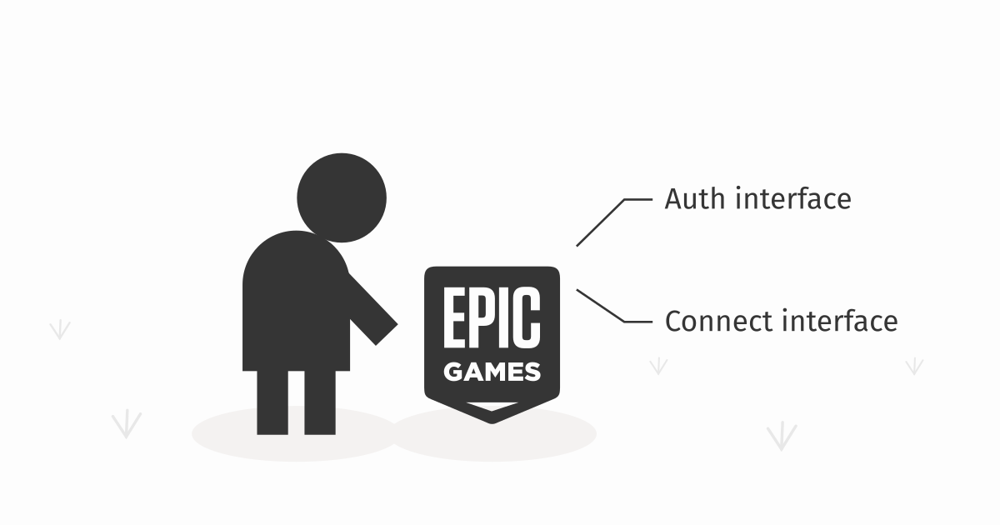

[Epic Online Services (EOS)](https://dev.epicgames.com/) are a set of tools by [Epic Games](https://epicgames.com/) that let you make your game more connected (authentication, friends, microtransactions). Most of these services require your player to be logged-in (authenticated), however EOS provides two authentication interfaces: [the Auth interface](https://dev.epicgames.com/docs/epic-account-services/auth/auth-interface) and [the Connect interface](https://dev.epicgames.com/docs/game-services/eos-connect-interface). This article explains the difference between the two and shows scenarios when and how to use either one.



The documentation pages of each of these two interfaces show a table explaining the difference between the two, but it is very hard to understand. The question I immediately asked was: "Why even have two ways to log-in?"


## Why have two systems

The reason for this seemingly strange decision seems to be that Epic wants any player to use their *EOS Game Services* (a subset of EOS), without requiring that player to create a full *Epic Account*. You may have a player that plays your game on Xbox and doesn't have an *Epic Account*. This player has an *Xbox Live* account and so they can participate in leaderboards via their *Xbox Live* account, together with other players that play via *Steam*, others that play via *Apple*, and even others that play via the *Epic Launcher* and have an *Epic Account* themselves.

This is because *Epic Online Services (EOS)* fall into two categories:

1. **EOS Game Services:** Even players without an *Epic Account* can use these. These are services related to the gameplay (leaderboards, achievements, matchmaking, sanctions).
2. **"The other services":** Only players with an *Epic Account* can use these.
    - **EOS Epic Account Services** (friends, presence, social features).
    - **Epic Games Store Services** (microtransactions, DLCs, game store achievements).

If you want to interact with services in the first category, you *must* login the player via [the Connect interface](https://dev.epicgames.com/docs/game-services/eos-connect-interface). If you want to interact with services in the second category, you *must* login the player via [the Auth interface](https://dev.epicgames.com/docs/epic-account-services/auth/auth-interface). If you want to interact with both, you must login the player via both interfaces simultaneously.

**The way you use these two systems depends on if and how you plan to distribute your game to multiple platforms (other than the Epic Store).** It's very likely that you will not need to fully use all this complexity (see the section [Distributing only to Epic Store](#distributing-only-to-epic-store)).


## Two identifiers for one player


### Epic Account Identifier

If a player has an *Epic Account*, this account has an `EpicAccountId`. Its value is a random hash, something like this:

```
286dc6ce12c132a756c7170877b8a2756c71
```

This ID identifies the *Epic Account* - the same account you use to log into the *Epic Launcher* and into the https://epicgames.com website. This is also the ID used to identify players logged in via [the Auth interface](https://dev.epicgames.com/docs/epic-account-services/auth/auth-interface).


### Product User Identifier (PUID)

If you want to interact with the *EOS Game Services*, you need to generate a *Product User ID (PUID)* for each of your players. Its value is again a random hash similar to the one above.

This identifier is interesting in that the same player will have different PUIDs for two different games. Another words, the identifier is game-scoped (or rather product-scoped, that's why it's called a PUID).

As mentioned before, this identifier exists to track players that do not have an *Epic Account* but still want to interact with *EOS Game Services*. Epic lets you create a PUID for any user that has some other supported identity account (Xbox Live, Steam, Apple, itch.io, etc...). It also lets you create a PUID for a player that has no such account by attaching a new PUID to their device ID.

**If a player has an Epic Account and they also want to access the EOS Game Services, you will need to create a PUID for that player. This PUID will be connected with their Epic Account (as opposed to, say Xbox Live).**


## Distributing only to Epic Store

If you plan to only distribute to *Epic Store*, you know that everyone who downloads your game will have an *Epic Account*. This means you can identify your players by their `EpicAccountId`.

To use the EOS from your game, you will log your player in via [the Auth interface](https://dev.epicgames.com/docs/epic-account-services/auth/auth-interface) first. You can utilize the fact that you are being launched by the *Epic Launcher* and use the [*Exchange Code* login method](https://dev.epicgames.com/docs/epic-account-services/auth/auth-interface#preferred-login-types-for-epic-account):

```cs
using System;
using System.Linq;
using Epic.OnlineServices;
using Epic.OnlineServices.Platform;

bool IsLaunchedViaEpicLauncher()
{
    string[] args = Environment.GetCommandLineArgs();
    return args.Contains("-EpicPortal");
}

string GetExchangeCode()
{
    const string prefix = "-AUTH_PASSWORD=";
    string[] args = Environment.GetCommandLineArgs();
    string arg = args.First(arg => arg.StartsWith(prefix));
    return arg.Substring(prefix.Length);
}

void LogInViaAuth(PlatformInterface platform)
{
    var loginOptions = new Epic.OnlineServices.Auth.LoginOptions() {
        Credentials = new Epic.OnlineServices.Auth.Credentials() {
            Type = LoginCredentialType.ExchangeCode,
            Id = null, // unused
            Token = GetExchangeCode()
        },
        ScopeFlags = AuthScopeFlags.BasicProfile // and others!
    };

    platform.GetAuthInterface().Login(
        ref loginOptions,
        null,
        (ref Epic.OnlineServices.Auth.LoginCallbackInfo info) => {
            if (info.ResultCode == Result.Success)
            {
                Debug.Log("Auth login succeeded.");
                Debug.Log("Your EpicAccountID is: " + info.LocalUserId);
            }
            else if (Common.IsOperationComplete(info.ResultCode))
            {
                Debug.Log("Auth login failed: " + info.ResultCode);
            }
        }
    );
}
```

Once this login succeeds, you can then login via [the Connect interface](https://dev.epicgames.com/docs/game-services/eos-connect-interface). You can refer to the [EOS documentation](https://dev.epicgames.com/docs/game-services/eos-connect-interface#authenticating-users) for more details:

```cs
void LogInViaConnect(
    PlatformInterface platform,
    EpicAccountId epicAccountId
)
{
    var copyOptions = new Epic.OnlineServices.Auth.CopyIdTokenOptions() {
        AccountId = epicAccountId
    };
    platform.GetAuthInterface().CopyIdToken(
        ref copyOptions,
        out IdToken? idToken
    );

    var loginOptions = new Epic.OnlineServices.Connect.LoginOptions() {
        Credentials = new Epic.OnlineServices.Connect.Credentials() {
            Type = ExternalCredentialType.EpicIdToken,
            Token = idToken.Value.JsonWebToken
        }
    };
    platform.GetConnectInterface().Login(
        ref loginOptions,
        null,
        (ref Epic.OnlineServices.Connect.LoginCallbackInfo info) => {
            if (info.ResultCode == Result.Success)
            {
                Debug.Log("Connect login succeeded.");
                Debug.Log("Your PUID is: " + info.LocalUserId);
            }
            else if (info.ResultCode == Result.InvalidUser)
            {
                Debug.Log("There is no PUID for this epic account, let's create one...");
                CreatePUID(platform, info.ContinuanceToken);
            }
            else if (Common.IsOperationComplete(info.ResultCode))
            {
                Debug.Log("Connect login failed: " + info.ResultCode);
            }
        }
    );
}

void CreatePUID(
    PlatformInterface platform,
    Epic.OnlineServices.Connect.ContinuanceToken continuanceToken
)
{
    var createOptions = new Epic.OnlineServices.Connect.CreateUserOptions() {
        ContinuanceToken = continuanceToken
    };
    platform.GetConnectInterface().CreateUser(
        ref createOptions,
        null,
        (ref Epic.OnlineServices.Connect.CreateUserCallbackInfo info) => {
            if (info.ResultCode == Result.Success)
            {
                Debug.Log("Connect login succeeded.");
                Debug.Log("Your PUID is: " + info.LocalUserId);
            }
            else if (Common.IsOperationComplete(info.ResultCode))
            {
                Debug.Log("Connect login PUID creation failed: " + info.ResultCode);
            }
        }
    );
}
```

The EOS documentation states that we should be careful about creating a PUID without asking the player whether they haven't used a different login before. This is unnecessary in our case. We know that we only distribute via the *Epic Store* and so there is no way a player could already have an existing PUID. This would only be the case if we have released somewhere (say Xbox) before and used the *EOS Gaming Services* without requiring the players to have an *Epic Account*.

> **Important:** These code snippets outline the login flow, but there is more code needed. More specifically:
> 1. You need to initialize the `PlatformInterface`, which is documented [here in the EOS documentation](https://dev.epicgames.com/docs/epic-online-services/eos-get-started/eossdkc-sharp-getting-started#setting-up-the-platform).
> 2. While the *Auth interface* keeps the user logged-in automatically, the *Connect interface* needs the Json Web Token (the "authenticated session") to be refreshed manually. Again, there is a documentation section on how to do that [here](https://dev.epicgames.com/docs/game-services/eos-connect-interface#connect-interface).
> 3. Production-ready code should handle all possible `null` values and unsuccessful logins properly. These snippets often ignore these edge cases.


## Distributing to Steam and Epic Store

If you plan to distribute to multiple platforms simultaneously, the correct login behaviour depends on if and how you want to use the *EOS Gaming Services*.

If you plan to use a third-party service (like [Unisave](https://unisave.cloud/)) for storing player progression, achievements, and leaderboards, then you can keep this simple login flow (and in fact, make it even simpler). What you want to do in such a case is to have Steam player log in into Unisave via Steam, and Epic players log in into Unisave via Epic. This way Steam players definitely have a *Steam Account*, and Epic players definitely have an *Epic Account*. This means you can only use [the Auth interface](https://dev.epicgames.com/docs/epic-account-services/auth/auth-interface) for this and completely ignore *EOS Game Services* as they will be replaced by Unisave. If you still want to use *EOS Game Services* (say to synchronize the leaderboards with Unisave), you can use the exact same login flow as desribed earlier.

If you want even the Steam players to show up in the *EOS Game Services* leaderboards, you now have to create PUIDs for them and use [the Connect interface](https://dev.epicgames.com/docs/game-services/eos-connect-interface) in the complicated fashion. Now you need to worry about [account linking](https://dev.epicgames.com/docs/game-services/eos-connect-interface#linking-an-external-account), but that is outside the scope of this article.


## Conclusion

While confusing at first, the separation of the two login systems makes sense. One is for *Epic Accounts* and grants full access to all things Epic, while the other one is (also) for non-Epic players and you use it if you want to use *EOS Gaming Services* while distributing to non-Epic platforms.
