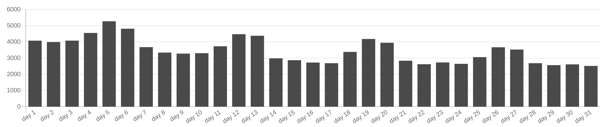
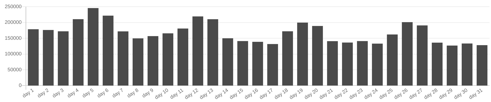
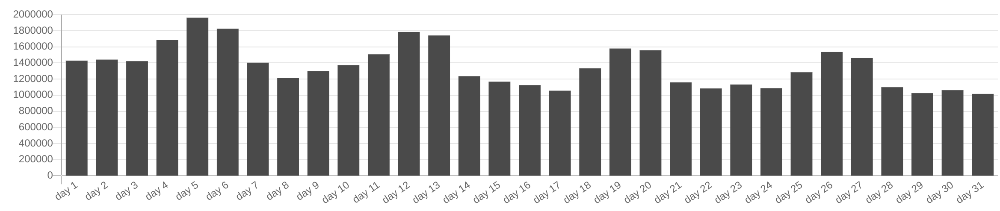
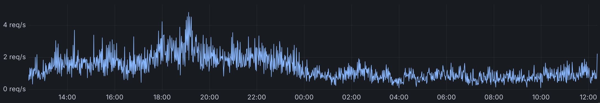
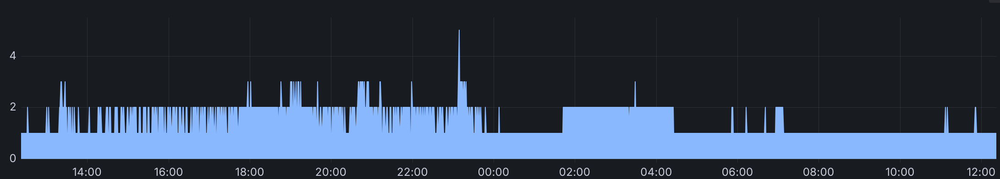

If you are thinking about using Unisave but are unsure about your expected expenses, this case study should help you get a good estimate. It analyzes the traffic and costs experienced by the game [Motorbike Evolution](https://store.steampowered.com/app/2456070/Motorbike_Evolution_2024/) in October 2024, which I was able to share with Peter's approval (the game developer).

> **TL;DR;** You pay 60 USD for 3500 DAU with a heavy backend-using game, which amounts to 100 peak daily CCU.

```
[TODO: media-image here]
```


## Motorbike Evolution

There are two types of games using Unisave. They have either:

1. Minimal Unisave usage (e.g. using only Steam microtransactions)
2. Extensive Unisave usage (relying on Unisave as the backbone for game logic)

This article focuses on the second case, because these games tend to scale their usage into serious numbers. The simple games in the first category usually remain in one of the smaller pricing tiers, since they can operate with a single backend worker running 24/7.

Motorbike Evolution is one of the larger games running on Unisave. It is an online motorbike racing game - you register via Steam or Epic, you get a tier I motorbike and you join races with other players. As you win, you get credits and experience to unlock and buy faster motorbikes. It's a motorbike-focused [World of Tanks](https://worldoftanks.eu/), really. It's important to point out that it's a free-to-play game, distributed via Steam.

```
[TODO: motorbike evolution screenshot here]
```

Unisave handles all of the non-racing logic of the game. It stores the registered players, owned motorbikes, leaderboards, championship data, and it even handles matchmaking and in-race chat. The real-time synchronization of motorbikes in the race is handled via [Photon Fusion](https://www.photonengine.com/).

As you can see, without Unisave, this game would not even exist (see the note). This makes it an ideal comparison for other backend-heavy games, such as turn-based games, card games, and other games where all of the player's data is stored in the cloud.

> **Note:** Actually, Unisave would not exist without this game either. Peter was the reason I started building it in 2019. And Unisave was thus precisely built to serve games like these.


## October game traffic

Motorbike Evolution was released in March of 2024 but the months around the release are always exceptional. Usually, the fist month after release, the game can encounter 3x to 5x the traffic it does half a year later. In this case, the situation was different and the game was instead picking up traffic slowly - probably since there was the older version of this game still around, so people took time to update.

I chose to analyze the October of 2024, since the traffic in this month is very stable and monthly averages thus match the daily traffic. We can start by looking at **DAU - Daily Active Users**:



You can see the game averages 3500 DAU with weekend surges clearly visible. Also you can see the slow downward trend. Most games after release experience this slow decay and players usually return only with major marketed updates to the game.

We can compare this to **Request Count** (facet calls):



And to **Database Request Count**:



As you can see, this very tightly correlates with DAU. Simply because the kinds of facet calls made average out and the number of requests per player averages out throughout the day, which leaves us with these numbers normalized to 1 DAU:

| Resource | Amount |
| -------- | ------ |
| DAU      | 1 per DAU |
| Facet calls | 101.5 per DAU |
| Compute time (GBs) | 8.8 per DAU *(0.087 per facet call)* |
| Database requests | 371.6 per DAU *(3.66 per facet call)* |
| Outbound network traffic (MB) | 1.5 MB per DAU *(15.3 KB per facet call)* |

In fact, this correlation is so stable among games, that the pricing tiers of Unisave have been designed such that quotas on these resources should not be the limiting factor. It should all be tied to facet calls, which directly affects the compute time - and compute time is therefore practically the ONLY METRIC you should worry about. The only reason these other quotas are in place is so that people don't use Unisave in some awkward ways, breaking it (for example by making 100 database requests per facet call, or by sending 20MB responses with each facet call).


### Compute time

Since compute time is the only important metric, let's analyze that in detail.

> **Note:** Compute time is measured in gigabyte-seconds - worker RAM allocation in gigabytes, times its wall-time runtime in sconds. This is the same unit used by other FaaS services, such as AWS Lambda.

We can look at 24-hours of data from the middle of November 2024. First, we can see the **Requests per second** (facet calls per second):



And then the corresponding **Worker count**:



You can see that the traffic during the day (first half) is almost 3x the traffic over night. You can also see that there is one worker instance running 24/7 and another one or two joining in once the load peaks during the day. This scaling is based on the worker's CPU utilization.

From the in-game CCU tracker I know that the peak CCU at 19:00 was around 100 CCU (concurrent users).

> **Note:** In the middle of October I did some CCU / RPS measurements so I use those to get the CCU for a given request rate:<br/>
> `[2024-10-12]: 90 CCU at 4 RPS with 3 worker instances`

I chose this game and month, because it just-enough exhausts one worker instance, so that addional ones have to join in and help. This means that when we compute values like *compute time per facet call*, they are actually representative of the true value (we get something like 87 GBms, which is cca 350 ms of wall-time execution time per facet call).

> **Note:** The default worker instance has 250MB of RAM, which means 1 GBs is 4 wall-time execution seconds.


#### Low traffic

During low-traffic, the whole system behaves differently. If you have low traffic and there are isolated facet calls, separated by half an hour in between, what happens is the following:

1. There is no worker allocated. You pay nothing.
2. Requet comes, a worker is started and handles the request.
3. The worker stays alive for 5 minutes to handle any additional requests that do not come.
4. The worker is killed, you go back to 1.

If you were to calculate the compute time used per facet call, you'd get 5 minutes. Or put another way, with 20 requests, you could achieve 1 hour of compute time usage. This sounds scary, but it's important to remember that this is really an artifact of how the system works and it will go away with more traffic (as you can see in the example above).

Also note that 5 minutes may seem like a lot, but those are most of the hair-like spikes on the worker count chart.


### Database disk usage

Somewhat orthogonal to compute time is the usage of database disk space. This metric depends primarily on the number of registered players, regardless of the current traffic.

In October 2024, the game was using about 3.5 GB of disk space, while there were about 1.3M registered player. This corresponds to about 2.7 KB of data per player.

I did a detailed analysis of all entities, when I was building a representative stress test simulation in October:

```
Major large collections with entity counts
------------------------------------------
MotorbikeEntity 7.5M ... represents a bought motorbike
PlayerEntity 1.3M ... represents the registered player
DailyMissionEntity 1.3M ... contains info about daily missions for a player
PlayerStatsEntity 1.3M ... lifetime statistics for a player
CustomizationEntity 1.2M ... skins per player
PlayerReportEntity 600K ... when someone, or the game reports a player
PlayerStatsLeaderboard 500K ... ranking of players by their stats
EngineLeaderboardEntity 480K ... time records per track
PhotonRoomEntity 5K ... represents a room with races

Each player has on average:
- 6 motorbikes
- 1 daily missions entity
- 1 player stats entity
- 1 customization entity

Then there are global entities:
- rooms
- leaderboards
```


## Unisave usage and cost

The invoice that Peter received for October contains these numbers:

| Description | Quantity | Amount |
| ----------- | -------- | ------ |
| Professional plan | 744 hours | $36.17 |
| Additional compute time | 181 989 GBs | $6.74 |
| Additional database requests | 35 901 432 | $11.97 |
| Additional disk usage | 7 596 523 GBs | $2.93 |
| **Total** | | **$57.81** |

While with the first pricing tiers you get a bulk of resources to use, once you scale past the professional plan, you pay for these resources separately, but they stay at a fixed ratio to each other (the value of which depends on the way your game uses the backend).

> **Note:** The invoice excludes any taxes, [see pricing](https://unisave.cloud/pricing#taxes) for more info.

Also note that the price that Peter paid for this game in the last year and a half ranges from 40 USD up to 120 USD, depending on the traffic that month. Also one month it peaked to 170 USD, but that was due to an infficient database request that was taking up too much time - we fixed that by adding a database index. So really, think of this game as being in the range from $40 to $120 with $60 being the boring average. With DAU ranging from 1K to 8K with 3.5K being the average (and the corresponding CCU range from 30 to 230 with 100 CCU being the average).

> **Note:** This actually corresponds well with [Photon Fusion's](https://www.photonengine.com/fusion/pricing) $125 monthly for 500 CCU.


## Conclusion

As you can see, getting to the true cost may be very complicated. Luckily all you have to do is measure your facet calls per DAU and disk usage per player and see how you compare to this game. Since Motorbike Evolution is rather complex, we could say it's the worst-case estimate and your game is probably going to be the same (+-20%) or cheaper.
