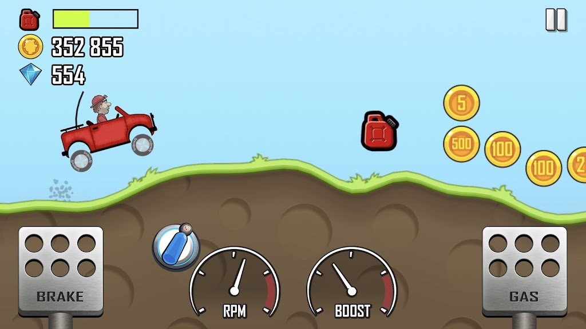

Many game development hobbyists and indie developers work on their passion projects for years with the game release existing somewhere in the ambiguous future. *"I will figure out the release once the game is finished."*, they tell themselves. But oftentimes the project drags on for a number of years, then life gets in the way and the game never sees the light of day. What a shame! So many interesting ideas and unfinished projects die out.

This is why I wanted to share the story of Carsick Carventure - a game that was built and released in under two months and acted as a mindset life-changer for its developers. The described journey happend in October, November, and December 2023.


## Motivation for the game

The main actor and developer here is Vláďa. He is a computer science student and when I first met him, he told me his dream is to make computer games and to lead a small game development studio.

He had a game in mind - he wanted to make a 2D car endless runner, similar to [Hill Climb Racing](https://play.google.com/store/apps/details?id=com.fingersoft.hillclimb), but which would target the PC world and be a multiplayer game. It would be a casual fun game, that you would play with your friends online.



He had experience with making games. He attended many game jams before and had two friends, who would help him with coding and graphic design. But he has never published a game for real. He had no idea of what it takes to publish to [Steam](https://store.steampowered.com/). In his mind, it was this *thing* to be figured out after the game is finished.


## Unique opportunity

Around that time, my other friend Peter, who studies PhD at the university, was approached by a local news company [CzechCrunch](https://cc.cz/). They were planning on releasing a *Gaming Special* article in December and they wanted a student mini-game in WebGL to be published on their website alongside the article. They wanted to build something similar to the [Chrome Dino](https://en.wikipedia.org/wiki/Dinosaur_Game).


Peter approached Vláďa with this offer and they got thinking. They realized that they could build a proof-of-concept; a minimum-viable-product for the Vláďa's dream game. Peter offered to help with the release, Steam page, and marketing, since he already had experience with his own game [Engine Evolution](https://store.steampowered.com/app/2196640/Engine_Evolution_2023/).

They agreed to create one WebGL build for the news company and one PC build for Steam and Epic Store. They also decided to use [Unisave](https://unisave.cloud) to add leaderboards to the game, and [Anzu](https://www.anzu.io/) to generate some ad revenue to cover the costs.

The release date was scheduled on the 8th of December 2023, which was the article release, and the [Game Developer Session](https://gdsession.com/) conference in Prague. We all agreed to attend the conference to market and validate the game on-site, talking to real people, as part of the Indie expo.


## Development

In the two following months, Vláďa and his team (3 people in total) worked on the game tirelessly. Vláďa said it was exhausting, but the tight deadline made the development simpler in many ways. Vláďa had to make quicker decisions about what to include and what to scrap. This forced the them to quickly settle on the main game loop and to not waste time with unimportant wannabe-cool features. If it wasn't essential, it wouldn't be built.


For example, at first the player had to manually press the forward key so that the car would start moving. It was later replaced with automatic scrolling, similar to how Flappy Bird, or the Dino works. To reward well-timed jumps, a coin collection system with a progress bar and a combo effect was added. In fact, there wasn't even time to create the coin sprites - the gray circle above the ghost is the coin! But it didn't matter, players on-site enjoyed the game even if it wasn't all in tip-top shape.

In the end, Vláďa said the whole experience felt like a two-month game jam. It wasn't much different.


## Game Developer Session

The [Game Developer Session](https://gdsession.com/) conference in Prague was the event, where the team showed their work to the world. The alignment of the Steam release with the conference was not an accident. The goal was to generate traffic and increase awareness at the physical venue, so that people would download the game at home and write positive reviews. This should send the first traffic peak to Steam and the plan was then for Steam to notice this traffic and throw more players at the game via the Steam algorithm.

In fact, Steam works very much like YouTube or TikTok in this sense and you are more of a YouTuber, than anything else on the day of the release. You need the algorithm to notice your game. Peter said that we need to get 10 positive reviews on the first day to call it a success. Of course, friends helped here a lot to get these first 10 as soon as possible.

> "We need 10 positive reviews on the release day to kick things off."

To spread the word on-site, we printed 5 000 leaflets and a roll up poster. It was a bit of an overkill, because in the end we (Peter) managed to give away only 1 000 leaflets (at a conference with 3 000 visitors). But at least we have some left for any future events. Doing this again, I would print only about 2 000 pieces.


Giving away so many leaflets was not a waste. On the second day of the conference, a number of high school excursions arrived, and we managed to give a leaflet to every single teenager there, while they were waiting in the queue. They are the target audience after all, and they can turn this encounter into a meme.

Peter was so aggressive in the leaflet distribution that he managed to give one to the Czech minister for digitisation, [Ivan Bartoš](https://en.wikipedia.org/wiki/Ivan_Barto%C5%A1), as he was walking out of the backstage. Three hours later he showed up at the Indie expo, and guess whose game he wanted to try out:


We got a chance to playtest the game with many people. A major reason why many of them returned, or played multiple sessions is that there was a leaderboard to be conquered. Adding this leaderboard was planned since the very beginning and it proved successful. In fact, there were multiple sub-leaderboards, and the one for Vláďa's podcast even had a winning price attached. All of this customization was possible thanks to it being built on [Unisave](https://unisave.cloud).


## Financial report

It was obvious from the beginning, that the game needed to be free-to-play. It was meant to be freely available online on the CzechCrunch website after all. The goal with this project was never to make much money, but there were expenses to be covered and we didn't want to pay for them out of out pockets. And should these be covered, it would be nice to see some additional money come out of this and also to test out game release even from the financial perspective.

For this reason we decided to use [Anzu](https://www.anzu.io/) for in-game ads. These ads would only be present in the Steam and Epic releases, and be replaced with CzechCrunch logos in the CzechCrunch web release. This is what an actual ad looks in-game:


From the on-site play testing we realized, that many people didn't even think these ads were real. They thought it was a joke on our part. And since we placed them as in-game biillboards, they blended with the game so well, that nobody not even once told us that they dislike the ads, or that they distract them.

So as a result I would encourage you taking a look at [Anzu](https://www.anzu.io/), they say *"Let gamers play"* and they mean it. (I'm not sponsored by them, I just think they solve a big issue for many free-to-play games).

Here is the summary of all the expenses we had:

| Item | Price |
| --- | ---: |
| Steam fee | $100 |
| Epic fee | $100 |
| Website for 1 year | $20 |
| Unisave for 1 year (1x indie, 11x hobby) | $113 |
| Rollup poster | $60 |
| Leaflets | $360 |

You can see that if you cut out physical marketing and Epic store, you can make a Steam release for only around 240 USD. That's not bad!

The ad revenue in December (around the release peak) was 190 USD. Of course this will go down in the next months as the traffic eases. But if we let the game live for the next year, there's a good chance we will not only cover our expenses, but also make some profit. That's not bad for a quickly put together experimental F2P project!

These are the daily active users in December:


You can see the development and friends-testing on 1st-6th and the Steam release on 7th and the conference on 8th and 9th. One month later we are at 20 DAU.


## Future plans

I reflected on this project with Vláďa recently and he mentioned something I think is very important:

> "By releasing Carsick, something within me *clicked*. Suddenly I felt like I can turn any idea I have into a finished, released game so easily. Oh I could release this, oh I could release that!"

That's why I think it's important to release anything you have right now to the public. Make it a demo, make it an early access (Carsick is that). The full release can come later, but while you're building your game, there is a Steam page gathering wishlists already, there is a Discord server building a community already, there is a website you can share with people already!

By doing this, it will *click* for you too, because now you will know the terrain of game releasing well. You will have the complete map. Not a sketch like this:

```cs
1. Have the idea
2. Develop the game
3. ??
4. Profit
```

And if you feel people will hate your idea, firstly, they don't really care (and you shouldn't care either), but second, why can't you make a separate project as a proof of concept, just like Vláďa did with Carsick Carventure? Do you know what's the name of his original PC racing game? No you don't. You know only about Carsick Carventure. You can hate Carsick, but Vláďa will take this knowledge he gained and incorporate it into his true passion project that is yet to come. And it will probably be called *Carsick Carventure the Amazing Venture*, because there was no hate. And the project will be so much better and more successful because of all the gained experience.

So the plan for Carsick Carventure today is to build a mobile version, polish it, add more content and do a full release. And we already have a community that will instantly jump onto the game once the full release comes. Don't under-estimate the value of *being known*.

> If releasing fast sounds scary, read this Reddit post by Vláďa, where he describes the scariness from his perspective (read it anyways, I love it; also the discussion in comments is interesting):
> ["2 months to make a commercial game" - scary but necesary](https://www.reddit.com/r/indiegames/comments/18w856i/2_months_to_make_a_commercial_game_scary_but/)

Where should you start?
1. Create a discord server.
2. Create a website.
3. Create a Steam page to start gathering wishlists (or itch, or AppStore, or whatever makes sense in your context)
4. Spread the word, talk about your game:
	- Twitter, Facebook groups ([Indie Game Devs](https://www.facebook.com/groups/132728896890594)), whatever you read daily
	- Reddit ([indiegames](https://www.reddit.com/r/indiegames/), [cozygames](https://www.reddit.com/r/cozygames/), ...)
5. Let people actually try out your game (you get the best feedback this way), put a demo build on [itch.io](https://itch.io) that you link to from your posts. That demo will send people to wishlist on Steam for your full game. Another words, do the "release" today.
6. Set up some monetization right now, you will like it more if you don't do it for free. Forget Kickstarter, you have no experience with that. Go with Pateron, donate button on Itch, or reduced-price early access version on Steam. Or all of them (some players only have Steam accounts, some only Patreon accounts)! Or maybe try in-game ads if you have a F2P game.

I hope this article comes in handy to all hobbyists and indie game developers out there. You make the dreams come true.

Related links:
- [Reddit post by Vláďa about the whole endeavor](https://www.reddit.com/r/indiegames/comments/18w856i/2_months_to_make_a_commercial_game_scary_but/)
- [Carsick Carventure on Steam](https://store.steampowered.com/app/2658840/Carsick_Carventure/)
- [Carsick Carventure on Epic Store](https://store.epicgames.com/en-US/p/carsick-carventure-d216ba)
- [CzechCrunch Game Special where the game can be played online](https://cc.cz/ceskehry/)
- [CzechCrunch article about Carsick Carventure](https://cc.cz/vyzkousejte-hru-kterou-pro-vas-stvorili-studenti-matfyzu-a-pedagogicke-fakulty-zahral-si-ji-i-ivan-bartos/)
