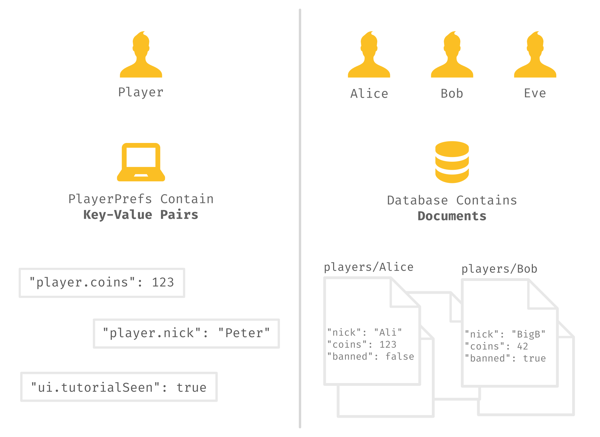
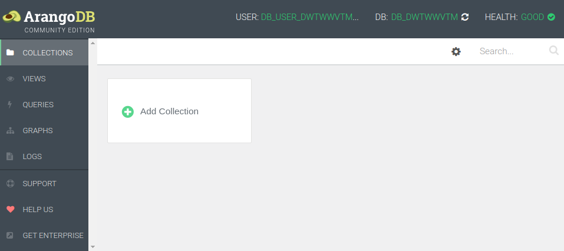
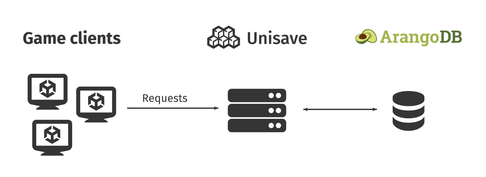
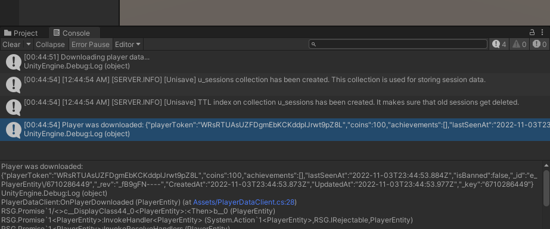
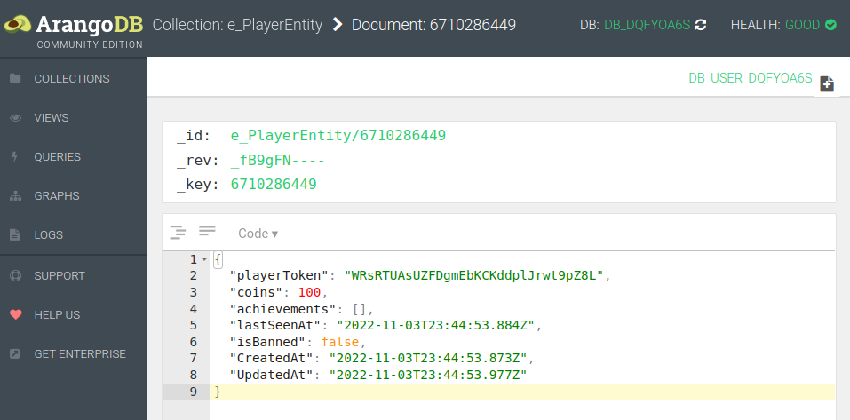
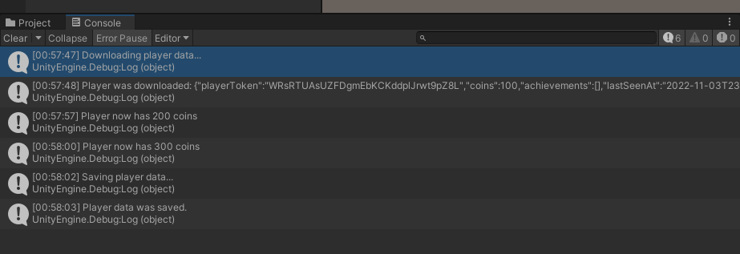

Today, most games offer at least some multiplayer features (e.g. leaderboards) and these require storage of data online. The part of a game responsible for online data is called the game backend.

This guide shows you, how to use Unisave (a game backend service) for storing information about your players (inventory, achievements, analytics).


## Prerequisites

In order to follow along with this guide, you'll need to have Unisave set up in your game. You can set up an account and download the open-source Unity asset for free. Read the [installation documentation page](/docs/installation) for more instructions.


## Distinguishing players

Storing player data offline in the [Unity game engine](https://unity.com/) usually involves using [PlayerPrefs](https://docs.unity3d.com/ScriptReference/PlayerPrefs.html). It's a simple solution and we would like to have something similar but instead stored in a cloud database.

```cs
// storing data in Unity's PlayerPrefs
PlayerPrefs.SetInt("player.coins", coins);
```

When using PlayerPrefs, we know that the data always belongs to the player sitting in front of the screen. With an online database, we need to know what data belongs to what player and for that we need to identify players (give them some IDs). The process of identifying a player is called authentication.



One option is to ask the player for a username (or email) and a password. This, however, interrupts the player and is not ideal for mobile games. Another option is to let some external service (e.g. [Steam](https://store.steampowered.com/)) handle the authentication and give us the player ID (Steam ID).

> **Note:** See the [authentication documentation page](/docs/authentication) for email+password authentication and the [Steam authentication page](/docs/steam-authentication) for login via Steam.

We will identify players by a randomly generated string (a token), that will be kept in PlayerPrefs. We will create a helper class for this, in a new `PlayerToken.cs` file:

```cs
using UnityEngine;
using Unisave.Utils;

public static class PlayerToken
{
    private const string TokenKey = "auth.playerToken";

    public static string Get()
    {
        if (!PlayerPrefs.HasKey(TokenKey))
        {
            PlayerPrefs.SetString(TokenKey, Str.Random(32));
            PlayerPrefs.Save();
        }

        return PlayerPrefs.GetString(TokenKey);
    }
}
```

This is the simplest authentication method that lets us track players without any interruption or work needed by the player. Also, when we need to work with the token, we just ask for it:

```cs
string token = PlayerToken.Get();
```

> **Note:** The token acts as both a username and a password, therefore you should treat it as a password and never show it to a different player.


## Player entity

Unisave uses [ArangoDB](https://www.arangodb.com/), an open-source database, which represents data as collections of [JSON](https://www.json.org/) documents (similar to [MongoDB](https://www.mongodb.com/)). We will create a collection for all the players where one player will be represented by one document:

```json
{
    "playerToken": "GZ9Mjf6IJpUKVkJmaFxDAYHbXSDG7LER",
    "coins": 37,
    "achievements": [
        "gettingWood", "startingFire"
    ],
    "lastSeenAt": "2022-10-05T16:32:16.349Z",
    "isBanned": false
}
```

The document belongs to the player with the given token and then we store some data:

- The number of gold coins and taken achievements (player state)
- Timestamp of the last request (useful for analyzing the playerbase)
- Flag, indicating the banned state (useful for moderating cheaters and troublemakers)

We interact with the database using C# code and so we need a way to represent these player documents by C# classes. These classes are called entities in Unisave. Let's define the `PlayerEntity.cs` (put it inside the [backend folder](/docs/installation#creating-backend-folder)):

```cs
using System;
using System.Collections.Generic;
using Unisave.Entities;

public class PlayerEntity : Entity
{
    public string playerToken;
    public int coins = 100;
    public SortedSet<string> achievements
        = new SortedSet<string>();
    public DateTime lastSeenAt = DateTime.UtcNow;
    public bool isBanned = false;
}
```

We can provide default values for fields so that we don't have to set them all during player creation.

> **Note:** It is useful to use the UTC time on the server (and for the data in the database) and convert to local timezones only when displaying the time in the user interface.

You can view the data in the database from the web console. After you log in and open your game, you open the development console page and click the green "Development database" button. The database UI will open in a new tab:



Currently, there are no collections and no data. The collection for your player entities will be automatically created when you create the first entity.


## Creating and loading players

The game client (the built Unity game) that runs on the player's device cannot access the database directly. This would allow anyone to edit any data and would be a matter of time before some cheater would ruin your database. Instead, there is a layer of code, that is executed on the server, that has full access to the database, and defines what clients can a can't do with the data. You could think of this as the buttons on an ATM, giving people only the money they own, instead of letting them take it themselves from the vault. Unisave groups this code into classes called facets.



We can create a facet method, that will return the PlayerEntity for a given player token. It will also create a new entity for an unknown token (effectively registering, or creating the player). Put the `PlayerDataFacet.cs` into the [backend folder](/docs/installation#creating-backend-folder):

```cs
using System;
using Unisave.Facets;
using Unisave.Facades;

public class PlayerDataFacet : Facet
{
    public PlayerEntity GetPlayer(string playerToken)
    {
        PlayerEntity player = DB.TakeAll<PlayerEntity>()
            .Filter(e => e.playerToken == playerToken)
            .First();

        if (player == null) // no entity with this token
        {
            player = new PlayerEntity();
            player.playerToken = playerToken;
            player.Save(); // insert new document
        }

        player.lastSeenAt = DateTime.UtcNow;
        player.Save(); // update the existing document

        return player;
    }
}
```

When we call this facet method for the first time, a new player entity is created. Remember that calling `new PlayerEntity()` only creates a C# object, not a document in the database. The document is created only when the `.Save()` method is called.

> **Note:** Calling `.Save()` on an entity created via `new` always creates a new database document and the document gets a unique ID assigned by the database. The ID in the method above can be accessed via `player.EntityId`.

The `DB.TakeAll`, `Filter` and `First` methods let us search the existing documents in the database and find the one with the proper player token. If no such document exists, `null` is returned.

Calling `.Save()` on an entity that has been already inserted or retrieved from the database will update the existing database document to match the values in the C# object.

Now that we have the facet defined, we can call it from the client to fetch the player entity. You can call facets from any `MonoBehaviour`, so let's create `PlayerDataClient.cs`:

```cs
using System;
using UnityEngine;
using Unisave.Facets;
using Unisave.Facades;
using Unisave.Serialization;

public class PlayerDataClient : MonoBehaviour
{
    public PlayerEntity player = null;

    void Start()
    {
        Debug.Log("Downloading player data...");

        OnFacet<PlayerDataFacet>
            .Call<PlayerEntity>(
                nameof(PlayerDataFacet.GetPlayer),
                PlayerToken.Get()
            )
            .Then(this.OnPlayerDownloaded)
            .Done();
    }

    void OnPlayerDownloaded(PlayerEntity downloadedPlayer)
    {
        this.player = downloadedPlayer;

        Debug.Log(
            "Player was downloaded: " +
            Serializer.ToJsonString(downloadedPlayer)
        );
    }
}
```

Add this new component into the scene and hit the play button. You should see the newly created entity in the Unity console. After a game restart, the same entity will be returned. The entity is also now visible in the database.






## Updating a player

We can modify the entity on the client, send it to the server, and save it into the database. We need a new facet method to accept the modified entity and write it to the database. Add this method to the `PlayerDataFacet.cs`:

```cs
public void StorePlayer(
    string playerToken,
    PlayerEntity uploadedPlayer
)
{
    PlayerEntity playerFromDatabase = this.GetPlayer(playerToken);

    playerFromDatabase.coins = uploadedPlayer.coins;
    playerFromDatabase.achievements = uploadedPlayer.achievements;
    // we don't want the player to update
    // the "isBanned" and "lastSeenAt" fields

    playerFromDatabase.Save();
}
```

We need to modify and save an entity that we fetch from the database, instead of saving the uploaded one. This is because the entity received from the client may have different document ID and it could overwrite some other player (if a hacker player toys with your client code). Also, we want to allow the modification of only some fields (coins and achievements).

> **Note:** If you don't want to copy the fields manually, you can use [mass assignment](/docs/entities#mass-assignment). The idea is to mark said fields with the `[Fillable]` attribute and use `playerFromDatabase.FillWith(uploadedPlayer)` to copy the values.

Now, let's modify the client code (`PlayerDataClient.cs`) so that pressing the key "A" will give the player 100 coins. Pressing "S" or closing the game will save the player entity:

```cs
void Update()
{
    if (Input.GetKeyDown(KeyCode.A))
    {
        this.player.coins += 100;
        Debug.Log($"Player now has {this.player.coins} coins");
    }

    if (Input.GetKeyDown(KeyCode.S))
        this.SavePlayer();
}

void SavePlayer()
{
    Debug.Log("Saving player data...");

    OnFacet<PlayerDataFacet>
        .Call(
            nameof(PlayerDataFacet.StorePlayer),
            PlayerToken.Get(),
            this.player
        )
        .Then(() => {
            Debug.Log("Player data was saved.");
        })
        .Done();
}

void OnDisable()
{
    this.SavePlayer();
}
```

You can test the new logic:




## Conclusion

We have created a token-based authentication system that lets you store player data in a cloud database. Facets and entities let you create almost any backend logic your game might need, including leaderboards, teams, and more.

Your source code should now have the following structure:

- [**Assets**/PlayerToken.cs](PlayerToken.cs)
- [**Assets**/PlayerDataClient.cs](PlayerDataClient.cs)
- [**Assets/Backend**/PlayerDataFacet.cs](PlayerDataFacet.cs)
- [**Assets/Backend**/PlayerEntity.cs](PlayerEntity.cs)
