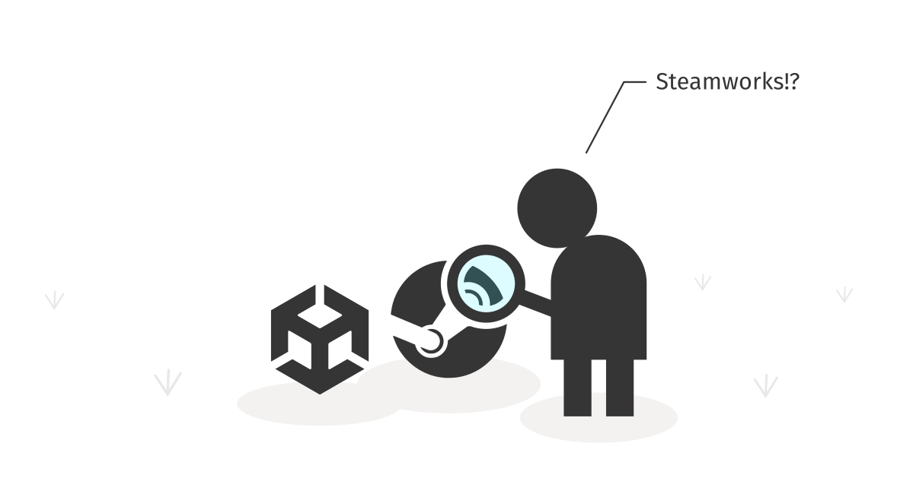
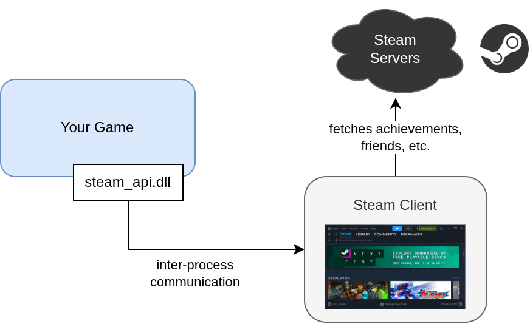
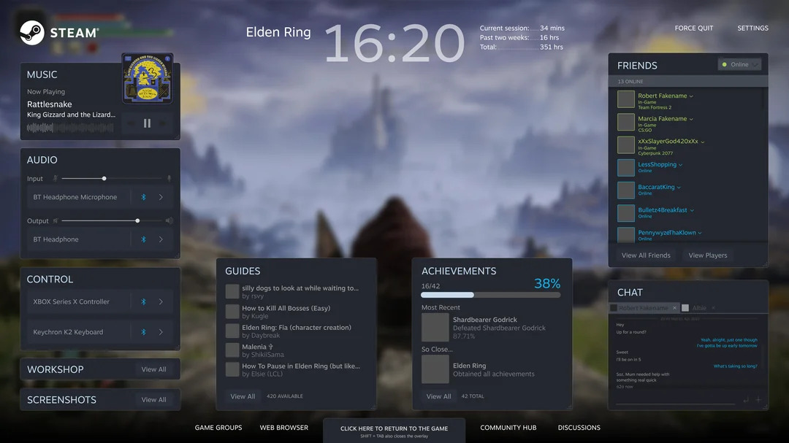

[Steam](https://store.steampowered.com/) is an important marketplace for desktop computer games. It provides a launcher application, called *Steam client*, through which your game is started and this launcher also allows your game to communicate with their services, called [Steamworks](https://partner.steamgames.com/). This guide shows you how to set up communication between your Unity game and Steamworks.


## The checklist

If you just want to have the setup quickly done, follow this checklist. If you want to learn more about what is actually happening, read the rest of the article.

1. Go to the [GitHub releases](https://github.com/rlabrecque/Steamworks.NET/releases) page of Steamworks.NET and downloads the latst `.unitypackage`.
2. Import everything into your project.
    - Right-click in the `Assets` window and choose `Import Package > Custom Package` and select the downloaded `.unitypackage`.

This will add the following files to your project:

```
Assets/
    com.rlabrecque.steamworks.net/       <-- 1
        [...]
    Scripts/Steamworks.NET/
        SteamManager.cs                  <-- 2
steam_appid.txt                          <-- 3
```

The `com.rlabrecque.steamworks.net` folder contains all the internal scripts of the library and the `SteamManager.cs` file is what you will use to talk to Steamworks from your C# scripts. The `steam_appid.txt` file stores the ID of your Steam game, for which you must:

3. Create a [Steamworks Account](https://partner.steamgames.com/doc/gettingstarted) and create a game to get its App ID.
4. Enter the App ID of your game into the `steam_appid.txt` file (replace the default `480`).
5. Restart Unity, so that it reloads the `steam_appid.txt` file contents.
6. In the `SteamManager.cs` file, find the line that says `SteamAPI.RestartAppIfNecessary(AppId_t.Invalid)` and replace the `AppId_t.Invalid` with `(AppId_t)1234` where 1234 is your App ID. This ensures that when your game is built and launched directly, it will re-launch itself via Steam.

That's all, now you can:

- Read the rest of this article to learn how all of this works
- Go to the [Unisave modules](#unisave-modules) section to learn how to install Steam-related Unisave modules
- Go to the [Steamworks.NET Getting Started](https://steamworks.github.io/gettingstarted/) documentation page if you want to talk directly to Steamworks yourself


### Upgrading to newer version

The safest option when upgrading is to delete all the files belonging to the Steamworks.NET package and then go through [the checklist](#the-checklist) again. ☝️

The files to delete are the `com.rlabrecque.steamworks.net` folder and the `SteamManager.cs` file. The `steam_appid.txt` file can remain in place, unless you want to remove Steamworks.NET completely.


## Steamworks SDK

The official way of talking to Steamworks is the [Steamworks SDK](https://partner.steamgames.com/doc/sdk), which can be downloaded from [here](https://partner.steamgames.com/downloads/list). The downloaded zip file contains a number of tools and libraries:

```
steamworks_sdk_162.zip:

sdk/
    glmgr/
    public/
    redistributable_bin/
    steamworksexample/
    tools/
    Readme.txt
```

For example, the `tools/ContentBuilder` is used to upload a built game binary to Steam. However we are interested in `redistributable_bin/steam_api.dll`. This library is what must be included in your game to be able to talk to Steamworks (and also `libsteam_api.so` for linux and another one for mac).

The library provides public methods for interacting with Steamworks for you to call from your game. It implements these methods by communicating via inter-process communication (IPC) with the running Steam client. If the Steam client process is not running, the library refuses to do any work. It's then up to the Steam client to communicate with Steam servers.

<!-- https://drive.google.com/file/d/1CRZQYzwO3LHWV34yi8bimTnevfJPw-7W/view?usp=drive_link -->


The library can also render the [Steam Overlay](https://partner.steamgames.com/doc/features/overlay), which is Steam-related user interface that is displayed on top of your game. You have no control over this overlay, the library manages all of it. For example, when you initiate a microtransaction, this library will display the overlay, pause your game, handle the purchase, and then return control back to you once it's all finished (or failed). Notice that **the overlay is really a part of your game!** It is running in the same process, just the code is imported from the `steam_api.dll` library.

This becomes a complication when used in-development in the Unity editor, as Unity also shares the same process as your game. The Steam APIs that only communicate with the Steam client (such as getting the logged-in player) work fine in Unity, but APIs that open the overlay (such as microtransactions) cannot be tested from within the Unity editor. Instead, you must build the game completely, upload to Steam (maybe as a beta branch), and launch it from within the Steam client. This is quite painful, but I found no other solution. Just remember that when you get a non-sensical error in Unity, this might be the reason.



To do the Steamworks integration, you could place the `steam_api.dll` library into your Unity project and start talking to it. However, the library is written in C++, which is a pain to talk to from within C#. Luckily, people have built wrapper libraries that provide access to it from C#, and they also handle all the integration related to game-pausing and Steam overlay for Unity.

Note that this C++ interface of the library is what is documented in the official [Steamworks API Reference](https://partner.steamgames.com/doc/api) documentation page.


## Unity and C# wrappers

For talking with the Steamworks SDK from C# or Unity, there exist a number of wrapper libraries:

- [Steamworks.NET](https://github.com/rlabrecque/Steamworks.NET)
- [Facepunch.Steamworks](https://github.com/Facepunch/Facepunch.Steamworks)

You can only use one of these in your Unity project, as the `steam_api.dll` library can only really be loaded and managed once.

I chose the `Steamworks.NET` for Unisave modules that integrate with Steam, because it provides the most one-to-one mapping between C# methods and the underlying C++ Steamworks methods. This means you can rely on the [official Steamworks documentation](https://partner.steamgames.com/doc/api) and the information there will directly apply to the Steamwork.NET library.

For example, this is how the method for obtaining player's Steam ID ([see the docs](https://partner.steamgames.com/doc/api/ISteamUser#GetSteamID)) is translated into C#:

```csharp
// C++
CSteamID steamID = SteamUser()->GetSteamID();

// C#
ulong steamId = SteamUser.GetSteamID().m_SteamID;
```

The downside is that the code is really ugly and awkward to use, as it's really just C++ in C#'s clothes.


### SteamManager.cs

The `Steamworks.NET` library is integrated into your game through the `SteamManager.cs` MonoBehaviour script. It handles the loading of the DLL and all of the integration so that you can then use the static methods to actually access the Steam API (such as the `SteamUser.GetSteamID()` method).

It does the following:

- Makes sure it only exists once and that it survives scene changes.
- Re-launches your game through the Steam client, if launched directly.
- Loads the `steam_api.dll` library.
- Initializes the connection to the Steam client.
- Consumes callbacks coming from the Steam client and invokes them within the body of its `Update` method.

The easiest way to make sure you have the `SteamManager` present in your game is to create an empty game object in your startup scene and add the `SteamManager` to it. If you have it in multiple scenes simultaneously, it's ok, it will only be used once and the other instances will destroy themselves automatically.

Alternatively, you can create it programmatically by reading the `SteamManager.Instance` static property:

```csharp
// This creates the SteamManager if it does not exist yet.
var _ = SteamManager.Instance;

// We can just throw the variable away (underscore), since
// we don't need to do anything with it. Just create it.
```

Run this code in `Awake` so that the `SteamManager` is initialized by the time your `Start` method runs. You cannot use it immediately, its `Awake` method must be called before first use.


## Unisave modules

Unisave is a game backend platform that lets you build a custom backend server. It can be used to register players and store their data online. Unisave provides ready-to-use modules that integrate it with certain Steam features. For example, in order to use Steam Microtransactions, Steam needs you to have a "[purchasing server](https://partner.steamgames.com/doc/features/microtransactions/implementation#3)" which acts as a safe place to store all your player's transactions and also your Steam API keys. The [Steam Microtransactions](../../docs/steam-microtransactions.md) Unisave module provides this purchasing server, as well as additional code to make the integration easier.

Unisave currently provides these Steam modules:

- [Steam Authentication](../../docs/steam-authentication.md) (login via Steam)
- [Steam Microtransactions](../../docs/steam-microtransactions.md)
