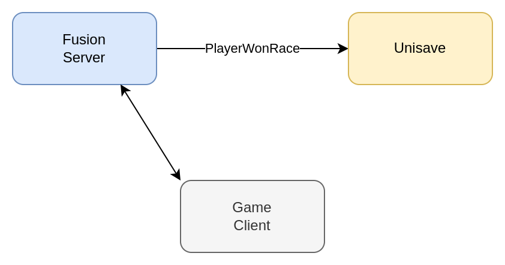
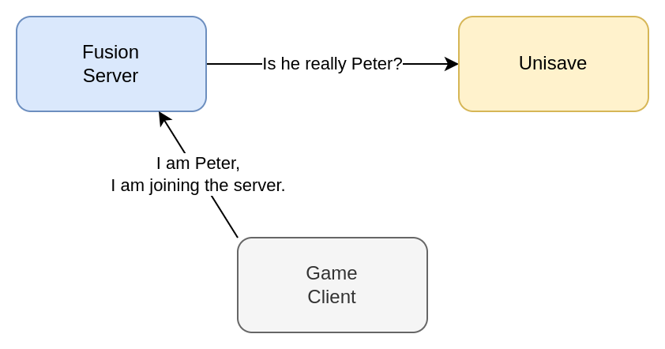
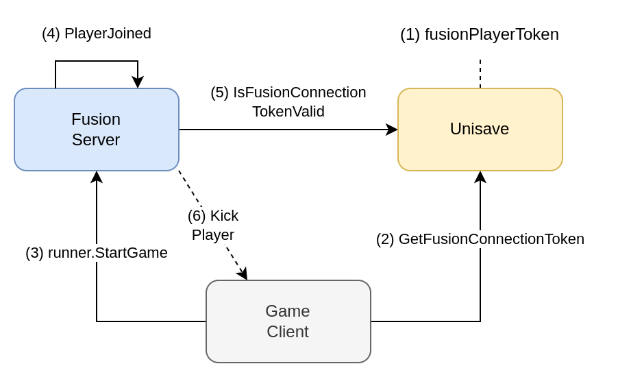

This guide explains how to make Photon Fusion and Unisave talk to each other. More specifically, how to authenticate requests sent from *Fusion Dedicated Server* to Unisave and how to authenticate players joining the *Fusion Server* using Unisave.


## Network topology

There are three main ways in which you can set up Photon Fusion:

- Shared
- Client Host
- Dedicated Server

This guide focusses on the *Dedicated Server* setup, as it’s the only one where Photon-to-Unisave communication must be handled. In both two remaining cases, there are only game clients, which can be authenticated via standard Unisave authentication.

You would typically choose the *Dedicated Server* setup if you want the Fusion server to have authority over the state of the game. And in this scenario, you want the Fusion server to talk to Unisave, triggering business logic events (e.g. player won race, grant them reward coins).

In this situation, the Fusion server is built as a “Headless Server” build in Unity and uploaded to Photon cloud during deployment. From the Unisave’s perspective, this Fusion server is just another build (like the PC build, mobile build, WebGL build). Therefore when the Fusion server makes a request to Unisave, we need to make sure it is the Fusion server indeed and not just some hacker-client trying to pretend.

This is the first scenario and we call this the *Fusion Server Authentication* scenario:


<!-- https://drive.google.com/file/d/1aqwh1_fFH3lahtKzXCjwEPPnw5_wuT1W/view?usp=sharing -->

But even when we secure this, we still have to make sure that when the Fusion server thinks a player won the race, the Fusion server needs to know that this player is who he says he is. And this is handled when the player connects to the Fusion server and the scenario is called the *Fusion Player Authentication* scenario:


<!-- https://drive.google.com/file/d/1aqwh1_fFH3lahtKzXCjwEPPnw5_wuT1W/view?usp=sharing -->

With both these mechanisms in place, we can have Unisave trust the `PlayerWonRace` facet call.


## Fusion connection token

Firstly, we need to define what the *Fusion Connection Token* looks like. It’s a binary blob that you can send to Photon whenever a player wants to join. The server can then parse this token to know who is joining in.

> **Note:** The connection token is passed to Photon in `StartGame` as a part of the [`StartGameArgs`](https://doc-api.photonengine.com/en/fusion/v2/struct_fusion_1_1_start_game_args.html#a9d0ceab922a47799bf15cba826051ef0). It can then be obtained by calling `Runner.` [`GetPlayerConnectionToken`](https://doc-api.photonengine.com/en/fusion/v2/class_fusion_1_1_network_runner.html#a83afbf1ff2eff060d7be42dfcd819922)`(playerRef)`.

We will create a custom C# class that will use the [Unisave serializer](https://unisave.cloud/docs/serialization#using-the-serializer-directly) to turn itself into a binary blob. The class will hold the Unisave player ID (the `PlayerEntity` ID) and also the *Fusion Player Token* (explained later). Place the class into your backend folder as it will also be used by your Unisave backend:

```csharp
public class FusionConnectionToken
{
    public string unisavePlayerId;
    public string fusionPlayerToken;

    public byte[] ToBytes()
    {
        return Encoding.UTF8.Encode(
            Serializer.ToJsonString(this)
        );
    }

    public static FusionConnectionToken FromBytes(byte[] data)
    {
        return Serializer.FromJsonString<FusionConnectionToken>(
            Encoding.UTF8.Decode(data)
        );
    }
}
```

> **Note:** You can understand the `FusionConnectionToken` as a username and password pair, that will be used by a player to connect to the Fusion server.

> ⚠️ **Warning:** The *Connection Token* has a limit of 128 bytes maximum, enforced by Photon. This limits how many more fields you can add to it substantially. Also note that there seems to be inconsistency with Client-Host setup, where the limit is only enforced for clients. Be wary of this.


## Fusion Server Authentication

Fusion Server authentication is the first requirement for a secure Photon Fusion setup with Unisave and it makes sure that facet calls that only the Fusion Server is supposed to make cannot be made by any other client.

The solution is simple. Generate a random token (a password used by the fusion server) and send it with each facet call to Unisave. Unisave then checks this token and if it matches, it performs the requested business action. We can call this token the *Fusion Server Token*.


### Calling facets from the Fusion server

Since the Fusion server is built with Unity just like any other game build, it gets automatically registered by Unisave in the list of builds and can make facet calls like any other build.

Let’s say the Fusion server tracks the winner of a race. When the race finishes, it calls Unisave and tells it which player won and that coins should be given to them:

```csharp
public class MyRaceManager : NetworkBehaviour
{
    void Update()
    {
        // Somehow detect the end of the race and the winner
        // and trigger the Unisave logic.
        if (raceHasFinished() && Runner.IsServer)
            SendWinnerToUnisave(this.RacePlayers[0]);
    }

    async void SendWinnerToUnisave(PlayerRef player)
    {
        // Provided to the server by configuring
        // your hosting provider, e.g. Hathora.
        string fusionServerToken = Environment.GetEnvironmentVariable(
            "FUSION_SERVER_TOKEN"
        );

        // We assume the Unisave player ID is sent to Photon
        // as the connection token.
        string unisavePlayerId = Encoding.UTF8.Decode(
            Runner.GetPlayerConnectionToken(
                playerRef
            )
        );

        // Make the facet call to Unisave about the player winning.
        await this.CallFacet(
            (MyRaceFacet f) => f.PlayerWonRace(
                fusionServerToken,
                unisavePlayerId
            )
        );
    }
}
```

The *Fusion Server Token* can be passed into the Fusion server via environment variables. How exactly that is performed depends on the hosting provider you use. Photon itself does not provide hosting for servers (Game Session servers in the Photon terminology). Check out this Photon Fusion [documentation page](https://doc.photonengine.com/fusion/current/concepts-and-patterns/dedicated-server-overview). There are a number of listed providers, and for example Hathora can have environment variables [set up like this](https://hathora.dev/docs/guides/access-env-variables).

Alternatively you could accept the token as one of the startup command-line arguments of the server, say `--fusion-server-token=123456789`. [Here](https://learn.microsoft.com/en-us/dotnet/api/system.environment.getcommandlineargs) is how to get these from C#.


### Securing facets designated for the Fusion server

On the Unisave side, once you receive the facet call, you verify the fusion server token against the one stored in [Unisave environment variables](https://unisave.cloud/docs/environments) (you put the same token into both the fusion server as well as the unisave environment) and if it matches, you perform the business logic:

```csharp
public class MyRaceFacet : Facet
{
    public void PlayerWonRace(
        string fusionServerToken,
        string unisavePlayerId
    )
    {
        // Verify the given Fusion server token.
        string trueFusionToken = Env.Get("FUSION_SERVER_TOKEN");
        if (trueFusionToken != fusionServerToken)
            throw new Exception(
                "Given Fusion server token is invalid"
            );

        // Give the player their victory gold.
        var player = DB.Find<PlayerEntity>(unisavePlayerId);
        player.coins += 420;
        player.Save();
    }
}
```

For all the facet calls that originate from the Fusion server, you need to send the Fusion Server Token and perform its validation.


## Fusion Player Authentication

Now that Unisave can authenticate (verify the identity of) the Fusion server, we also need to Fusion server to authenticate (verify the identity of) players that connect to it.

Photon Fusion [provides a mechanism](https://doc.photonengine.com/fusion/current/manual/connection-and-matchmaking/authentication/custom-authentication) for custom authentication, but because Photon does not host game servers, this authentication only supports making HTTP request to a given endpoint. It does not allow us to make facet calls. Therefore we will use a different approach.

We will let the player connect no matter what, and then when he starts being handled by our Fusion server, we verify his identity there and kick him out in case the validation fails.

The process will be the following:

1. We will create a new field in the `PlayerEntity` called `fusionPlayerToken`. This random token will act as the password used by the player to join our Fusion server.
2. Before the player attempts to join the Fusion server, it first fetches its *Fusion Player Token* from Unisave.
3. Then the player connects to the Fusion server, while providing the *Unisave Player ID* and the *Fusion Player Token* as part of the `ConnectionToken` (a binary payload that can be sent to Photon during connection).
4. Photon makes the player join a session and in turn triggers the `PlayerJoined` callback on the Fusion server.
5. The Fusion Server sends the player’s connection credentials to Unisave and Unisave checks their validity.
6. If the validation fails, the player is kicked from the Fusion server.

The process is visualized in this diagram:


<!-- https://drive.google.com/file/d/1aqwh1_fFH3lahtKzXCjwEPPnw5_wuT1W/view?usp=sharing -->

First, we modify the `PlayerEntity`:

```csharp
public class PlayerEntity : Entity
{
    /* ... */

    public string fusionPlayerToken;
}
```

Then we need to add the token generation and fetching facet to Unisave:

```csharp
public class MyFusionAuthFacet : Facet
{
    [Middleware(typeof(Authenticate))]
    public FusionConnectionToken GetFusionConnectionToken()
    {
        var player = Auth.Get<PlayerEntity>();

        // Regenerate fusion player token before returning it.
        player.fusionPlayerToken = GenerateSecureToken();
        player.Save();

        return new FusionConnectionToken() {
            unisavePlayerId = player.Id,
            fusionPlayerToken = player.fusionPlayerToken
        };
    }

    private string GenerateSecureToken()
    {
        byte[] bytes = new byte[32];
        var cryptoProvider = new RNGCryptoServiceProvider();
        cryptoProvider.GetBytes(bytes);
        return Convert.ToBase64String(bytes);
    }
}
```

Now, when the player wants to connect to the Fusion server, we first call this facet and pass the information to Photon:

```csharp
async void StartGame()
{
    // Create the Fusion runner.
    runner = gameObject.AddComponent<NetworkRunner>();

    /* ... */

    // Get the connection token from Unisave
    FusionConnectionToken connectionToken = await this.CallFacet(
        (MyFusionAuthFacet f) => f.GetFusionConnectionToken()
    );

    // Join the Fusion server.
    await runner.StartGame(new StartGameArgs()
    {
        ConnectionToken = connectionToken.ToBytes(),
        /* ... */
    });
}
```

Then, in the scene (in the Fusion server), we need to have a `NetworkBehaviour` running which will check for new incoming players and verify their identity:

```csharp
public class FusionPlayerAuthenicator : NetworkBehaviour, IPlayerJoined
{
    public void PlayerJoined(PlayerRef player)
    {
        // We only perform authentication if we are the server.
        if (!Runner.IsServer)
            return;
        
        // Get the connection token for the player.
        var connectionToken = FusionConnectionToken.FromBytes(
            Runner.GetPlayerConnectionToken(
                playerRef
            )
        );

        // Ask Unisave whether the token in valid.
        bool isValid = await this.CallFacet(
            (MyFusionAuthFacet f) => f.IsFusionConnectionTokenValid(
                connectionToken
            )
        );

        // If not, kick the player.
        if (!isValid)
            Runner.Disconnect(player);
    }
}
```

Finally, we need to extend the `MyFusionAuthFacet` to implement the token validation method:

```csharp
public class MyFusionAuthFacet : Facet
{
    /* ... */

    public bool IsFusionConnectionTokenValid(
        FusionConnectionToken connectionToken
    )
    {
        var player = DB.Find<PlayerEntity>(
            connectionToken.unisavePlayerId
        );

        string givenToken = connectionToken.fusionPlayerToken;
        string trueToken = player.fusionPlayerToken;

        if (givenToken != trueToken)
        {
            Log.Warning(
                "Received invalid Fusion player token for player: " \
                + player.Id
            );
            return false;
        }
        
        return true;
    }
}
```

## Conclusion

While the setup might seem complicated at first, it completely outsources Photon authentication onto Unisave. This lets you add more authentication methods for Unisave (Steam, Epic), and this code can remain unchanged. You can also extend this logic to fetch metadata about the player from Unisave and grant them more fine-grained privileges.
