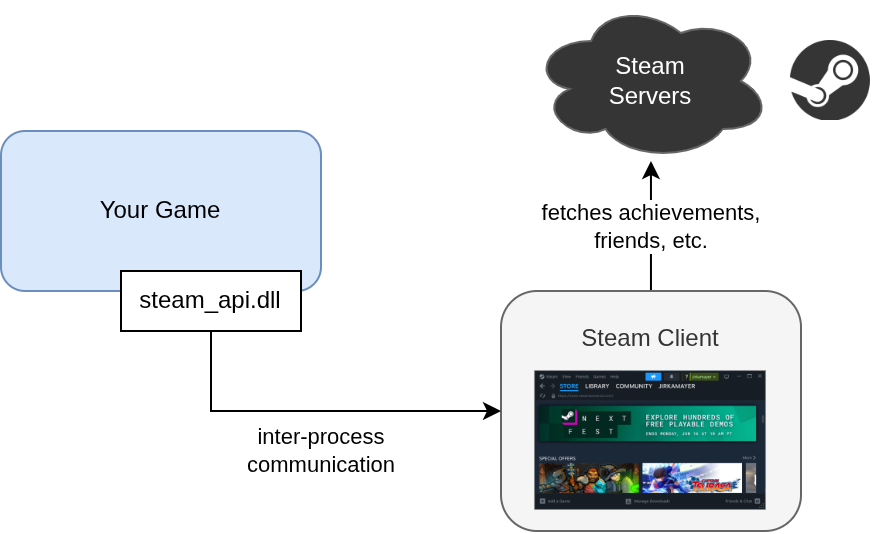

Steam Overlay is a feature of Steamworks SDK that displays Steam's UI on top of your game when you press `Shit + Tab`. It also handles other interactions between Steam and your game, such as authorizing Steam microtransactions. Due to the way it integrates with your game, it is impossible to test Steamworks features that utilize the Overlay from within the Unity Editor. This guide describes possible workarounds to ease development and debugging.

## Context

I wrote this guide as a result of my frustrations when developing and debugging the [Steam Microtransactions Unisave Module](../../docs/steam-microtransactions/steam-microtransactions.md). You can apply techniques described here to your own Steamworks integration, but this guide will use the demo scene from that module.

The Steamworks SDK can be integrated into a Unity project via the [Steamworks.NET](https://github.com/rlabrecque/Steamworks.NET) library. The library then communicates with the running Steam client to provide the functionality, as is described in the [Installing Steamworks in Unity](../installing-steamworks-in-unity/installing-steamworks-in-unity.md) guide:

<!-- https://drive.google.com/file/d/1CRZQYzwO3LHWV34yi8bimTnevfJPw-7W/view?usp=drive_link -->

This communication works fine in Unity, but it breaks Steam in subtle ways. When you enter and exit play mode, the connection is kept alive, which makes the Steam client think your game is still running. The only way to fix this is to restart Unity. Luckily this does not cause any major issues but it illustrates the complexity of the setup.

Most Steamworks functionalities work in this regime fine, for example getting the logged-in Steam player ID works without issues. However a well-known problem is the Steam Overlay, which does not work. It is mentioned in the [Steamworks.NET FAQ page](https://steamworks.github.io/faq/) that it is because in Unity, the Steamworks library is loaded after the OpenGL renderer is initialized, which is too late and so the overlay cannot render.

This makes it very impractical to test overlay-dependant features, such as Steam microtransactions. Processing a microtransaction requires a choreographed dance of multiple components (client, backend, Steam API, Steam client, Steam overlay) where the overlay plays a central role in authorizing transactions by the player.

There are two ways to tackle this problem:

1. Build, upload and launch the game via the Steam client.
2. Hijack the overlay with the Steam-launched game.

The first option is slow and cumbersome - practically being equal to doing a full new release of your game anytime you change anything. It's a very slow way to debug. You can create a private [Steam branch](https://partner.steamgames.com/doc/store/application/branches) to not interfere with your production deployment. This process is described in the second part of this guide, in the [Deploy build to a testing branch](#deploy-build-to-a-testing-branch) section.

Luckily I've found a hack to make this process much faster, if you have already uploaded your game to Steam at least once. In this alternative setup, we launch the older build from the Steam client and then we enter play mode in Unity. The overlay will get open in the older build, can be interacted with there and then when submitted, the callback will be handled back in Unity.

Assuming you have already uploaded your game to Steam at least once, I will first explain this hijacking approach in more detail.

## Hijack Overlay with Steam Client

First, make sure you have the Steamworks.NET library [set up properly](../installing-steamworks-in-unity/installing-steamworks-in-unity.md) and you have the app ID specified in the `steam_appid.txt` file. You will also need to have at least some build (any old version) with the same app ID uploaded to Steam and be able to launch it via the Steam client.

1. Close the Unity editor (if running).
2. Start or open the Steam client and make sure it shows your game as NOT running.

3. Hit the `[Play]` button to start your old build and keep it running on the side.
4. Open your Unity project and the scene with the Steamworks integration.
5. Enter the play mode.

The `SteamManager` inside the scene should now be initialized and connected to the Steam client. In other words, there should be no errors in the console.

Right now there are three processes running - Unity, Steam client, and your old build launched via the client:

<!-- https://drive.google.com/file/d/1CRZQYzwO3LHWV34yi8bimTnevfJPw-7W/view?usp=drive_link -->

6. Initiate the overlay-triggering action. In my case, I'll click the `[Purchase]` button.

While in Unity, nothing seems to happen, the overlay has been openned over the old build of your game.

7. Interact with the overlay in the old build, e.g. authorize the purchase.

The overlay closes. Now back in Unity, the Steam client has sent a callback that was processed and the transaction was fulfilled. The console shows the transaction completed and the player details show the purchased gold coins were given to the player.

8. You can exit the play mode in Unity.

This setup will function even if you re-enter the play mode again and even if you modify the C# code, recompile, and enter the play mode then. The only condition is that **you must keep the old build running**. Once you close the old build, only the connection between Unity and Steam client remains open, Steam client will still believe your game is running, and the overlay will not be able to open. Now you have to exit Unity to convince the Steam client that your game has been closed. This is also the first step, so now you can follow the checklist again from the start.

### Why this works?

To be honest, I don't know. So I don't guarantee it will work for you. But it did work for me. I remember from tests I did 4 years back, that this setup used to fail by not sending the Steamworks callback to Unity. The overlay would open in the old build, but when closed, Unity still did nothing.

If the setup does not work for you, try closing both Unity and the Steam client to make sure you have a fresh start. Also make sure you launch the old build first - not necessarily before Unity itself, but definitely before the Steamworks library gets first loaded in Unity. Also ensure that you start the old build through the Steam client, not directly from its executable.

If it still doesn't work, then try the option below. That one should always work.

## Deploy build to a testing branch

I assume you have Steam publisher account, you paid the Steam fee and have an app for your game registered in the Steam dashboard.

> **Note:** This checklist is a reduced and focused version of the official Steam game uploading documentation at: https://partner.steamgames.com/doc/sdk/uploading

Open the Steam dashboard: https://partner.steamgames.com/dashboard

Go to `Apps & Packages > All Applications` and open your game.

### Create a testing branch

Go to `Technical Info > Edit Steamworks Settings` to see a page with multiple tabs which contains Steamworks configuration. Go to the tab `Steam Pipe > Builds`.

This tab shows the list of available [Steam branches](https://partner.steamgames.com/doc/store/application/branches) for your game. Create a branch named `testing` and give it some weak password so that it isn't visible to everyone in the Steam client, only to people who know about it.

When you create the branch, **make sure you publish changes** otherwise you won't be able to see the branch from the Steam client. Open the `Publish` tab in the Steamworks Settings page and go through the process there: `Prepare for Publishing`, `Publish to Steam`, type in `STEAMWORKS`, click `Really Publish`.

### Upload build to Steam

First, build your game in Unity and create a ZIP file with the built files. This ZIP archive should have less than 2GB in size. If it has more, you have to perform the upload using the `steamcmd` command line tool, which is outside the scope of this guide. See the [official documentation](https://partner.steamgames.com/doc/sdk/uploading).

> **Note:** The `.exe` file should be directly in root of the ZIP archive and match the name you have specified in the `Installation > General Installation` tab under `Launch Options`. Otherwise these files will be downloaded by the Steam client but it won't be able to launch your game.

In the `Steam Pipe > Builds` tab, there's a small, easy-to-overlook text with a link:

> Upload depots as ZIP directly without using steamcmd (2048MB max). Click _here_

Click on the link and upload the ZIP file. Once that completes, it will ask you to set the build live to a given branch. Select our new `testing` branch and click `Commit`:

Again, **go through the publishing flow** to make sure the newly uploaded build will be visible from the Steam client.

### Launch beta branch from the Steam client

Open the Steam client and in your library, right-click your game and choose the `Properties...` option:

This opens up a dialog window where you select the `Betas` tab. Type in the password for the testing branch and click `Check Code`. Then click the `Opt into: ...` blue button that appears.

The dropdown button in the upper right corner of the dialog will change to our testing branch. You can close the dialog now. The Steam client starts automatically downloading the new branch and it also displays that branch name after the download finishes:

Now when you hit the `Play` button, Steam client should launch your game and you can proceed to testing your Steamworks integration. The game gets launched in the exact same way as it gets launched in production.

### Repeating this during debugging

Once you set up the branch, then doing this process when debugging your game involves these steps:

1. Build your game from Unity.
2. Upload the ZIP of your build to Steam, set live to the testing branch.
3. Publish changes to the app Steamworks configuration.
4. Restart the Steam client so that it starts downloading the updated build.
5. Launch the game from the Steam client and do your testing.

Fix bug, repeat - until your game works as expected.

As you can see, this is quite slow and cumbersome. With this setup in place and the beta branch selected, try giving a one more attempt to the [Hijack Overlay with Steam Client](#hijack-overlay-with-steam-client) approach, as that one is much more convenient to work with. I wish you success.
