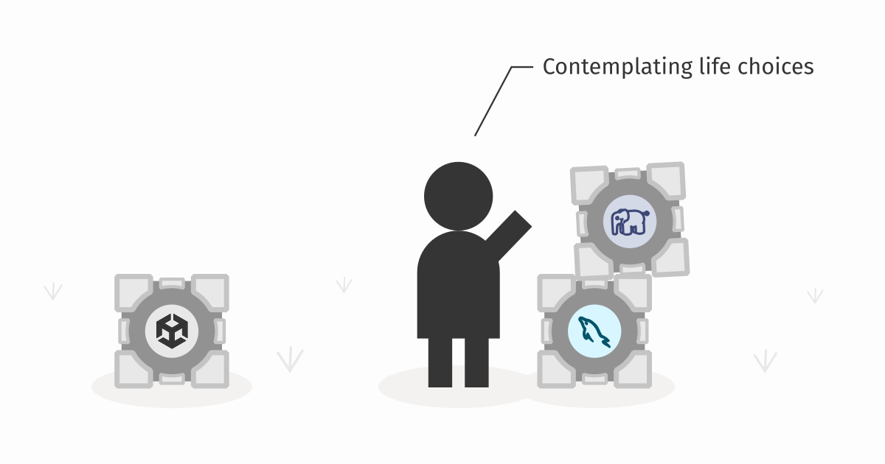
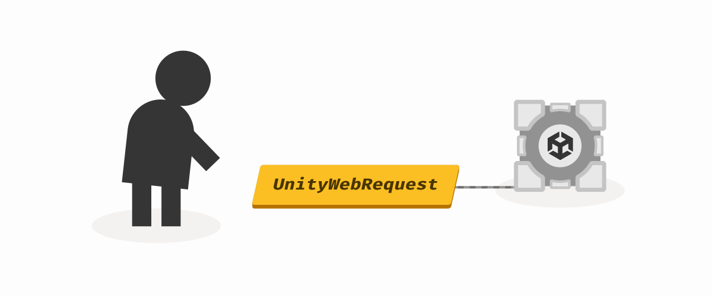
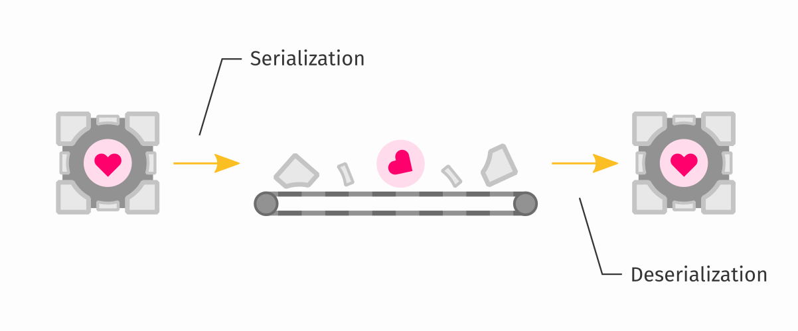
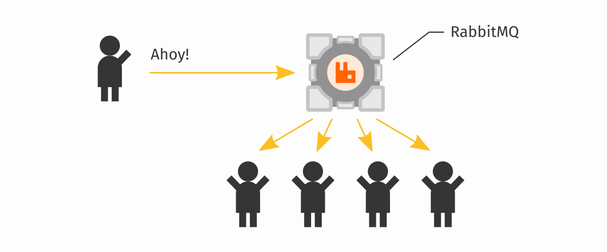

When you try googling for saving game data online, you will find answers suggesting you to use PHP and MySQL. You might be tempted to pursue this path, as you may already have some experience with building websites. But a website is not the same as a game backend server and you will encounter lots of problems that will take plenty of your time to solve. This article attempts to list the major problems you will encounter. Instead, consider using a dedicated game backend service like [Unisave](https://unisave.cloud/), I believe you will be better off at the end.


## Communicating with the server

Having a backend server that stores all your player accounts is only a part of the puzzle. You also need to communicate with it. You want to download the stored data and trigger actions like registering players, logging them in, etc. For this communication, the HTTP protocol is used.




### The HTTP Protocol

In [Unity](https://unity.com/), making HTTP requests is possible. You can use the `UnityWebRequest` class for that. But it's a low-level tool that is very verbose to use. Look how much code we need to write just to register a new player. This is not very readable:

```cs
IEnumerator RegisterPlayerCoroutine(string email, string password)
{
    List<IMultipartFormSection> formData
      = new List<IMultipartFormSection>();
    formData.Add(new MultipartFormFileSection(
      "email", email
    ));
    formData.Add(new MultipartFormFileSection(
      "password", password
    ));

    UnityWebRequest request = UnityWebRequest.Post(
      "https://my-server.io/api/register-player",
      formData
    );
    
    yield return request.SendWebRequest();

    if (request.result != UnityWebRequest.Result.Success)
    {
        Debug.Log(request.error);
    }
    else
    {
        // {"id":"12345","email":"john@doe.com","score":0}
        Debug.Log(request.downloadHandler.text);
    }
}
```

That is 24 lines of messy code. With Unisave, you can call custom public server methods easily (we call these methods [Facet methods](../../docs/facets.md)):

```cs
void RegisterPlayer(string email, string password)
{
    this.CallFacet((AuthFacet f) => f.RegisterPlayer(email, password))
        .Then((Player player) => {
            Debug.Log(player.email);
            Debug.Log(player.score);
        })
        .Catch((Exception e) => {
          Debug.Log(e);
        });
}
```

That's one third the number of lines and it's way more readable. Unisave also supports coroutines and `async` & `await`.

If you want to learn more about the HTTP protocol and its ecosystem, try reading the article [HTTP and the Web explained for game developers](../http-and-the-web-explained-for-game-developers/http-and-the-web-explained-for-game-developers.md).


### Serialization

Inside your game, you store data in variables of various types. These variables represent data stored somewhere in the computer's memory. When you want to make an HTTP request, you need to convert this data into some format that is commonly used for such communication. This is most likely going to be the [JSON](https://www.json.org/) format:

```json
{
  "id":"12345",
  "email":"john@doe.com",
  "score":0
}
```

Converting your variables to such a format is called *serialization* and retrieving the values back from such a format is called *deserialization*. When developing a backend server yourself, you will need to choose (or build) a serialization library that you use each time you send or receive data in your game.



With Unisave, this serialization layer is already included and acts completely transparently. You can *"just send"* strings, numbers, lists, or your own types:

```cs
public class Player
{
    public string id;
    public string email;
    public int score = 0;
}
```


### Server-initiated communication

Imagine you're building a friend system for your game. You have two friends, playing together and talking over Discord. One of them says "I'll send you a friend request in the game.", the other one replies "Oh, yeah, I see it. I confirmed it.".

❗This simple interaction cannot be built using plain HTTP and PHP!❗

When the first friend sent the friend request, it has been registered in the database. But then the server needs to immediately tell the other friend that a new request has been created. Otherwise the second player would need to refresh their game to get the new list of friend requests from the sever (and all the solutions like this are ugly).



> **Note:** Notice that the same problem arises when we try to implement an in-game chat.

The HTTP protocol is only designed to allow clients to ask the server, but not the server to notify the clients. Therefore a different protocol is typically used.

There are three approaches used:

- WebSockets protocol
- Server-Sent Events protocol (SSE)
- Long Polling

Both WebSockets and SSE are not supported by Unity. You will need to find or buy a suitable library for this. Implementing Long Polling in Unity is complicated and will need a completely separate solution for the WebGL platform (I did that for Unisave, it was a pain).

While the client-side can be solved, the server side with PHP is way worse. PHP is not really suited for handling long-running requests, because one request always consumes one execution thread. This means that with about 20 concurrent users the PHP machine runs out of worker threads and no more players can connect. That's not good...

In addition, you need a system that lets you track connected players and then send messages to some of them. Another words, you need some routing system. That's easy. Just set up a [RabbitMQ](https://www.rabbitmq.com/) message broker, figure out the [AMQP protocol](https://www.amqp.org/) for PHP, then get rid of PHP for the threading problems and use Javascript or Python instead.

As you can see, implementing this on your own requires a lot of dedication. So you turn to the internet and you find companies (like [Pusher](https://pusher.com/)) that sell such a service. If you are going to pay for this anyways, why not pay for Unisave, that in addition provides other services and is tailored to game developers?

Unisave uses the SSE protocol and a RabbitMQ broker as parts of a system it calls [Broadcasting](../../docs/broadcasting.md). The Unisave Broadcasting system is designed specifically for sending messages from the server to a set of connected clients. You will never, when reading its documentation, find the words "SSE" or "RabbitMQ" as they make up the internals you don't need to worry about.


## PHP is not C#

PHP is a great language that shaped the Web as we know it today. Also, lots of people know it so it's easy to find an employee or a friend to bring help if you decide to build your server with PHP. The problem is, that these people are web developers, not game developers. And you are a Unity game developer. You know C#, why not use it for the server?

Unisave does exactly that. You build your server in C#, because you build your game in C#. Not only do you get to use the same language and save time learning some other language, you also can write one code to be used both on the server and on the client.

You start by sharing your data classes:

```cs
class Player
{
    public string email;
    public int coins = 100;
}
```

Then you realize you can share your data-validation logic as well. Why should the registration form perform a different email-validation check then the server when saving the new player? It's the same check:

```cs
class Player
{
    // ...

    public bool IsEmailValid()
    {
        return this.email.Contains("@");
    }
}
```

With PHP you have none of that and you have to do everything all over again:

```php
class Player {
    public $email = null;
    public $coins = 100;

    public function isEmailValid() {
        return str_contains($this->email, "@");
    }
}
```

Ultimately, for a turn-based game, you realize you can write all your game logic independently of the Unity engine and make it executable on the server, turing your backend server into a fully-authoritative aynchronous (or turn-based) multiplayer server. And you save cost on Photon, Mirror, FishNet and other real-time multiplayer soltuions. How cool is that?


## SQL vs. NoSQL database

MySQL is a mature and tested database that is widely used and known. In fact, Unisave uses MySQL to track developer accounts and games. Therefore it is difficult to argue against it. But the choice of tools always depends on the problem at hand.

MySQL is a traditional relational database, that is best suited for mission-critical data with rigid structure, lower frequency of modifications, and buletproof durability (consistency, transactions, locks, etc.). If you're building a banking system, then MySQL (and other relational databases) are the right tool for you.

But a game backend resembles more a social network than a bank. Most players interact only with their own data and with other players interact only in small groups of their friends. And when we have global data (such as a leaderboard), we are not interested in perfect values all the time. We want the leaderboard to eventually represent the true state of reality, not all the time (this is called [eventual consistency](https://en.wikipedia.org/wiki/Eventual_consistency)). This, and the reasons below, is why I decided to use [ArangoDB](https://www.arangodb.com/) as the game-data database for Unisave.


### Schema

In MySQL, you have to define the tables and their columns first, before you insert any data. This definition is called the *schema*. This makes it difficult for someone to insert invalid data, but complicates the game development and schema evolution later during the game's lifetime.

ArangoDB is a schema-less database, meaning it stores whatever data you give it. This means that when adding a "steam login" system to your game, that needs to store a `steamId` for each player, you don't need to go over all players and create this field. Some players will have it and some will not. Those that don't have it will not be able to login via Steam. The integration of this system into your game has now been much faster thanks to this feature.


### Scalability

This is the primary reason why I chose ArangoDB and why other social networking sites also use NoSQL databases like [MongoDB](https://www.mongodb.com/). Because MySQL database provides a lot of security when it comes to data-integrity (see [ACID properties](https://en.wikipedia.org/wiki/ACID)) it needs to internally communicate a lot to ensure the safety. And this internal communication makes it difficult to scale the database to large traffic. While scaling read operations is doable, scaling write operations becomes a major problem.

Modern NoSQL databases were primarily designed to mitigate this problem. They don't provide as much data integrity (they will allow you to lock a few documents, not multiple tables or collections), but on the other hand let you scale the database to multiple machines, giving you very little limitations to its size.


### Flexibility

Lastly the question arises, why not use [MongoDB](https://www.mongodb.com/) if it's well known. Why choose ArangoDB instead? MongoDB is one of the first popular NoSQL databases and it is highly focused on the Javascript web environment. So the query language used in MongoDB is very easy to use from inside Javascript. But that also means it's awkward to use from C#.

Moreover, ArangoDB is one of the first modern *multi-model* databases. Multi-model means that the database does not dictate, what structure your data should have. It supports key-value data, it supports collections of documents, and it also supports graph data. MongoDB here only supports the document model and partially the key-value model.

This means that if you know MySQL tables, you will very quickly understand the document collections. But should you need it, you can also store graphs, or even perform full-text search on documents (which is typically the domain of [Elastic Search](https://www.elastic.co/)).


## Infrastructure

If you build your backend server with PHP, you need to run the server somewhere. Website hosting is the first option, but that won't scale well. You need something that will grow, if your playerbase grows. But managing custom servers is a whole different job. Not to mention managing a database server, which requires much more care and attention.

On your own servers, you will also need to manage DNS, set up custom SSL certificates and worry about load balancing. It all gets complicated fast.

With Unisave all this is taken care of. Unisave scales from a small single instance setup to a setup with multiple worker machines without you even realizing.


## Deployment

This is last, but probably the most important from the perspective of you as the game backend developer. How do you get the server code from your computer to the servers? And how do you test the code when developing it? Also, how do you separate your development server from the production one?

You don't want to open an FTP connection or use SCP each time you add a forgotten semicolon and try again. And forget about drag&dropping files, that's soo slow. You need something faster that does not take time away from you.

With Unisave, you have your backend server code inside your Unity project. It lives in a folder named `Backend`. Whenever you change the code and Unity recompiles, it also uploads this code to Unisave servers. When you hit the play button, the server is ready and the game will connect to it right away. You don't have to change anything about your current workflow.


## Conclusion

Developing your own backend server may *seem like an easy feat*, but when you encounter all of these problems, it may be the thing that makes you leave your game on the shelf forever. You should focus on the fun game-part instead and let [Unisave](https://unisave.cloud/) handle this boring infrastructure work. If you still want to do it on your own, take this article as a starting ground to analyze all the mentioned problems. I wish you good luck on your journey.
