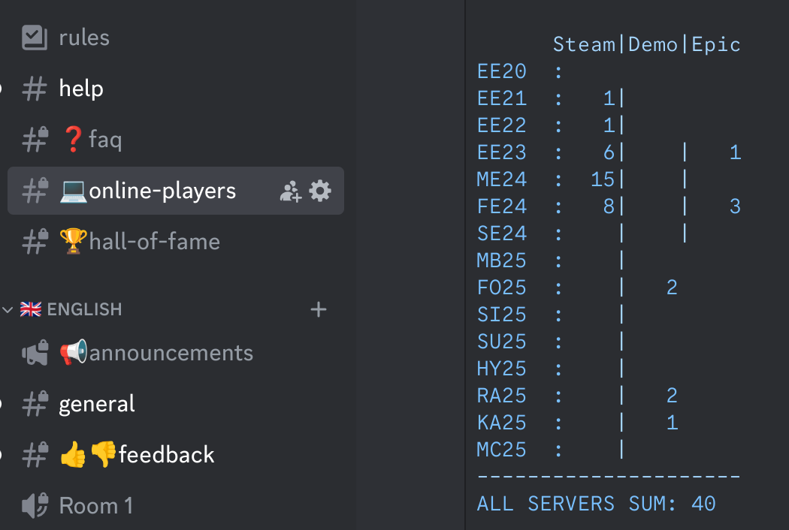

<div class="youtube-container">
    <iframe width="560" height="315" src="https://www.youtube.com/embed/leGadAt4t9k?si=Z2_xOUGUZr3ihKtN" title="YouTube video player" frameborder="0" allow="accelerometer; autoplay; clipboard-write; encrypted-media; gyroscope; picture-in-picture; web-share" referrerpolicy="strict-origin-when-cross-origin" allowfullscreen></iframe>
</div>

Hello, my name is Jirka. Welcome to [Unisave Zero to Hero](../zero-to-hero.md) - a video tutorial series that explains Unisave from the absolute basics. But first, what is Unisave? Unisave is a platform for building backend servers for Unity games.

> 📖 **Navigation**<br>
> [Unisave Zero to Hero](../zero-to-hero.md)<br>
> ➡️ Next: [Registration, Asset, Installation](../01-registration-asset-installation/zth-registration-asset-installation.md)


## What is Unisave

Let's say you are building a multiplayer game. It's very likely that you need to register players and store them in a cloud database. Unisave provides both the database and the cloud infrastructure to run your backend logic.


## Database

The database is actually the central piece. What data you store there and in what form is completely up to you, since each project has different needs. In Unisave, you can view and modify this data from your web browser.


## Cloud functions

Most importantly, the database can be accessed by your game. This is done indirectly through cloud functions called facets that you write yourself in plain C#. For example, the player clicks on a star to be collected, the game client calls a cloud function, and that function modifies the player data and sends them back to the client.


```csharp
public class PlayerDataFacet : Facet
{
    // a cloud function callable from the client
    public PlayerEntity CollectStar()
    {
        // fetch from the database
        var player = Auth.GetPlayer<PlayerEntity>();

        // update state
        player.collectedStars += 1;

        // store back into the database
        player.Save();

        // send the new state back to the client
        return player;
    }
}
```


## Connecting external services

You don't have to be building a multiplayer game to find Unisave useful. It can also be used to integrate third party services into your game. One such example are Steam microtransactions. When a player makes a purchase, Steam must send the purchase confirmation to your secure backend server to grant the player the purchased goods. Without a backend server, your game cannot even integrate microtransactions. But a more fun integration to your players may be a Discord bot that logs the number of online players, like this one in Engine Evolution:




## Ultimately extensible

The primary advantage of Unisave is its flexibility - you can build any backend system you want. Leaderboards, tournaments, friends system, or a whole turn-based game. As an example, I built this chat application demo that is [hosted on itch.io](https://unisave.itch.io/chat-example). It uses exclusively Unisave and no other service:


## Conclusion

If you are interested in adding such features to your game, please continue watching this tutorial series. The goal is to teach you the basics even if you know nothing to begin with. Each video has a corresponding web page linked from the video description on YouTube and that web page contains all the code and resources shown in the video.

That's all from me, see you at the next one.

**You can continue with the next tutorial in the series:**<br>
➡️ [Registration, Asset, Installation - #1 Zero to Hero](../01-registration-asset-installation/zth-registration-asset-installation.md)
