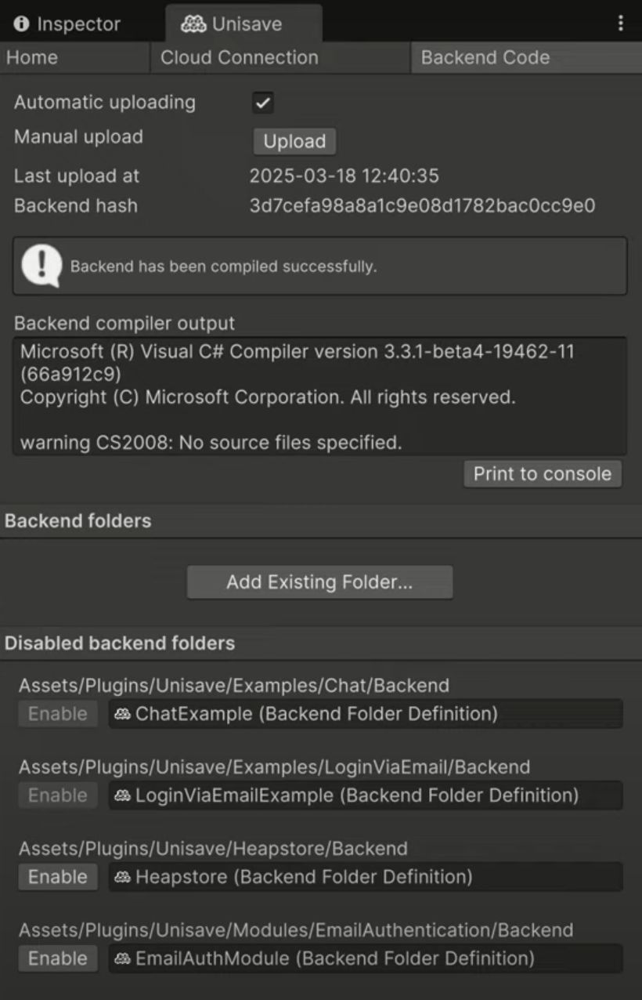
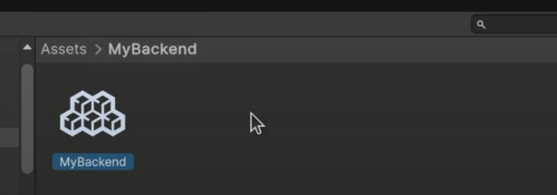
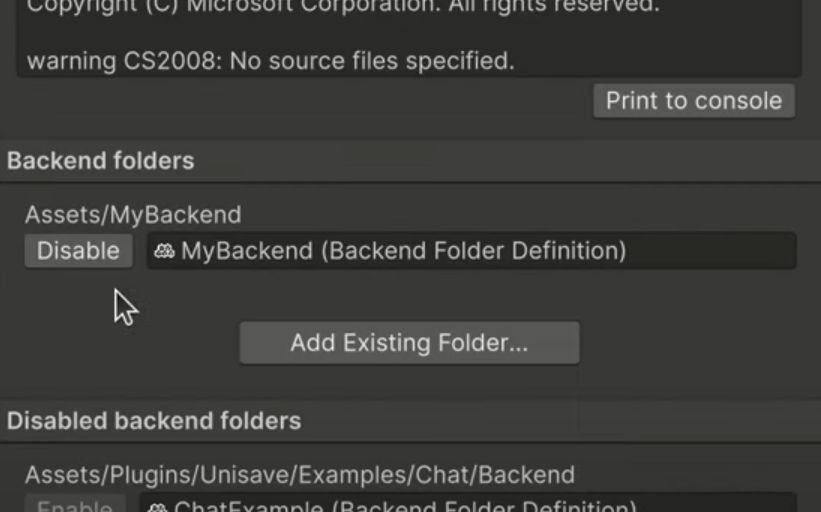
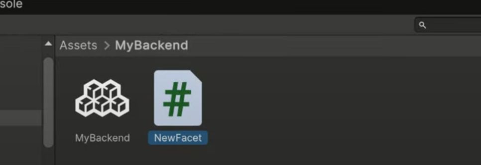
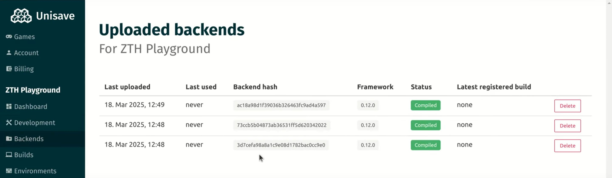
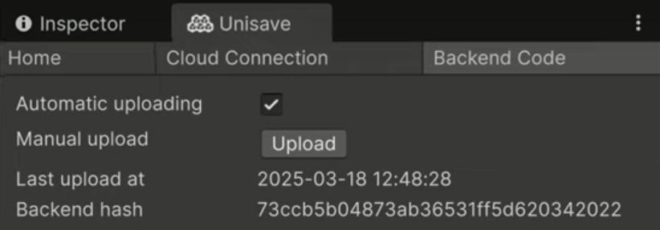

    <iframe width="560" height="315" src="https://www.youtube.com/embed/T508SW8JQXA?si=wy9TVCutQVF2YQ2w" title="YouTube video player" frameborder="0" allow="accelerometer; autoplay; clipboard-write; encrypted-media; gyroscope; picture-in-picture; web-share" referrerpolicy="strict-origin-when-cross-origin" allowfullscreen></iframe>

This tutorial talks about backend folders, whose content is uploaded to Unisave cloud and compiled to make your backend server.

> 📖 **Navigation** 
> [Unisave Zero to Hero](../zero-to-hero.md) 
> ⬅️ Previous: [Registration, Asset, Installation](../01-registration-asset-installation/zth-registration-asset-installation.md) 
> ➡️ Next: Example Projects (comming soon)

## Backend folders

In Unisave you build your backend server by putting files into so-called **Backend Folders**. These are folders in your Unity project just like any other (Textures, Scripts, etc.) but they are uploaded by the Unisave asset to the cloud and compiled there.

You can see the list of all backend folders in your Unity project in the **Unisave Window**, in the **Backed Code** tab:

You can see that in an empty project, there are no enabled folders that would be uploaded, which the server compiler confirms by stating `warning CS2008: No source files specified`. All the backend folders listed below come from the example scenes and built-in modules (will be discussed later).

## Creating a backend folder

To create a backend folder, you can go to the root of your `Assets` folder and create a new folder there and call it `MyBackend`. Then, in the **Unisave Window** in the **Backend Code** tab you can click the **Add Existing Folder...** button (see the image above). Select the `MyBackend` folder and click **Open**.

This will create a file named `MyBackend` inside the `MyBackend` folder:

This file is a **Backend Folder Definition File** and it defines this folder to be a backend folder. Unisave asset will then periodically scan its contents and upload them to the server to be compiled.

> **Note:** You can alternatively create a backend folder definition file by right-clicking the folder in the **Assets** window and choosing `Create > Unisave > Backend Folder Definition File`.

> **Note:** These files are analogous to the assembly definition files (asmdef) in Unity.

Now we can see the new backend folder in the **Unisave Window**:

## Uploading backend code

We can test that the upload works by creating a [facet](../../../docs/facets.md) class inside our backend folder (facets are cloud functions). In the backend folder, right-click and choose `Create > Unisave > Facet`. Leave the default name in and hit enter.

Creating this cloud function class triggers Unity to recompile assemblies and Unisave observes that and performs backend upload right after the Unity compiler finishes. If you look at the **Unisave Window** you can see that the backend hash (identifier of a specific backend snapshot) has changed and that the compiler no longer complains about having no source files. This means the backend was uploaded and compiled successfully.

You can also verify the upload by going to the **Backends** page of the web dashboard and see that there is a new backend snapshot uploaded with the same hash:

## Automatic and manual uploading

In the **Unisave Window** there is an **Automatic uploading** checkbox. When it's checked, Unisave triggers a backend upload each time Unity finishes assembly compilation. This is convenient as it makes sure there is the most up-to-date backend available on the server the moment you can hit the Unity play button.

However, if you prefer to have manual control, you can uncheck this box and manually click the **Upload** button each time before you want to test new backend logic. This is useful if you don't have internet connection or if the automatic upload breaks down for some reason (Unity is sometimes magical 🪄).

## Examples and modules

In the **Unisave Window** there is a list of disabled backend folders. These are folders present in the Unity project, but are not uploaded to the server, nor compiled.

These fall into two categories:

- examples
- modules

Example backend folders accompany the example projects in the `Assets/Plugins/Unisave/Examples` folder. These are set up such that whenever you open the corresponding example **Scene**, the backend folder is automatically enabled. This is why you cannot enable the folder manually - just open the example scene instead.

Modules are standalone libraries that extend the Unisave functionality in some way (for example, `EmailAuthentication` provides *Login via Email* functionality). They usually come as separate assets, but a few are included in the core asset and those the ones you can see. If you want to use this extended functionality, you have to enable the corresponding backend folder.

## Conclusion

Thank you for reading the tutorial. You can visit the [Introduction](../../../docs/introduction/introduction.md) documentation page and browse the documentation to learn more details.

**You can continue with the next tutorial in the series:** 
➡️ Example Projects - #3 Zero to Hero (comming soon)
