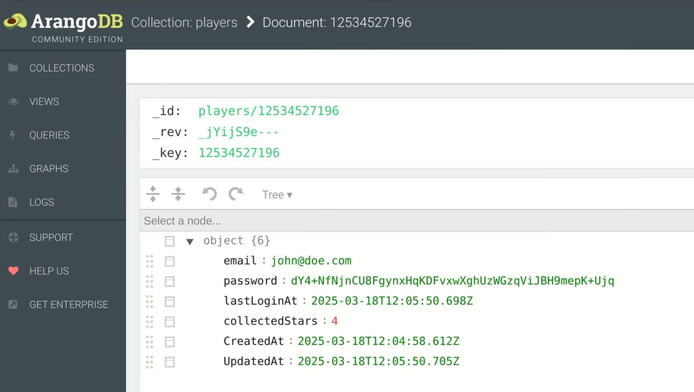

    <iframe width="560" height="315" src="https://www.youtube.com/embed/PmqXrDJ5-b4?si=HFZKRsCWyDFJR0_J" title="YouTube video player" frameborder="0" allow="accelerometer; autoplay; clipboard-write; encrypted-media; gyroscope; picture-in-picture; web-share" referrerpolicy="strict-origin-when-cross-origin" allowfullscreen></iframe>

In this tutorial we explore two example projects that come bundled with the Unisave asset - one implementing a simple chat application and another one implementing basic *login-via-email* functionality.

> 📖 **Navigation** 
> [Unisave Zero to Hero](../zero-to-hero.md) 
> ⬅️ Previous: [Backend Folders, Uploading](../02-backend-folders-uploading/zth-backend-folders-uploading.md) 
> ➡️ Next: ArangoDB Database (comming soon)

## Chat example

Start by openning the `Assets/Plugins/Unisave/Examples/Chat/Chat` scene. When you do that, you will see the chat example UI:

Also, the example's backend folder will automatically be switched to enabled (because you have the scene open). This will trigger automatic backend upload. If not, make sure to hit the backend **Upload** button to make sure the server is ready.

Now you can hit the **Play ▶️** button and explore the example. Join some chatting room and send a few messages.

> **Note:** This chat example is also deployed on itch.io, where you can open it in multiple tabs and see that they all join the same room: https://unisave.itch.io/chat-example

While doing that, you can open the web **Development Console** to see the cloud function requests that are being handled by your backend server:

### Cold starts

You can see that the first two requests take around 1 second to complete each. This is because the backend server was just started so that they could be handled and it takes some time for it to get ready (to load the backend DLL, to run the JIT compiler, etc.). This laziness is called a **cold-start**. If you make subsequent requests, they will be handled in a fraction of a second (which is demonstrated in the video).

## Login via email example

The second example is more interesting, because it interacts with the database. Open the scene at `Assets/Plugins/Unisave/Examples/LoginViaEmail/LoginViaEmail`.

After the scene open, you get two pop-up windows. The first asks you to import TextMesh Pro - a better UI text rendering package that comes with Unity. Click the **Import TMP Essentials** button:

The second pop-up is by Unisave. In the [previous episode](../02-backend-folders-uploading/zth-backend-folders-uploading.md) we mentioned modules - standalone sub-systems of Unisave that provide specific functionality and that you can enable in the list of backend folders. One of these modules is the [Email Authentication module](../../../docs/email-authentication/email-authentication.md) and this example scene requires it to be enabled (otherwise the backend server compilation fails). This dialog asks you to enable that module's backend folder. Just click the **Enable All** button:

Now you can hit the **Play ▶️** button and explore the example.

### Register an account

The example manages player accounts registered via email and password. You start by registering a new player. Click on the **Register** button:

Fill out some dummy email and password and register the player. Then you can log-in via those dummy credentials and hit **Login**.

### Play the game

After logging in, you will see a dummy game where you can collect stars to increase your score. The score is displayed in a dummy in-game UI stating `Stars: 0`. Below that you see the database JSON document represending the player. There are many fields, but the `collectedStars` field is what interests us.

When you click on the star, the counter is updated and a request is sent to the server to update the database document as well.

### Inspect the database

In the web dashboard, you can open the `Development database`. A new tab opens with the ArangoDB web UI called aardvark. In the list of collections you will see a `players` collection and inside of that there will be one document. When you open that document, you will see the data that is also shown in the example UI:

If you modify this document and re-login in the game, the newly updated values will be shown in-game. You can modify `collectedStars` or even the `email` field.

> **Note:** In the example, the `"Stars: 0"` UI text does not reflect database changes without doing a re-login. This is because it increments even before a request to the server is sent so that it changes immediately after the player clicks on the star (it does not wait for the cloud request to finish and for the new value from the database to be received). This makes the game feel responsive.

The `password` field stores the hash of the inserted password. Hashing is done so that even if the database contents leak, the player's password does not. These are basic security precautions and they are implemented in the [Email Authentication module](../../../docs/email-authentication/email-authentication.md).

## Conclusion

Thank you for reading the tutorial. You can visit the [Email Authentication module](../../../docs/email-authentication/email-authentication.md) documentation page to learn more about integrating such logic into your game. For the chat example implementation, see the [broadcasting](../../../docs/broadcasting.md) documentation.

**You can continue with the next tutorial in the series:** 
➡️ ArangoDB Database - #4 Zero to Hero (comming soon)
